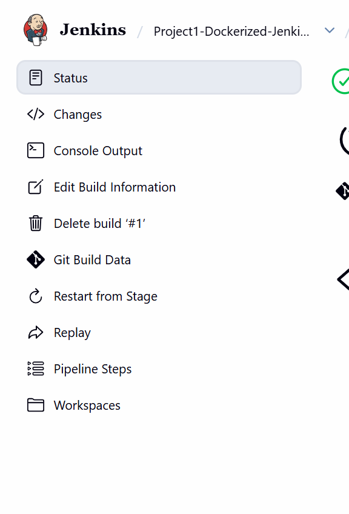

# Project 1 — Dockerizing Jenkins Pipeline

**Student:** Arsh Ansari | **PRN:** 23070122047

Declarative Jenkins pipeline that checks out Git, installs Flask, tests the route, builds a Docker image, and runs the container on port 5000.

---

## Architecture

```
GitHub (hello-world-flask / this repo)
        │
        ▼
Jenkins Pipeline (Jenkinsfile)
        ├── Checkout
        ├── Install Dependencies   (python3 pip)
        ├── Test                   (py_compile + Flask test_client)
        ├── Build Docker Image
        └── Deploy                 (docker run -p 5000:5000)
```

---

## Files

| File | Purpose |
|------|---------|
| `app.py` | Flask app returned by the pipeline |
| `Dockerfile` | Image for the Flask app |
| `Dockerfile.jenkins` | Jenkins master with Python, Maven, Git, Docker CLI |
| `Jenkinsfile` | CI/CD stages |
| `docker-compose.yml` | Optional standalone Jenkins (no slaves) |

The lab Jenkins used for screenshots is the **Project 4** stack, which builds this same `Dockerfile.jenkins` and adds two SSH slaves.

---

## Run Jenkins

```powershell
cd 23070122047_ArshAnsari\Project4-Distributed-Jenkins-Maven
docker compose up --build -d
```

Open http://localhost:8080 — login `admin` / `admin123`.

Create a **Pipeline** job:

- Definition: Pipeline script from SCM
- SCM: Git
- Repository URL: this submission repo
- Script Path: `23070122047_ArshAnsari/Project1-Dockerized-Jenkins-Pipeline/Jenkinsfile`

Then **Build Now**.

---

## Evidence




