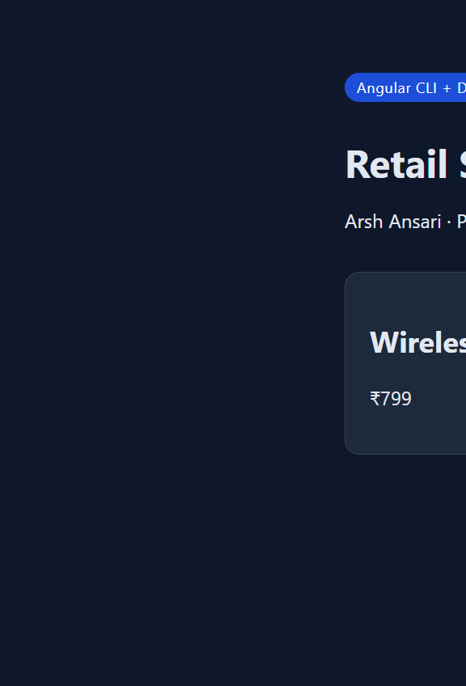

# Project 2 — Deploy Angular Application in Docker Container

**Student:** Arsh Ansari | **PRN:** 23070122047

Angular CLI retail store with two Compose files: **development** (`ng serve` on port 4200) and **production** (multi-stage Node build + Nginx on host port 4201).

---

## Architecture

```
Angular CLI source
        │
        ├─ docker-compose.dev.yml  →  Dockerfile.dev  →  ng serve --host 0.0.0.0 :4200
        │
        └─ docker-compose.yml      →  Dockerfile
                Stage 1  node:22-alpine   npm install && ng build
                Stage 2  nginx:1.27-alpine  serve dist/retail-store/browser :80
```

Host ports: **4200** (dev), **4201 → 80** (prod) so they do not clash with Jenkins on 8080.

---

## Run

```powershell
cd 23070122047_ArshAnsari\Project2-Angular-Docker

# Production (Nginx)
docker compose up --build -d
# Open http://localhost:4201

# Development (Angular CLI live reload)
docker compose -f docker-compose.dev.yml up --build
# Open http://localhost:4200
```

The app was generated as a standalone Angular 19 CLI project (`ng` scripts in `package.json`, `angular.json` application builder).

---

## Evidence



