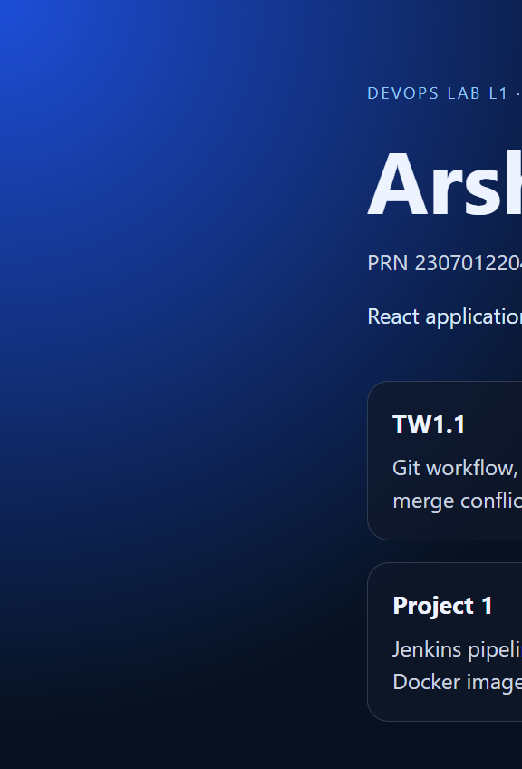

# Project 2 — Deploy React Application in Docker Container

**Student:** Arsh Ansari | **PRN:** 23070122047

Multi-stage Docker build: Node compiles the Vite React app, Nginx Alpine serves it.

---

## Architecture

```
React source (Vite)
    │
    ▼
Stage 1  node:22-alpine   →  npm install && npm run build
Stage 2  nginx:1.27-alpine →  serve /usr/share/nginx/html on port 80
```

Host port **3080** maps to container port **80** so it does not clash with Jenkins on 8080.

---

## Run

```powershell
cd 23070122047_ArshAnsari\Project2-React-Docker
docker compose up --build -d
```

Open http://localhost:3080

```powershell
docker build -t devops-react-portfolio:latest .
docker run -d -p 3080:80 --name devops-react-app devops-react-portfolio:latest
```

---

## Evidence



