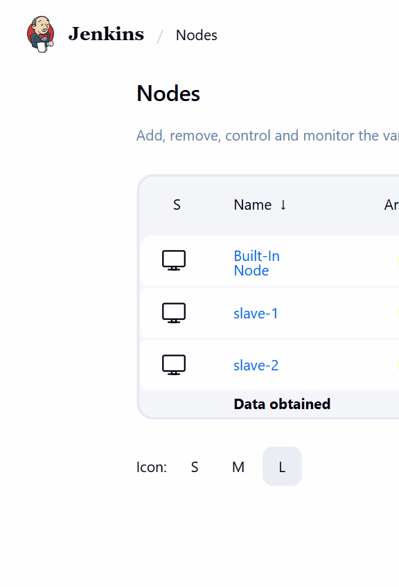
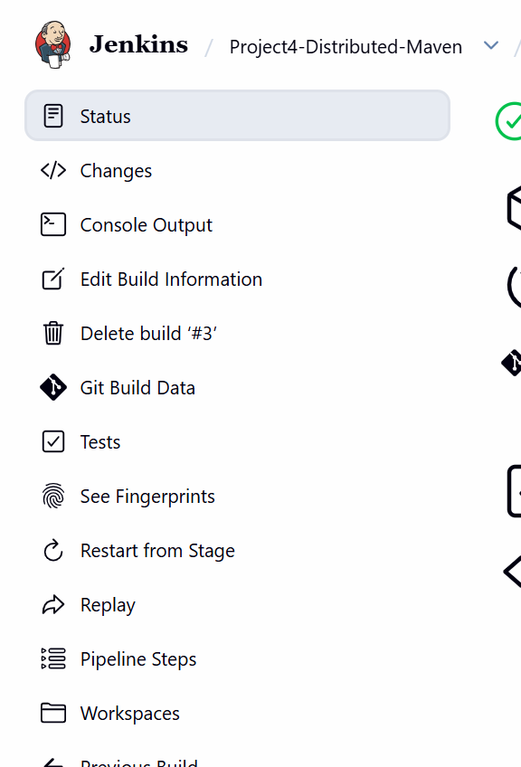

# Project 4 — Architecting Jenkins Pipeline for Scale

**Student:** Arsh Ansari | **PRN:** 23070122047

Distributed Jenkins pipeline for a Maven **portfolio** project. Compile/package run on **slave-1**, tests run on **slave-2**.

---

## Architecture

```
Jenkins Master  (no Maven workload for this job)
    ├── slave-1  (label: slave-1 maven-build)  →  mvn clean compile / package
    └── slave-2  (label: slave-2 maven-test)   →  mvn test
```

Nodes are SSH agents created by Jenkins Configuration as Code. The lab SSH key in `jenkins/ssh/` is **only for this local Docker network**.

---

## Pipeline stages

| Stage | Node | Action |
|-------|------|--------|
| Checkout | slave-1 | `checkout scm`, stash sources |
| Build | slave-1 | `mvn -B clean compile` |
| Test | slave-2 | `mvn -B test`, publish JUnit |
| Package | slave-1 | `mvn -B package -DskipTests`, archive JAR |

Maven was also verified outside Jenkins:

```powershell
docker run --rm -v ${PWD}:/app -w /app maven:3.9.9-eclipse-temurin-17 mvn -B test package
```

Result: **BUILD SUCCESS**, artifact `target/portfolio-1.0.0.jar`.

---

## Start the cluster

```powershell
cd 23070122047_ArshAnsari\Project4-Distributed-Jenkins-Maven
docker compose up --build -d
```

- Jenkins: http://localhost:8080  
- Login: `admin` / `admin123`  
- Nodes: Manage Jenkins → Nodes → `slave-1`, `slave-2`

Create a Pipeline job with Script Path:

`23070122047_ArshAnsari/Project4-Distributed-Jenkins-Maven/Jenkinsfile`

---

## Evidence





