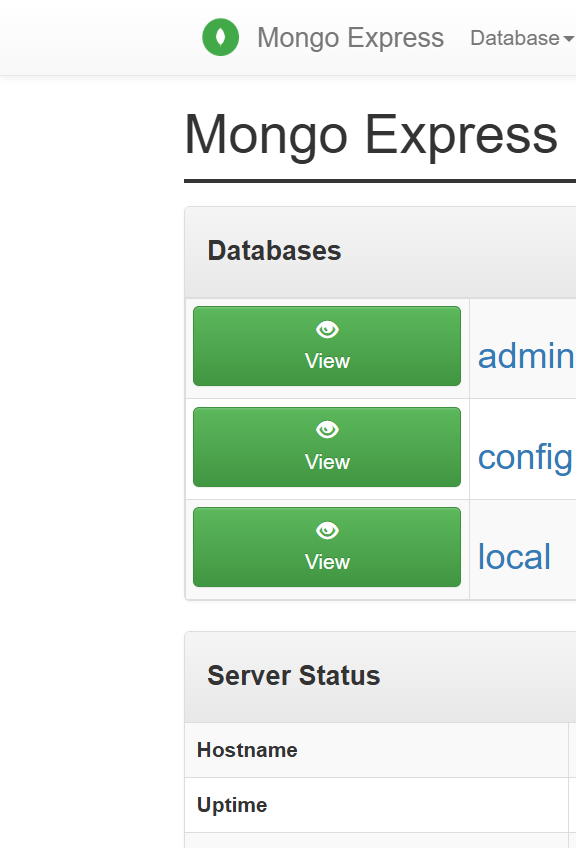

# Project 7 — Mongo and Mongo Express on Kubernetes

**Student:** Arsh Ansari | **PRN:** 23070122047

| Kind | Name | Role |
|------|------|------|
| Secret | `mongo-secret` | root username / password |
| ConfigMap | `mongo-config` | database name + mongo hostname |
| Deployment + Service | `mongo` / `mongo-service` | MongoDB 7 |
| Deployment + Service | `mongo-express` / `mongo-express-service` | UI, NodePort **30081** |

```powershell
kubectl apply -f k8s.yaml
kubectl get all
# Open http://localhost:30081
```

---

## Evidence



