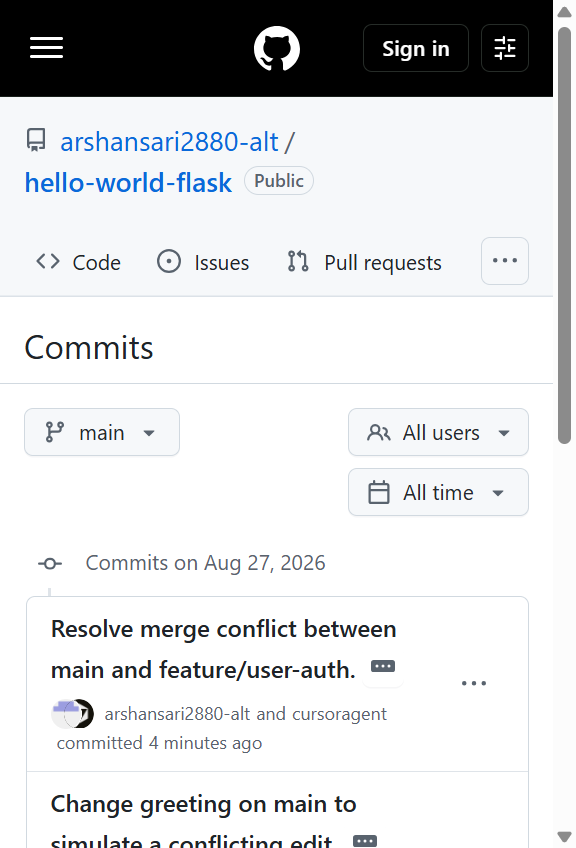
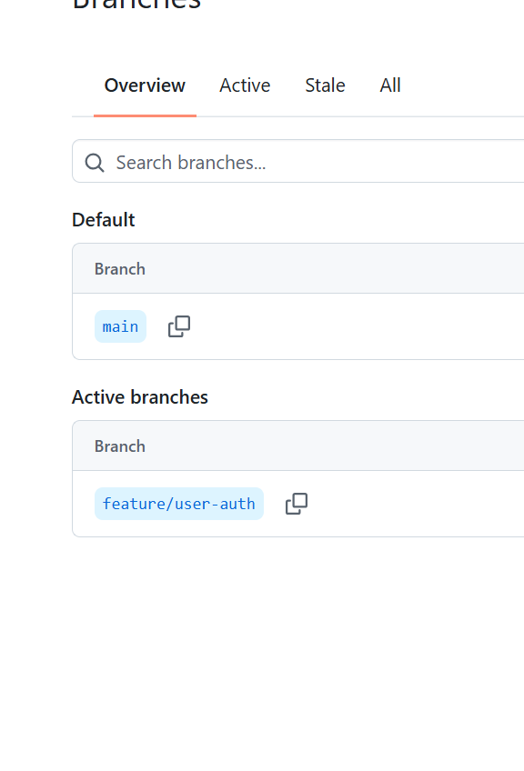
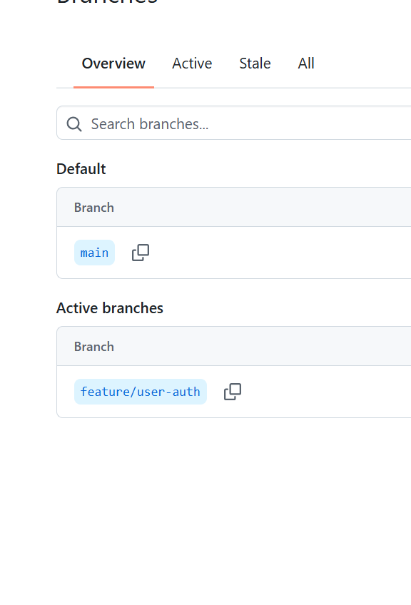

# TW1.1 — Git Workflow & Collaboration

**Student:** Arsh Ansari | **PRN:** 23070122047 | **Marks:** 4

Remote repository: [https://github.com/arshansari2880-alt/hello-world-flask](https://github.com/arshansari2880-alt/hello-world-flask)

---

## Task 1.1 — Initialize repo and commit to main (1 Mark)

Initialized a Git repository for the Flask Hello World app, added `app.py` + `requirements.txt`, and committed on `main`.

```powershell
git init -b main
git add app.py requirements.txt
git commit -m "Add Hello World Flask application on main."
gh repo create hello-world-flask --public --source=. --remote=origin --push
```

Initial route:

```python
@app.route("/")
def hello():
    return "Hello World"
```

### Evidence



---

## Task 1.2 — feature/user-auth branch (1.5 Marks)

Created `feature/user-auth`, added a print statement and changed the same greeting line, committed, and pushed the branch.

```powershell
git checkout -b feature/user-auth
# edited app.py
git add app.py
git commit -m "Add user-auth logging on the feature branch."
git push -u origin feature/user-auth
```

Feature-branch change:

```python
print("User authentication workflow initialized.")
return "Hello World - User Auth Enabled"
```

### Evidence



---

## Task 1.3 — Simulate conflict, merge, resolve, push (1.5 Marks)

On `main`, changed the **same line** (`return "Hello World"`) to `return "Hello World from main"`, committed, then merged `feature/user-auth`. Git reported a content conflict. Conflict markers were resolved by hand, then the merge was committed and pushed.

```text
<<<<<<< HEAD
    return "Hello World from main"
=======
    print("User authentication workflow initialized.")
    return "Hello World - User Auth Enabled"
>>>>>>> feature/user-auth
```

Resolved `app.py` on `main`:

```python
print("User authentication workflow initialized.")
return "Hello World — Git conflict resolved on main"
```

```powershell
git checkout main
git commit -am "Change greeting on main to simulate a conflicting edit."
git merge feature/user-auth
# edit app.py, remove conflict markers
git add app.py
git commit -m "Resolve merge conflict between main and feature/user-auth."
git push origin main
```

Graph after the merge:

```text
*   7ff7fc2 Resolve merge conflict between main and feature/user-auth.
|\
| * 21b34b2 Add user-auth logging on the feature branch.
* | fdfedc8 Change greeting on main to simulate a conflicting edit.
|/
* 6d7a3e7 Add Hello World Flask application on main.
```

### Evidence



