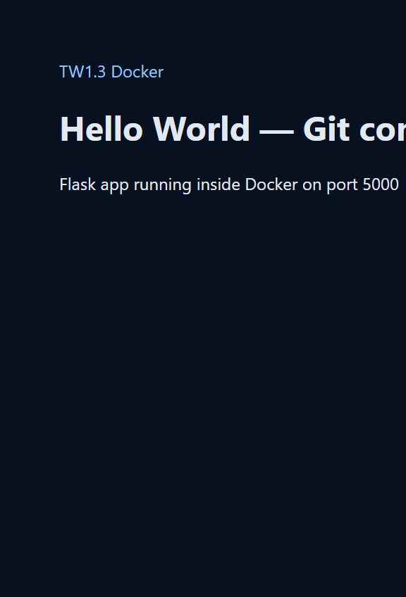
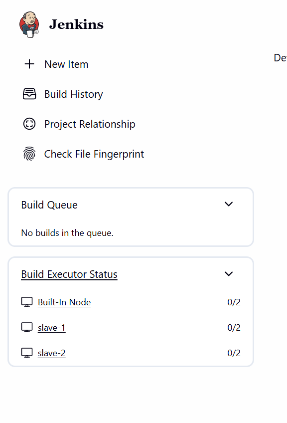
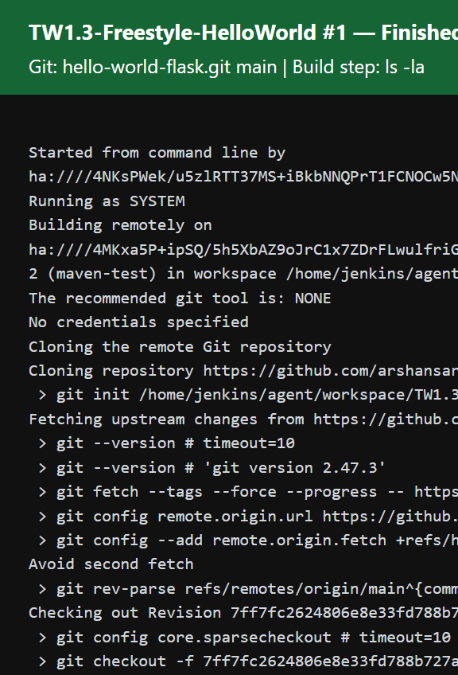

# TW1.3 — Basic Containerization (Docker) & Jenkins Freestyle Project

**Student:** Arsh Ansari | **PRN:** 23070122047 | **Marks:** 3

Flask source used here is the resolved Hello World app from TW1.1.

---

## Task 3.1 — Dockerize the Flask app (1.5 Marks)

Dockerfile builds a slim Python image and runs the app on port **5000**.

```dockerfile
FROM python:3.11-slim
WORKDIR /app
COPY requirements.txt .
RUN pip install --no-cache-dir -r requirements.txt
COPY app.py .
EXPOSE 5000
CMD ["python", "app.py"]
```

```powershell
docker build -t hello-world-flask:latest .
docker run -d --name hello-world-flask -p 5000:5000 hello-world-flask:latest
docker ps
curl http://localhost:5000/
```

Verified locally:

| Check | Result |
|-------|--------|
| Image | `hello-world-flask:latest` (211MB) |
| Container | `hello-world-flask` listening on `0.0.0.0:5000` |
| HTTP | `Hello World — Git conflict resolved on main` |

### Evidence




---

## Task 3.2 — Jenkins Freestyle project (1.5 Marks)

Jenkins runs from the Project 4 compose stack (master on port 8080, Docker socket attached).

1. New Item → **TW1.3-Freestyle-HelloWorld** → Freestyle project
2. Source Code Management → Git  
   Repository URL: `https://github.com/arshansari2880-alt/hello-world-flask.git`  
   Branch: `*/main`
3. Build step → Execute shell → `ls -la`
4. Build Now

The console output lists the workspace (`app.py`, `requirements.txt`).

### Evidence






Login for the lab Jenkins image: `admin` / `admin123`.
