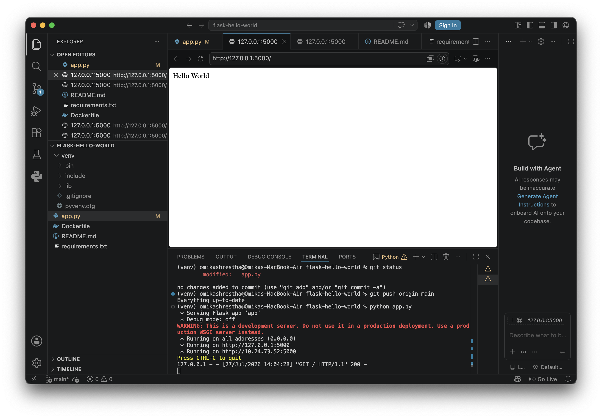
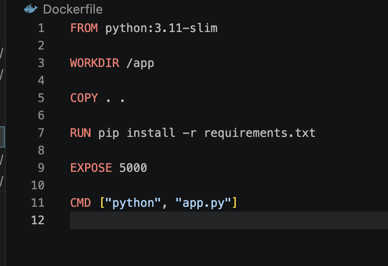
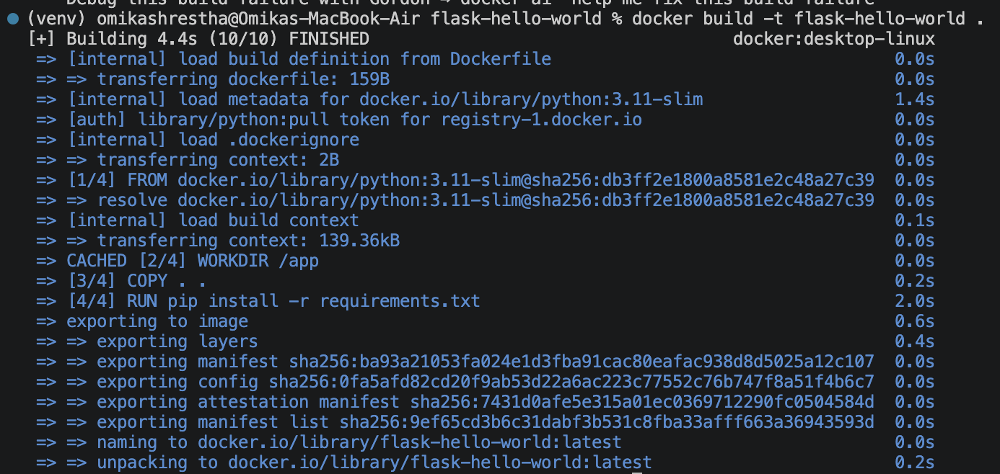
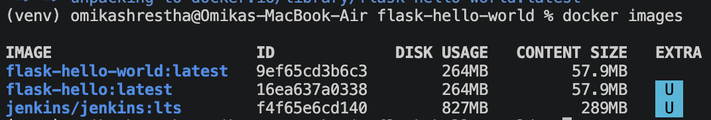
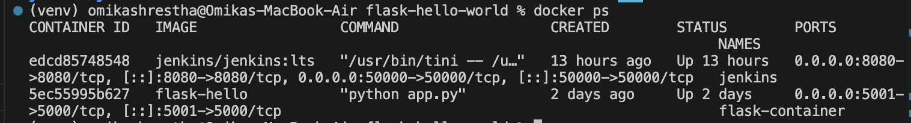
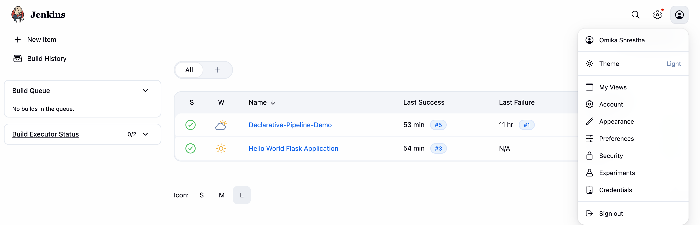
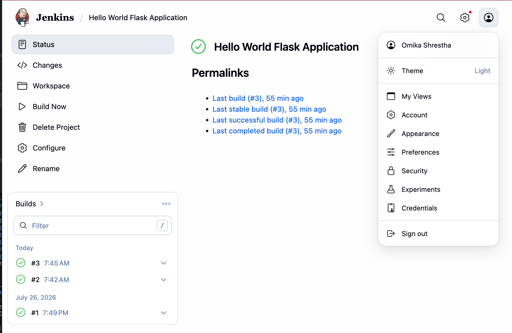
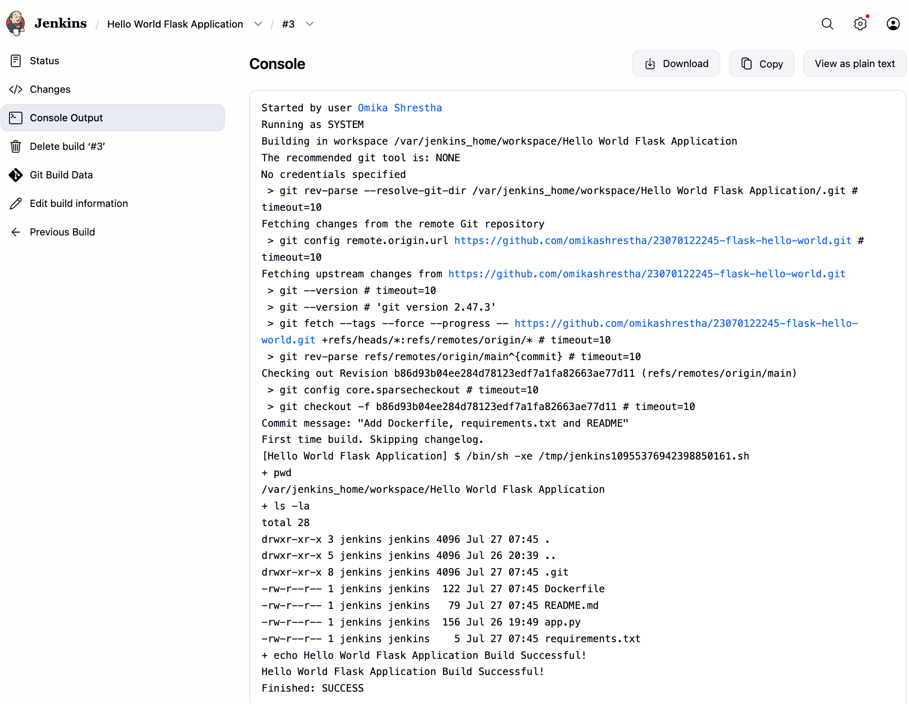
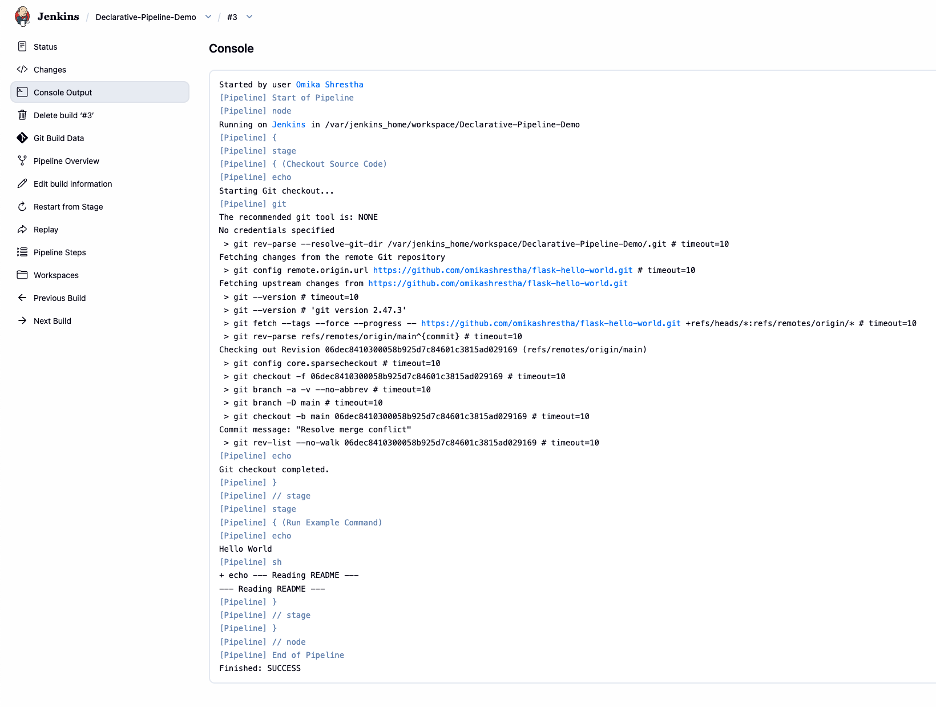
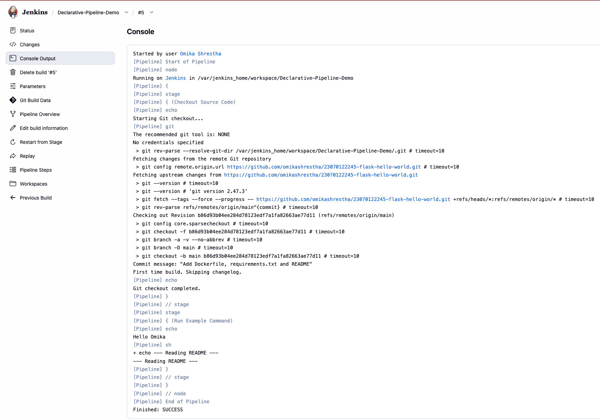

# Assignment TW1.3 - Docker & Jenkins

## Objective

This assignment demonstrates:

- Dockerizing a Python Flask Hello World application.
- Building and running a Docker image.
- Creating a Jenkins Freestyle Project.
- Creating a Jenkins Declarative Pipeline.
- Executing a parameterized pipeline successfully.

---

## Files Included

- app.py
- Dockerfile
- requirements.txt

---

## Docker

### Flask Application Running

The Flask application was executed successfully and accessed through the browser on localhost.



---

### Dockerfile

The Dockerfile used to containerize the Flask application.



---

### Docker Image Build

The Docker image was built successfully using the Docker build command.

Command used:

```bash
docker build -t flask-hello-world .
```



---

### Docker Images

The available Docker images were verified using:

```bash
docker images
```



---

### Running Docker Container

The running container was verified using:

```bash
docker ps
```



---

## Jenkins

### Jenkins Dashboard

The Jenkins dashboard showing the configured jobs.



---

### Freestyle Project

A Jenkins Freestyle Project was created to pull the GitHub repository and execute shell commands.



---

### Freestyle Build Output

The Freestyle build completed successfully.



---

## Declarative Pipeline

### Pipeline Configuration

A Declarative Pipeline was created using Jenkins Pipeline syntax.

The pipeline performs:

- Git Checkout
- Executes pipeline steps
- Displays console messages


---

### Pipeline Console Output

The pipeline executed successfully.

Output includes:

- Git checkout
- Hello Omika
- Reading README
- Finished: SUCCESS



---

### Pipeline with Parameters

The pipeline was modified to accept a parameter (`GREETING_NAME`) and successfully printed the supplied value during execution.

Example Output:

```
Hello Omika
```



---

## Conclusion

Successfully completed:

- Docker containerization of a Flask application.
- Docker image creation and execution.
- Jenkins Freestyle Project.
- Jenkins Declarative Pipeline.
- Parameterized Jenkins Pipeline.