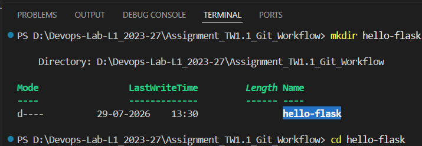
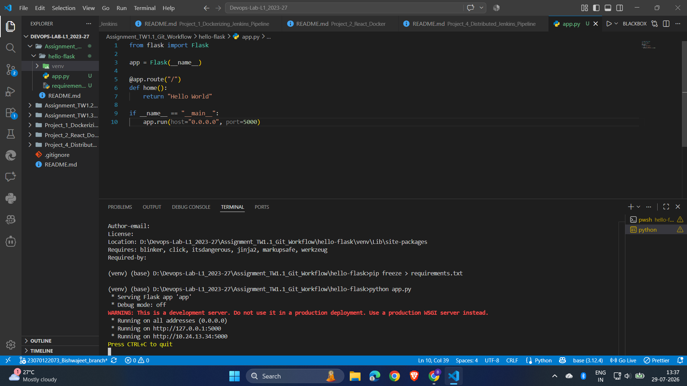
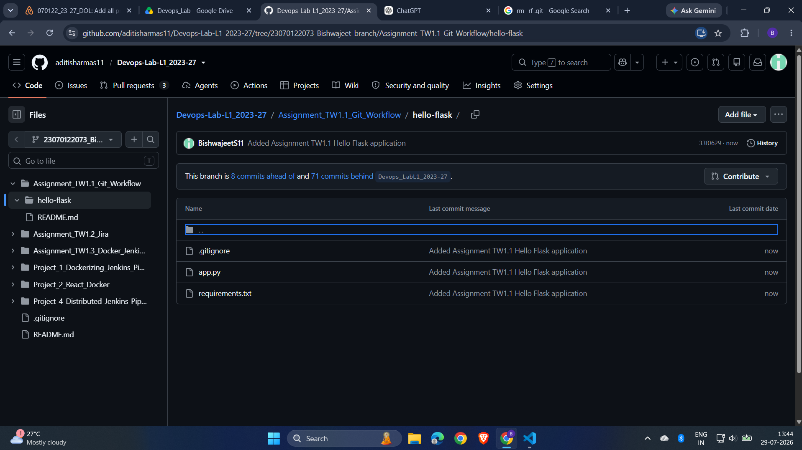
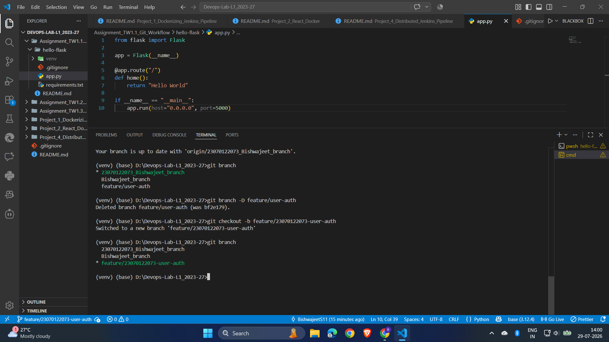
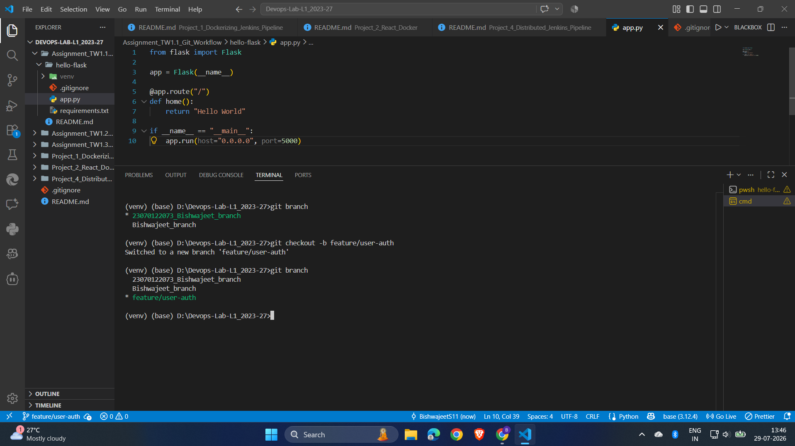
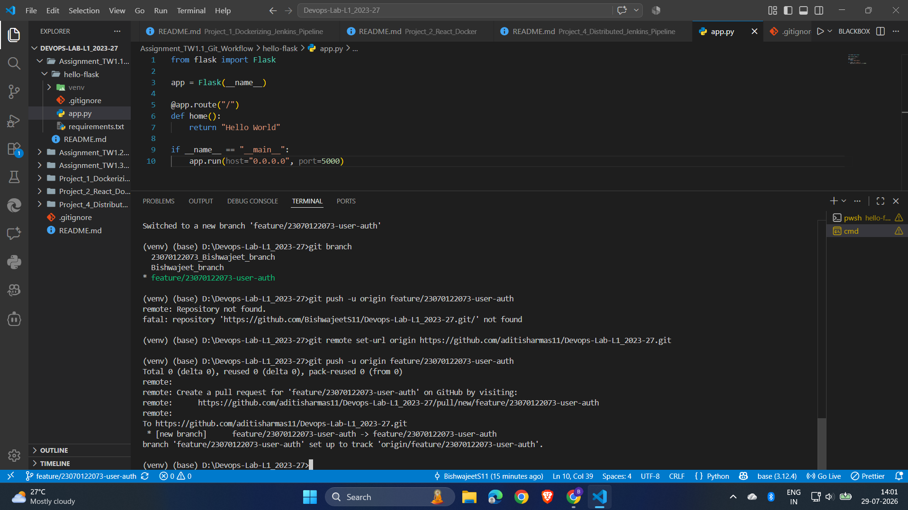
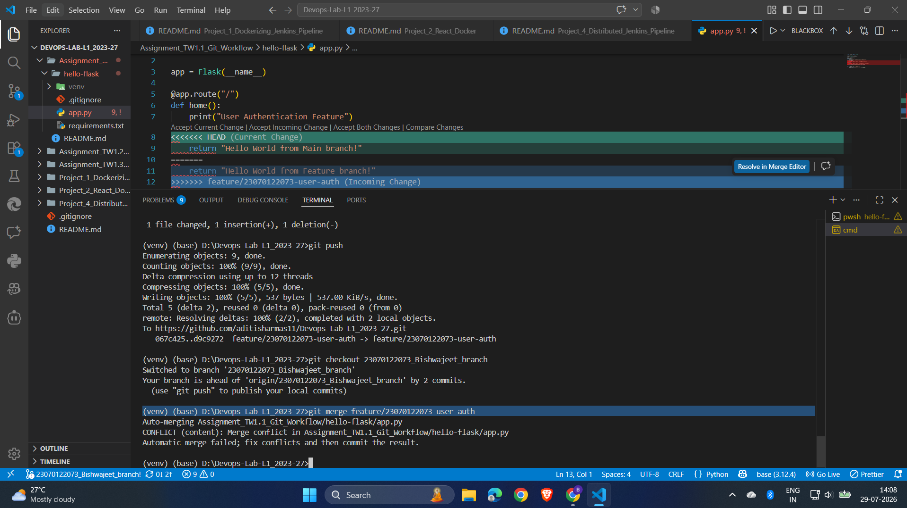

# Assignment TW1.1 – Git Workflow & Collaboration

## Objective

The objective of this assignment is to understand and implement the basic Git workflow used in collaborative software development. The assignment demonstrates repository initialization, version control, branching strategies, remote repository management, merge conflict simulation, and conflict resolution.

---

## Tools & Technologies

* Git
* GitHub
* Python
* Flask
* PowerShell
* Visual Studio Code

---

# Task 1.1 – Initialize a Git Repository

### Description

A simple **Hello World** Flask application was created. A Git repository was initialized, the project files were added, and the initial commit was created on the main branch.

### Commands Used

```bash
git init
git add .
git commit -m "Initial commit"
git push origin main
```

### Screenshots

#### Flask Project Structure



#### Creating Virtual Environment & Installing Flask


#### Running Flask Application



#### Browser Output


#### Initial Commit


#### Initial Commit on GitHub



---

# Task 1.2 – Create Feature Branch

### Description

A new branch named **feature/user-auth** was created. A small modification was made to the Flask application to simulate a user authentication feature. The changes were committed and pushed to the remote GitHub repository.

### Commands Used

```bash
git checkout -b feature/user-auth
git add .
git commit -m "Added user authentication feature"
git push origin feature/user-auth
```

### Screenshots

#### Switching to Feature Branch



#### Creating Feature Branch



#### Updated Source Code


#### Push Feature Branch to GitHub



---

# Task 1.3 – Merge Conflict & Resolution

### Description

The same section of code was modified in both the **main** branch and the **feature/user-auth** branch to intentionally generate a merge conflict. The conflict was resolved manually, and the merged code was committed successfully.

### Commands Used

```bash
git checkout main
git merge feature/user-auth
git add .
git commit -m "Resolved merge conflict"
git push origin main
```

### Screenshots

#### Merge Conflict



#### Conflict Resolved


---

# Learning Outcomes

After completing this assignment, the following Git concepts were successfully implemented:

* Repository initialization
* Version control using Git
* Creating and switching branches
* Feature-based development
* Remote repository management using GitHub
* Merge conflict simulation
* Manual conflict resolution
* Collaborative Git workflow

---

# Conclusion

This assignment provided practical experience with Git and GitHub workflows commonly used in software development teams. It covered repository management, branching strategies, conflict handling, and collaboration using a remote repository, forming a strong foundation for version control in DevOps practices.
