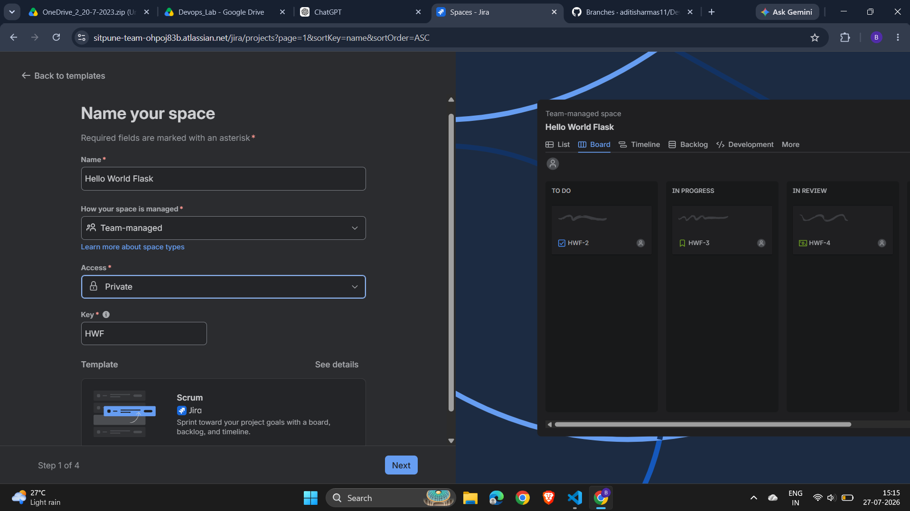
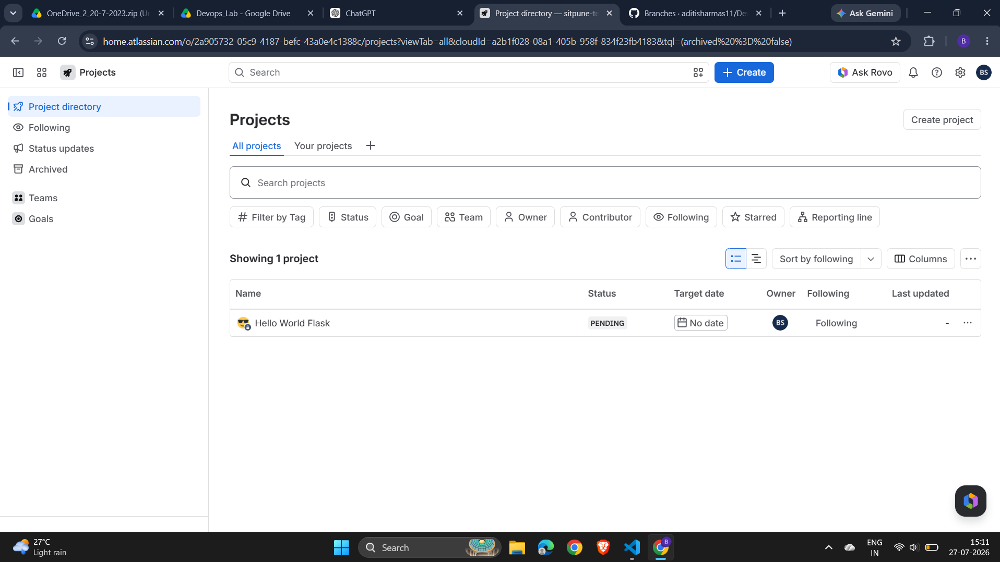
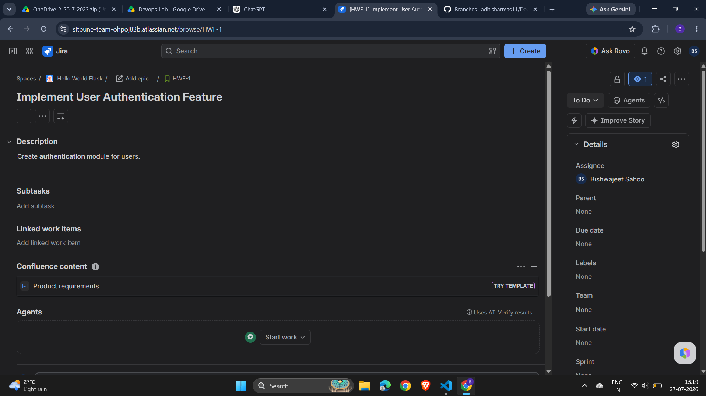
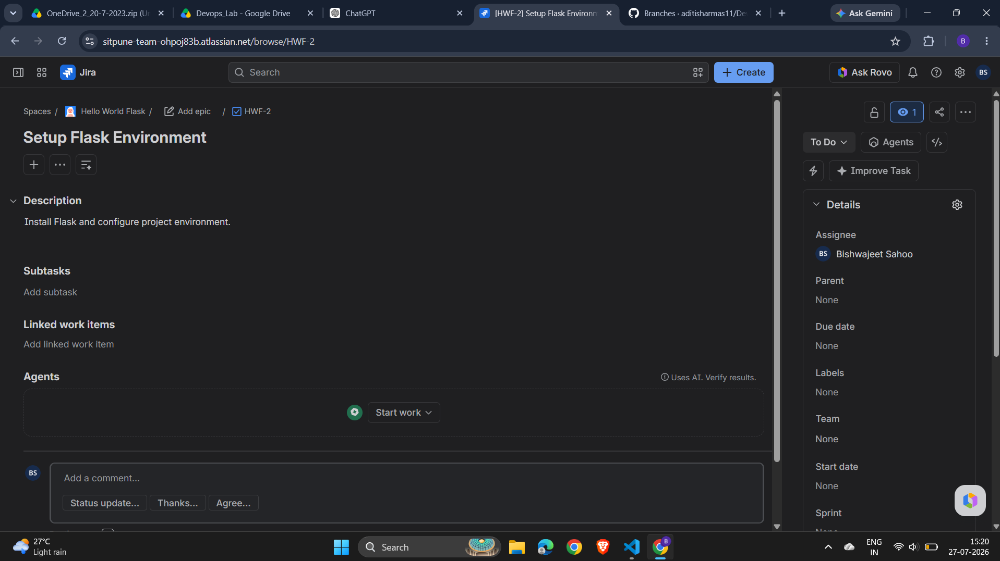
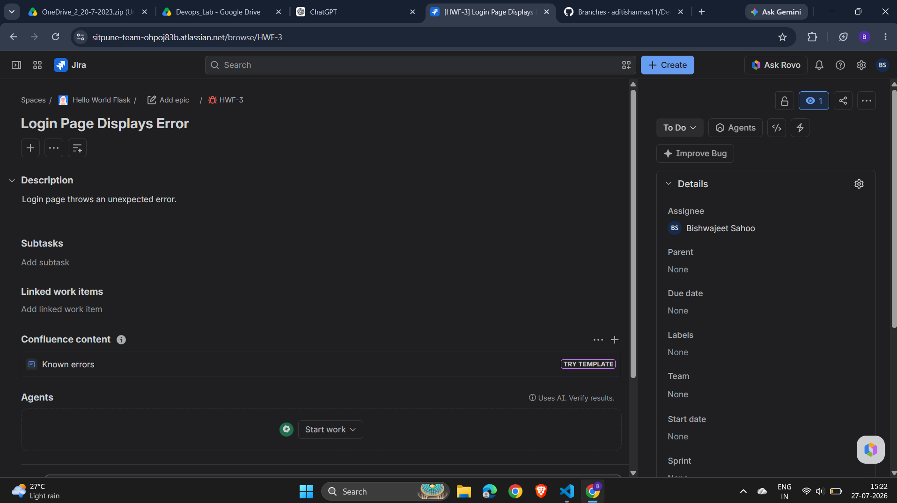
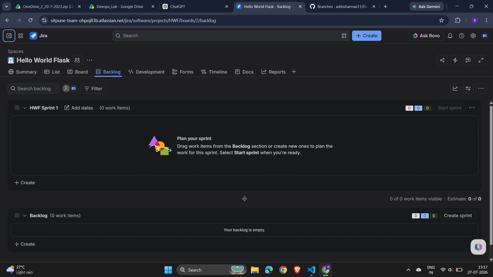
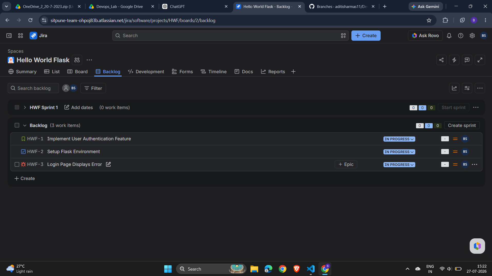
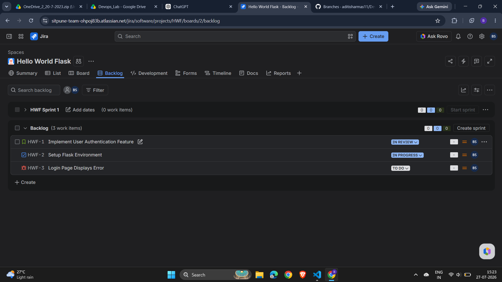
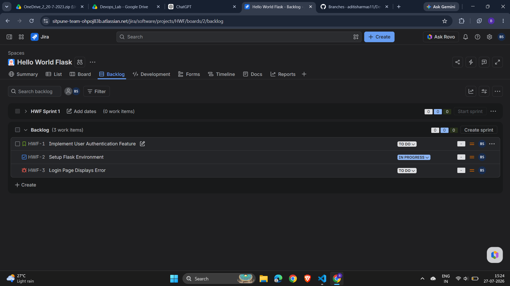

# Assignment TW1.2 – Jira Project & Issue Tracking

## Objective

The objective of this assignment is to understand the fundamentals of Agile project management using Jira Cloud. The assignment demonstrates the creation of a Scrum project, issue management, backlog organization, and workflow tracking through the Scrum board.

---

## Tools & Technologies

* Atlassian Jira Cloud
* Scrum Framework
* Agile Project Management

---

# Task 2.1 – Create a Scrum Project

### Description

A new Scrum project was created in Jira Cloud for the **Hello World Flask Application**. The project serves as the workspace for managing development tasks and tracking project progress.

### Screenshots

#### Jira Project

#### Project Dashboard

---

# Task 2.2 – Create Project Issues

### Description

The following issues were created within the Scrum project to represent different types of work items:

* **Story:** Implement User Authentication Feature
* **Task:** Setup Flask Environment
* **Bug:** Login Page Displays Error

These issues demonstrate how Jira categorizes and manages different types of software development work.

### Screenshots

#### Story Created

#### Task Created

#### Bug Created

#### Backlog View

---

# Task 2.3 – Update Issue Workflow

### Description

The **Setup Flask Environment** task was moved from **To Do** to **In Progress** using the Scrum Board workflow. This demonstrates how Jira tracks the progress of development activities throughout the project lifecycle.

### Screenshots

#### Updated Backlog Status

#### Updated Backlog List

#### Updated Story & Task Status

#### Task Moved to In Progress

---

# Learning Outcomes

After completing this assignment, the following Jira concepts were successfully implemented:

* Creating a Scrum project
* Managing Agile backlogs
* Creating Story, Task, and Bug issues
* Organizing project work using issue types
* Tracking task progress through Scrum workflow
* Updating issue status using the Jira Board

---

# Conclusion

This assignment provided practical experience with Jira Cloud for Agile project management. It demonstrated how Scrum projects are organized, how different issue types are created and managed, and how workflow states are updated to track development progress effectively.
