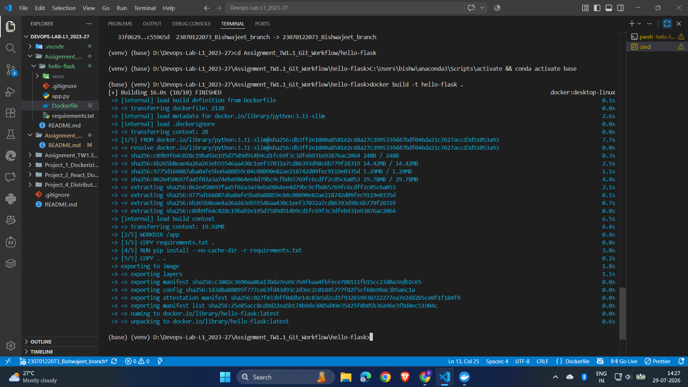
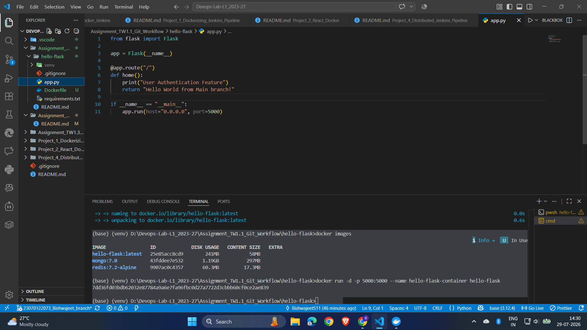
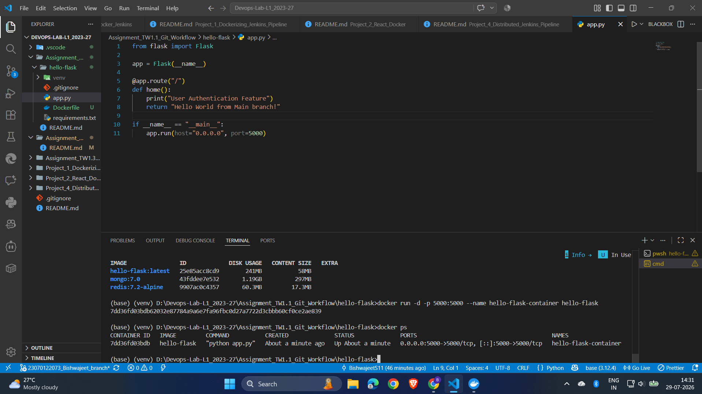
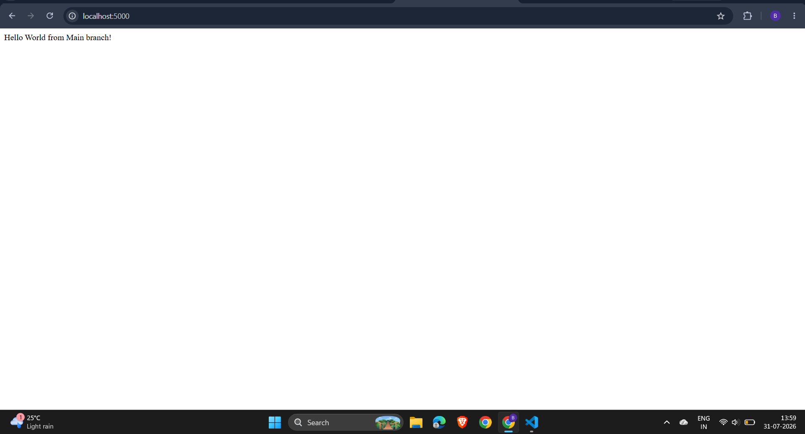
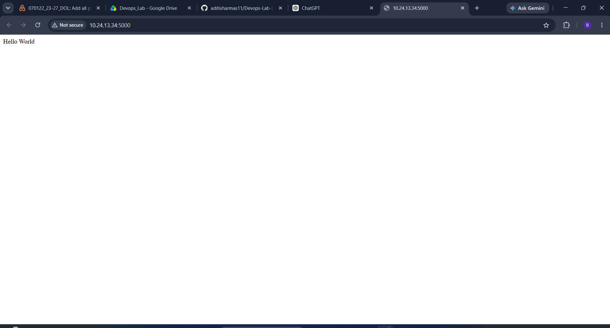
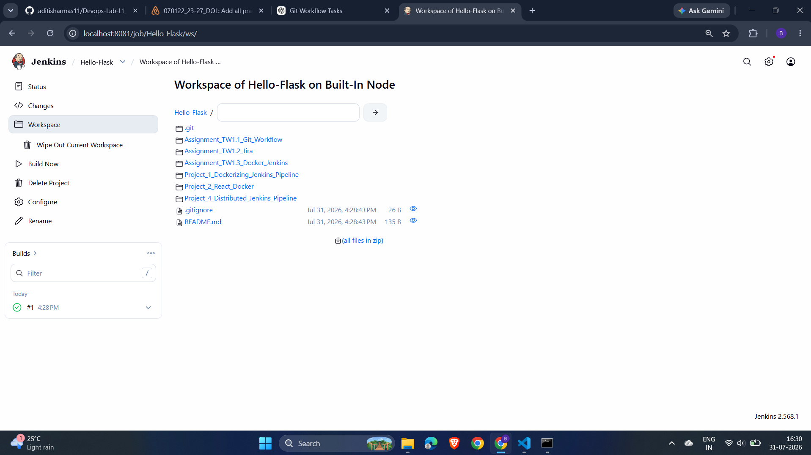
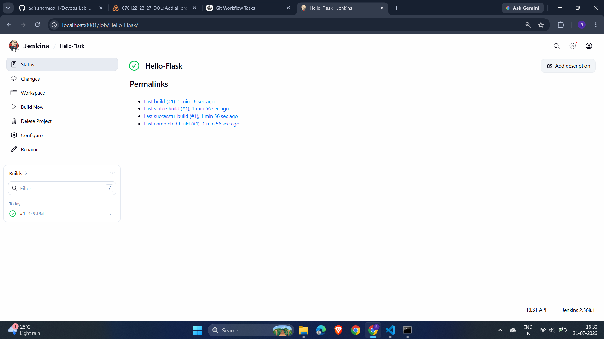
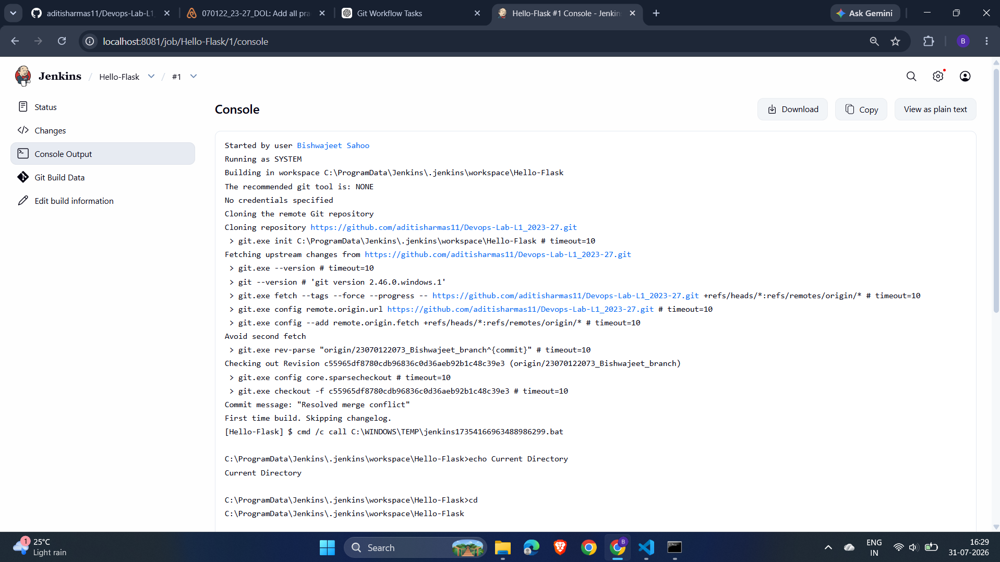
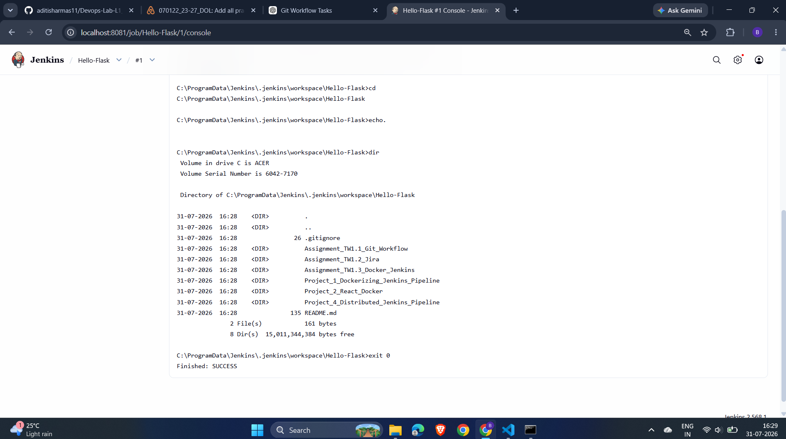

# Assignment TW1.3 – Basic Containerization (Docker) & Jenkins Freestyle Project

## Objective

The objective of this assignment is to understand the fundamentals of application containerization using Docker and build automation using Jenkins. A Docker image was created for a Python Flask application, the application was deployed inside a Docker container, and a Jenkins Freestyle project was configured to automate the build process.

---

## Tools & Technologies

* Docker
* Docker Desktop
* Jenkins
* Python
* Flask
* Git
* GitHub
* PowerShell

---

# Task 3.1 – Basic Containerization Using Docker

### Description

A Dockerfile was created for the Flask **Hello World** application. The application image was built locally and executed inside a Docker container. The running application was verified by accessing it through a web browser on **http://localhost:5000**.

### Dockerfile

The Dockerfile performs the following tasks:

* Uses an official Python base image
* Sets the working directory
* Copies the application files
* Installs project dependencies
* Exposes port **5000**
* Starts the Flask application

### Commands Used

```bash
docker build -t hello-flask .
docker images
docker run -d -p 5000:5000 --name hello-flask-container hello-flask
docker ps
```

### Screenshots

#### Dockerfile Creation



#### Building Docker Image


#### Docker Images



#### Docker Container Running



#### Docker Output



#### Flask Application Running in Browser



#### Stopping and Removing Docker Container


---

# Task 3.2 – Jenkins Freestyle Project

### Description

A Jenkins Freestyle project was created to automate the build process. Jenkins was configured to pull the source code from the GitHub repository and execute a build step that lists the contents of the project workspace.

The successful execution of the build verifies that Jenkins is correctly integrated with the Git repository.

### Jenkins Configuration

* Project Type: Freestyle Project
* Source Code Management: Git
* Repository: GitHub Repository
* Build Step: Execute Windows Batch Command
* Command Executed:

```cmd
dir
```

### Screenshots

#### Jenkins Workspace



#### Jenkins Build Status



#### Jenkins Console Output (Part 1)



#### Jenkins Console Output (Part 2)



---

# Learning Outcomes

After completing this assignment, the following DevOps concepts were successfully implemented:

* Creating Docker images
* Writing a Dockerfile
* Running applications inside Docker containers
* Managing Docker containers and images
* Verifying containerized applications
* Configuring Jenkins Freestyle projects
* Integrating Jenkins with GitHub
* Executing automated build jobs
* Monitoring build status through Jenkins Console Output

---

# Conclusion

This assignment provided practical experience in application containerization and build automation. Docker was used to package and deploy the Flask application in a portable environment, while Jenkins automated the build process by integrating with the GitHub repository. These tools form the foundation of modern Continuous Integration and Continuous Delivery (CI/CD) practices in DevOps.
