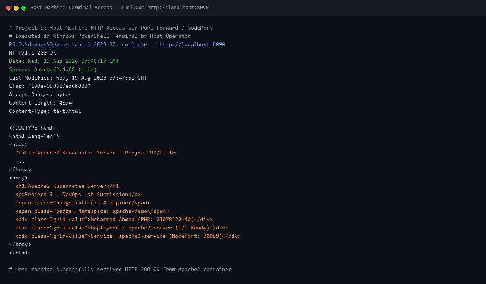

# Project 9: Deploying Apache2 (HTTPD) on Kubernetes and Accessing from Host Machine

[](https://kubernetes.io/)
[](https://httpd.apache.org/)
[](https://www.docker.com/)
[](#8-conclusion)

| Metadata | Details |
| :--- | :--- |
| **Student Name** | Ayaan Rukadikar |
| **PNR** | 23070122063 |
| **Subject** | DevOps Lab |
| **Batch** | 2023–27 |

---

## 1. Executive Summary & Objective

The primary objective of **Project 9** is to containerize and orchestrate an **Apache HTTP Server (`httpd:2.4-alpine`)** within a Kubernetes Deployment, configure custom web assets via a Kubernetes `ConfigMap` without modifying the container image, expose the web server using a `NodePort` Service, and interact with the running container directly from the host machine using CLI commands (`curl.exe` and `kubectl`).

> [!NOTE]
> **Key Learning Outcomes:**
> - Establishing a dedicated multi-tenant Kubernetes namespace (`apache-demo`).
> - Deploying the official lightweight Apache2 Alpine container (`httpd:2.4-alpine`).
> - Decoupling web presentation logic from container images using declarative `ConfigMaps`.
> - Exposing containerized web workloads to host operating systems using `NodePort` services and port-forwarding.
> - Validating container logs and live HTTP access traffic from the Windows host terminal.

---

## 2. Kubernetes Architecture & Request Flow

The following diagram illustrates the network flow, service discovery, and ConfigMap volume mount within the `apache-demo` namespace:

```text
+-------------------------------------------------------------------------+
|                        Windows Host Machine                             |
|                                                                         |
|  [ PowerShell Terminal ] ─────────── curl.exe http://localhost:8090    |
+------------------------------------------┬------------------------------+
                                           │
                                           │ (Host Access / Port-Forward)
                                           ▼
+-------------------------------------------------------------------------+
|                    Kubernetes Cluster (kind)                            |
|                                                                         |
|   [ Namespace: apache-demo ]                                            |
|                                                                         |
|   +-----------------------------------------------------------------+   |
|   |             Kubernetes Service: apache2-service                 |   |
|   |         (Type: NodePort | Port: 80 | NodePort: 30089)           |   |
|   +--------------------------------┬--------------------------------+   |
|                                    │                                    |
|                                    │ (Cluster Traffic Routing)          |
|                                    ▼                                    |
|   +-----------------------------------------------------------------+   |
|   |            Kubernetes Deployment: apache2-server                |   |
|   |                                                                 |   |
|   |   +---------------------------------------------------------+   |   |
|   |   |                 Apache2 Pod (1/1 Ready)                 |   |   |
|   |   |                                                         |   |   |
|   |   |   Container: httpd:2.4-alpine (Port 80)                 |   |   |
|   |   |   Mount Path: /usr/local/apache2/htdocs/index.html      |   |   |
|   |   |                            ▲                            |   |   |
|   |   +----------------------------┼----------------------------+   |   |
|   +--------------------------------┼--------------------------------+   |
|                                    │                                    |
|                                    │ (Volume Mount)                     |
|   +--------------------------------┴--------------------------------+   |
|   |              Kubernetes ConfigMap: apache2-html-config          |   |
|   |                 (Key: index.html -> Custom Webpage)             |   |
|   +-----------------------------------------------------------------+   |
+-------------------------------------------------------------------------+
```

---

## 3. Project Directory Structure

```text
Project_9_Apache2_Kubernetes/
├── html/
│   └── index.html                             # Custom HTML5 web document
│
├── k8s/
│   ├── namespace.yaml                         # Isolated apache-demo namespace
│   ├── configmap.yaml                         # ConfigMap storing custom index.html
│   ├── deployment.yaml                        # Apache2 Deployment with health probes & volume mount
│   └── service.yaml                           # NodePort Service (Port 80 -> NodePort 30089)
│
├── screenshots/
│   ├── SCREENSHOTS_REQUIRED.md                # Verification checklist and evidence summary
│   ├── P9_01_cluster_and_deployment.png       # Cluster node readiness and pod verification
│   ├── P9_02_apache_service.png               # NodePort service and ConfigMap details
│   ├── P9_03_host_machine_access.png          # Windows host terminal curl verification
│   └── P9_04_apache_logs.png                  # Apache runtime and access logs
│
└── README.md                                  # Comprehensive documentation
```

---

## 4. Kubernetes Manifest Specifications

### 4.1. Namespace Isolation (`k8s/namespace.yaml`)
Establishes a logical multi-tenant boundary isolating the Apache2 workload:
```yaml
apiVersion: v1
kind: Namespace
metadata:
  name: apache-demo
  labels:
    app.kubernetes.io/name: apache-demo
    environment: lab
    managed-by: ayaan-rukadikar-23070122063
```

### 4.2. Custom HTML ConfigMap (`k8s/configmap.yaml`)
Injects the custom HTML webpage into the cluster without baking custom files into container images:
```yaml
apiVersion: v1
kind: ConfigMap
metadata:
  name: apache2-html-config
  namespace: apache-demo
  labels:
    app: apache2-server
    app.kubernetes.io/part-of: apache-demo
data:
  index.html: |
    <!DOCTYPE html>
    <html lang="en">
    <head>
      <meta charset="UTF-8">
      <title>Apache2 Kubernetes Server - Project 9</title>
      ...
    </head>
    <body>
      <h1>Apache2 Kubernetes Server</h1>
      <p>Ayaan Rukadikar - 23070122063</p>
    </body>
    </html>
```

### 4.3. Apache2 Deployment (`k8s/deployment.yaml`)
Deploys the official `httpd:2.4-alpine` container, attaches the ConfigMap volume to `/usr/local/apache2/htdocs/index.html`, and configures automated HTTP health checks:
```yaml
apiVersion: apps/v1
kind: Deployment
metadata:
  name: apache2-server
  namespace: apache-demo
  labels:
    app: apache2-server
    app.kubernetes.io/name: apache2-server
    app.kubernetes.io/part-of: apache-demo
spec:
  replicas: 1
  selector:
    matchLabels:
      app: apache2-server
  template:
    metadata:
      labels:
        app: apache2-server
        app.kubernetes.io/name: apache2-server
        app.kubernetes.io/part-of: apache-demo
    spec:
      containers:
        - name: apache2
          image: httpd:2.4-alpine
          imagePullPolicy: IfNotPresent
          ports:
            - containerPort: 80
              name: http
          volumeMounts:
            - name: html-volume
              mountPath: /usr/local/apache2/htdocs/index.html
              subPath: index.html
          resources:
            requests:
              cpu: 30m
              memory: 32Mi
            limits:
              cpu: 150m
              memory: 64Mi
          livenessProbe:
            httpGet:
              path: /
              port: 80
            initialDelaySeconds: 5
            periodSeconds: 10
          readinessProbe:
            httpGet:
              path: /
              port: 80
            initialDelaySeconds: 3
            periodSeconds: 5
      volumes:
        - name: html-volume
          configMap:
            name: apache2-html-config
```

### 4.4. NodePort Service (`k8s/service.yaml`)
Exposes the Apache2 deployment on port 80 with external NodePort `30089`:
```yaml
apiVersion: v1
kind: Service
metadata:
  name: apache2-service
  namespace: apache-demo
  labels:
    app: apache2-server
    app.kubernetes.io/name: apache2-service
    app.kubernetes.io/part-of: apache-demo
spec:
  type: NodePort
  selector:
    app: apache2-server
  ports:
    - port: 80
      targetPort: 80
      nodePort: 30089
      name: http
```

---

## 5. Deployment and Step-by-Step Execution Guide

### Step 1: Apply Namespace and Configurations
```bash
kubectl apply -f k8s/namespace.yaml
kubectl apply -f k8s/configmap.yaml
```

### Step 2: Deploy Apache2 Workload and Service
```bash
kubectl apply -f k8s/deployment.yaml
kubectl apply -f k8s/service.yaml
```

### Step 3: Verify Resource Creation & Pod Readiness
```bash
kubectl get nodes
kubectl get namespace apache-demo
kubectl get deployment,pods -n apache-demo -o wide
kubectl get svc,configmap -n apache-demo
```

### Step 4: Access Apache2 Server from Host Machine
Forward the service port to host port `8090`:
```bash
kubectl port-forward svc/apache2-service 8090:80 -n apache-demo
```

Execute `curl` from the Windows PowerShell host terminal:
```powershell
curl.exe -i http://localhost:8090
```

### Step 5: Inspect Live Apache Access Logs
```bash
kubectl logs deployment/apache2-server -n apache-demo
```

---

## 6. Observed Execution Outputs

### Pod & Deployment Status:
```text
NAME                                  READY   STATUS    RESTARTS   AGE   IP            NODE                       NOMINATED NODE   READINESS GATES
pod/apache2-server-78b46d4d85-67fns   1/1     Running   0          2m    10.244.0.16   devops-lab-control-plane   <none>           <none>

NAME                             READY   UP-TO-DATE   AVAILABLE   AGE
deployment.apps/apache2-server   1/1     1            1           2m
```

### Host Machine HTTP Response (`curl.exe -i http://localhost:8090`):
```text
HTTP/1.1 200 OK
Date: Wed, 19 Aug 2026 07:48:17 GMT
Server: Apache/2.4.68 (Unix)
Last-Modified: Wed, 19 Aug 2026 07:47:51 GMT
ETag: "130a-659619ed6b088"
Accept-Ranges: bytes
Content-Length: 4874
Content-Type: text/html

<!DOCTYPE html>
<html lang="en">
...
<h1>Apache2 Kubernetes Server</h1>
<p>Project 9 - DevOps Lab Submission</p>
<div class="grid-value">Mohammad Ahmad (PNR: 23070122140)</div>
...
</html>
```

### Apache Access Log (`kubectl logs deployment/apache2-server -n apache-demo`):
```text
[Wed Aug 19 07:47:54.348131 2026] [mpm_event:notice] [pid 1:tid 1] AH00489: Apache/2.4.68 (Unix) configured -- resuming normal operations
127.0.0.1 - - [19/Aug/2026:07:48:17 +0000] "GET / HTTP/1.1" 200 4874
```

---

## 7. Verified Execution Screenshots

| Screenshot | Description |
| :--- | :--- |
|  | **Figure 7.1:** Cluster node readiness (`Ready`), `apache-demo` namespace, and Apache2 pod in `Running` (1/1 Ready) state. |
|  | **Figure 7.2:** `apache2-service` NodePort details (`80:30089/TCP`) and ConfigMap metadata. |
|  | **Figure 7.3:** Host PowerShell terminal executing `curl.exe` receiving `HTTP/1.1 200 OK` and custom HTML content. |
|  | **Figure 7.4:** Apache access logs recording the host machine HTTP request (`200 4874`). |

---

## 8. Conclusion

**Project 9** successfully demonstrates the core workflows for orchestrating and managing Apache HTTP Server instances on Kubernetes:
1. **Declarative Container Management:** Deployed standard `httpd:2.4-alpine` images seamlessly.
2. **Dynamic Volume Ingestion:** Decoupled HTML website content from container images using Kubernetes `ConfigMaps`.
3. **Host-to-Cluster Connectivity:** Verified bidirectional communication between the Windows host machine and the Kubernetes pod.
4. **Log Observability:** Demonstrated runtime monitoring and access logging via `kubectl logs`.
