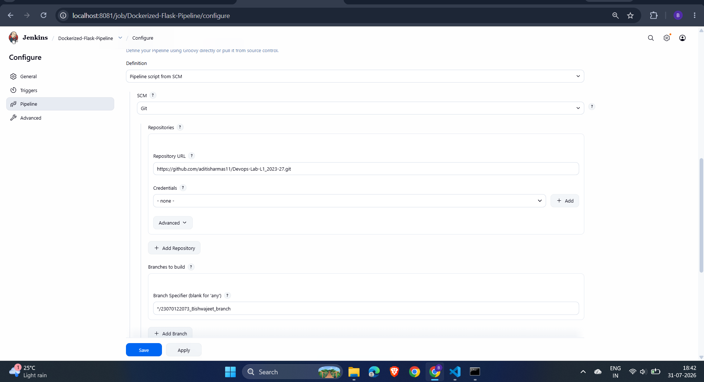
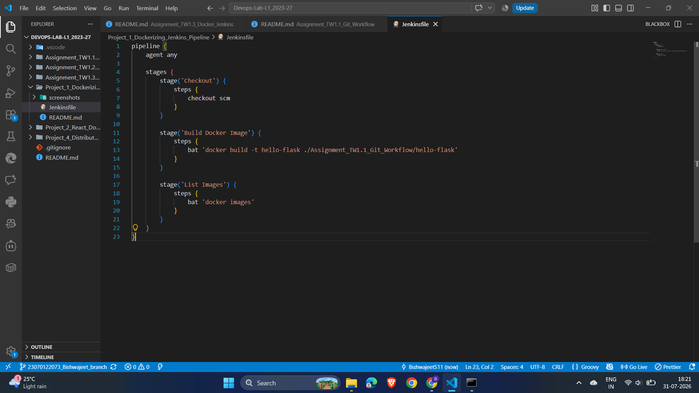
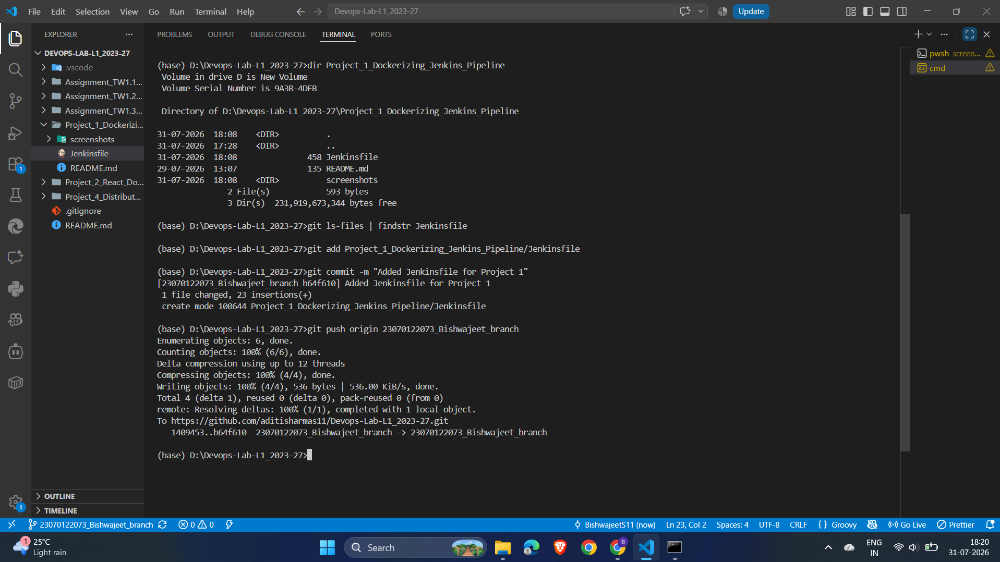
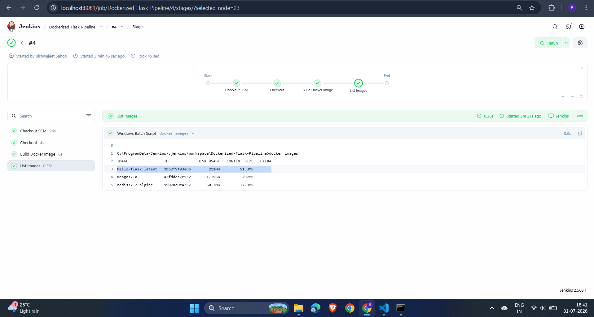
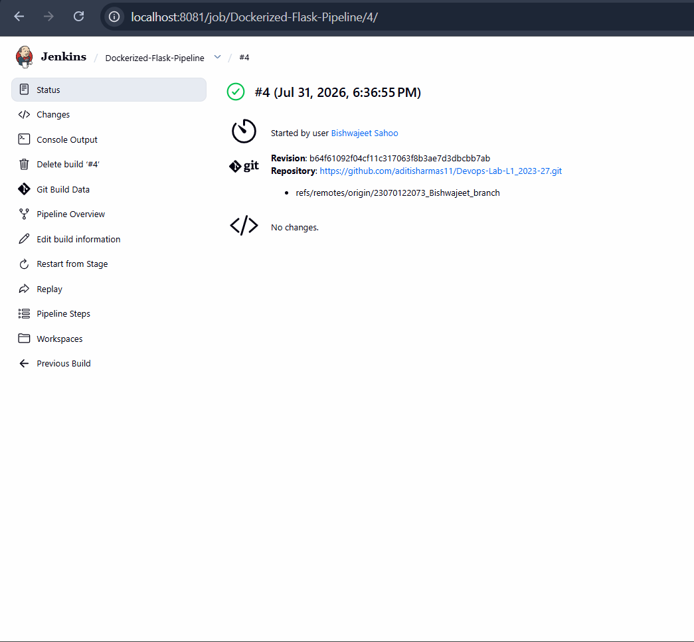
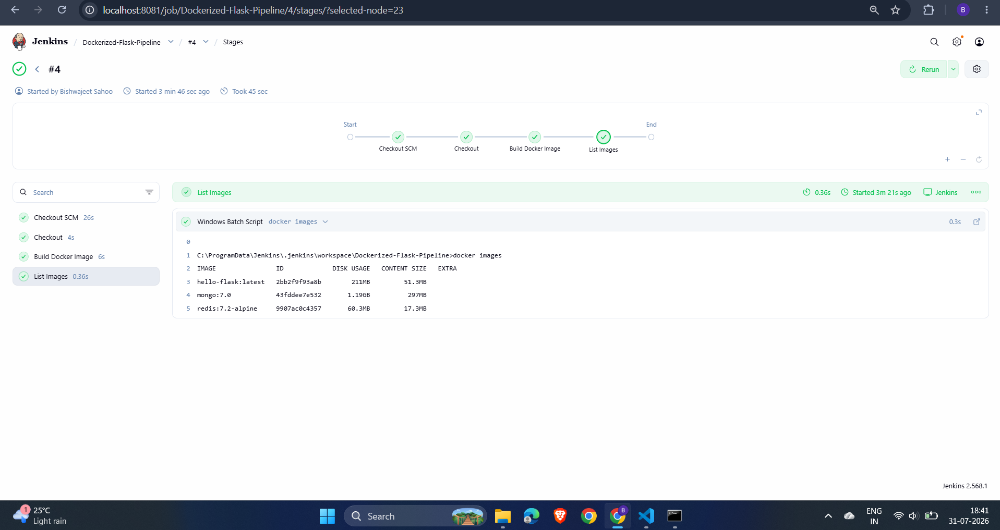
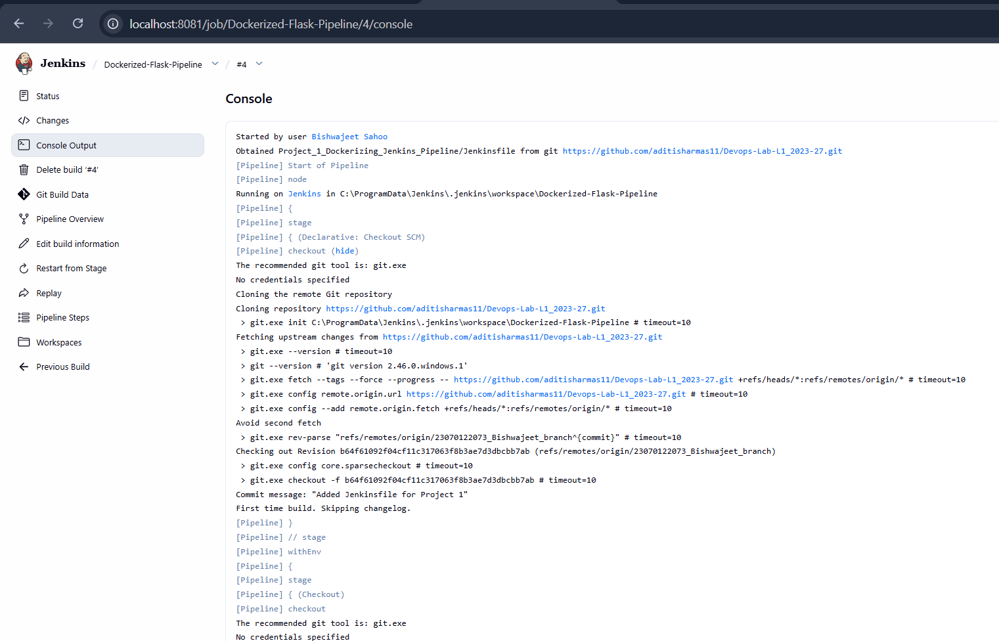
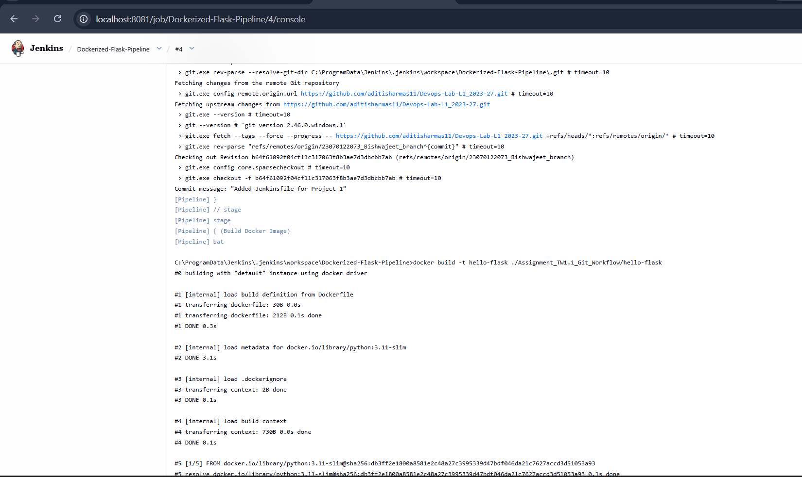
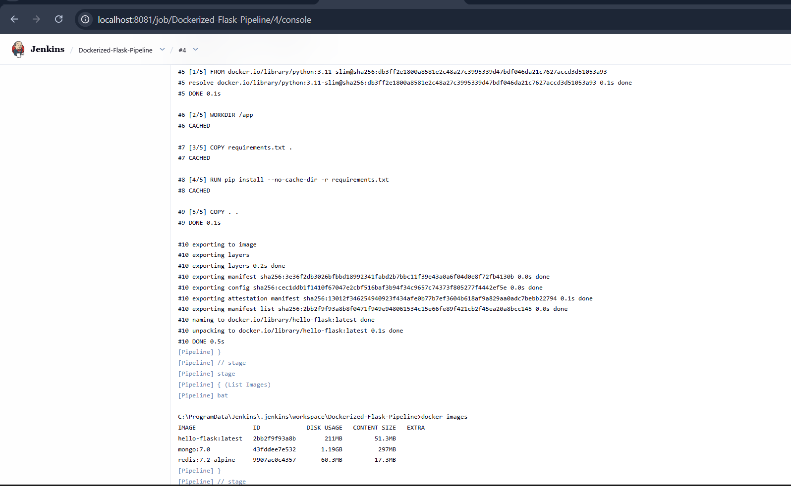
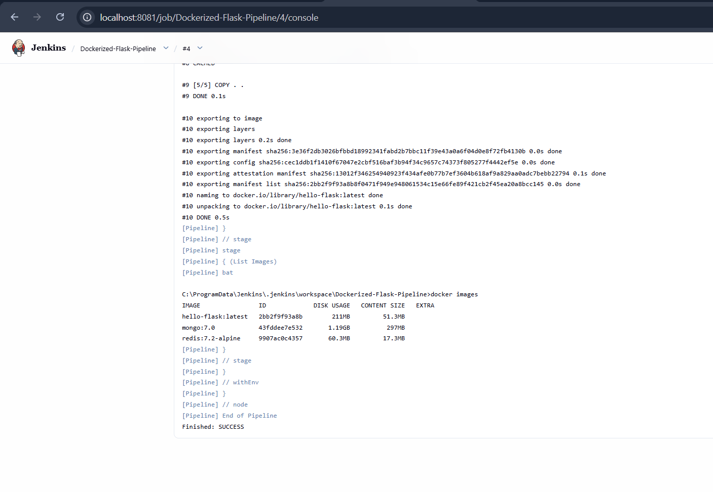

# Project 1 – Dockerizing Jenkins Pipeline

## Objective

The objective of this project is to automate the Docker image build process for a Python Flask application using a Jenkins Pipeline. The pipeline integrates with a GitHub repository, checks out the latest source code, builds a Docker image, and verifies the build by listing the available Docker images.

---

## Tools & Technologies

* Jenkins Pipeline
* Docker
* Docker Desktop
* Git
* GitHub
* Python
* Flask
* Windows PowerShell

---

## Project Overview

A Declarative Jenkins Pipeline was created to automate the build process of the Flask application. The pipeline is configured to:

* Connect to the GitHub repository.
* Checkout the latest code from the `23070122073_Bishwajeet_branch`.
* Build a Docker image for the Flask application.
* Verify the successful image creation by listing Docker images.

This demonstrates the fundamentals of Continuous Integration (CI) using Jenkins and Docker.

---

## Pipeline Workflow

### Stage 1 – Source Code Checkout

The pipeline retrieves the latest source code from the GitHub repository using the configured SCM settings.

**Screenshot**



---

### Stage 2 – Pipeline Configuration

The Jenkins Pipeline was configured using **Pipeline Script from SCM**, referencing the GitHub repository and the `Jenkinsfile` stored in the project directory.

**Screenshot**



---

### Stage 3 – Commit Jenkinsfile

The Jenkinsfile containing the pipeline definition was committed and pushed to the GitHub repository before executing the pipeline.

**Screenshot**



---

### Stage 4 – Build Docker Image

The pipeline builds the Docker image automatically using the following command:

```bash
docker build -t hello-flask ./Assignment_TW1.1_Git_Workflow/hello-flask
```

---

### Stage 5 – Verify Docker Images

After the build completes successfully, Jenkins executes:

```bash
docker images
```

to verify that the Docker image has been created successfully.

**Screenshot**



---

## Pipeline Execution

The Jenkins Pipeline completed successfully, executing all configured stages.

### Build Status



---

### Pipeline Stage View



---

## Console Output

The successful execution of each pipeline stage is shown below.

### Console Output – Part 1



### Console Output – Part 2



### Console Output – Part 3



### Console Output – Part 4



---

## Jenkinsfile Summary

The Declarative Jenkins Pipeline performs the following operations:

* Checkout source code from GitHub.
* Build the Docker image.
* Verify the generated Docker image.
* Report the build status.

---

## Learning Outcomes

After completing this project, the following DevOps concepts were successfully implemented:

* Jenkins Declarative Pipeline
* Source Code Management (SCM) integration with GitHub
* Docker image automation
* Continuous Integration (CI)
* Automated build execution
* Build verification using Jenkins Pipeline
* Docker image management

---

## Conclusion

This project demonstrates how Jenkins Pipelines can automate application build processes in a Continuous Integration environment. By integrating GitHub with Jenkins and Docker, the Flask application can be built automatically whenever the pipeline is executed. This workflow reduces manual effort, improves consistency, and forms the foundation of modern DevOps practices.
