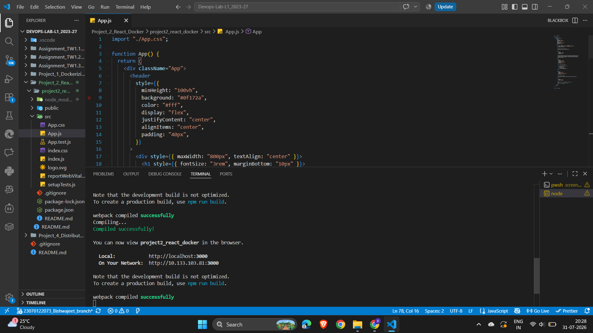
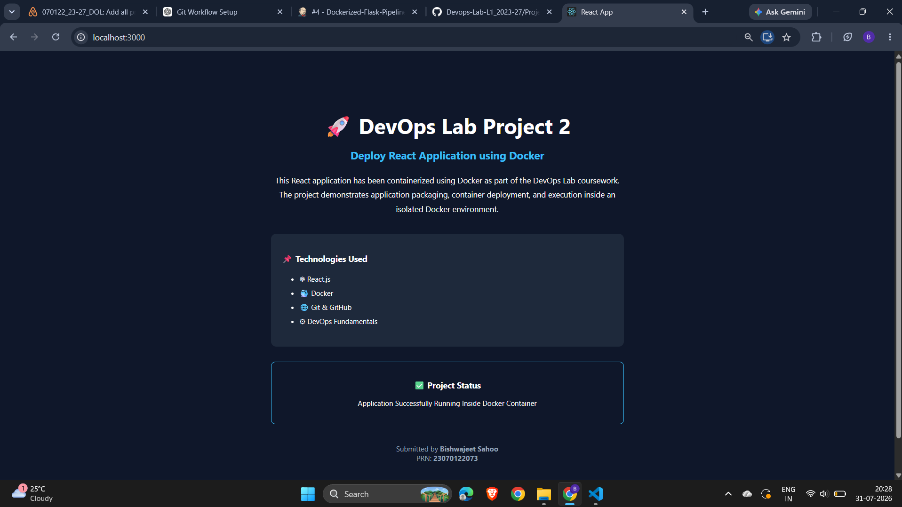
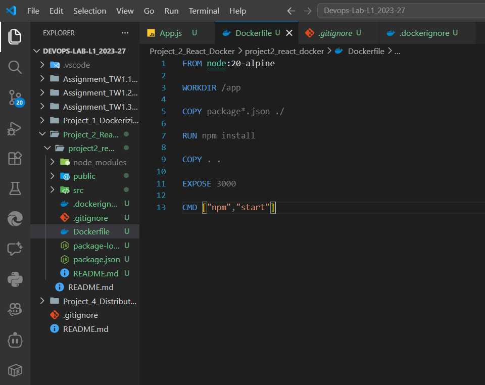
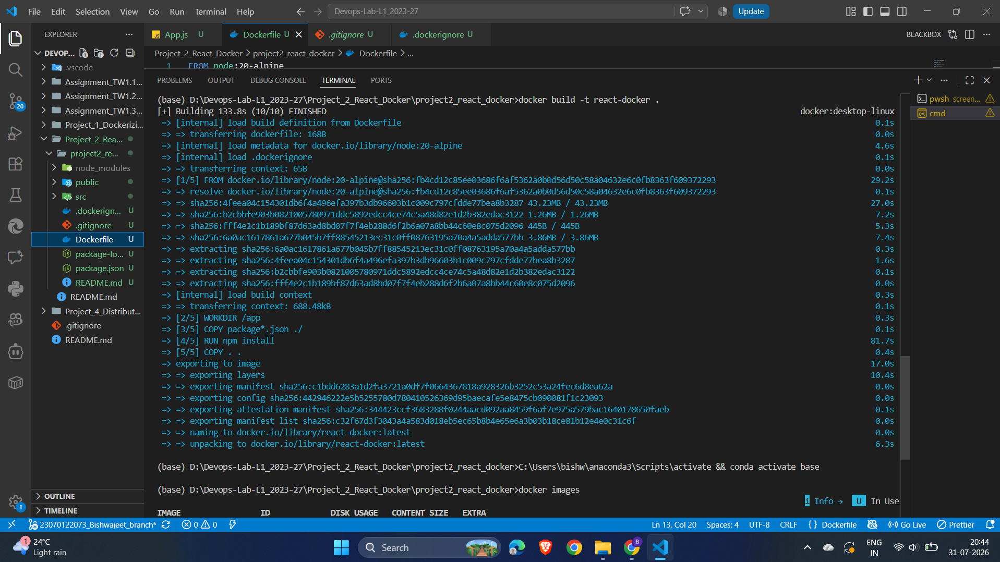
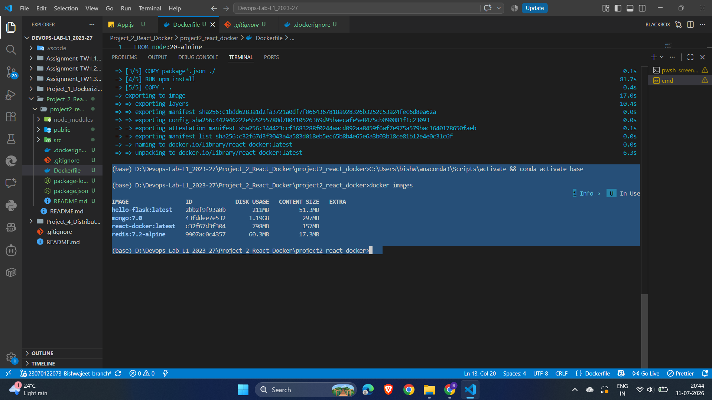
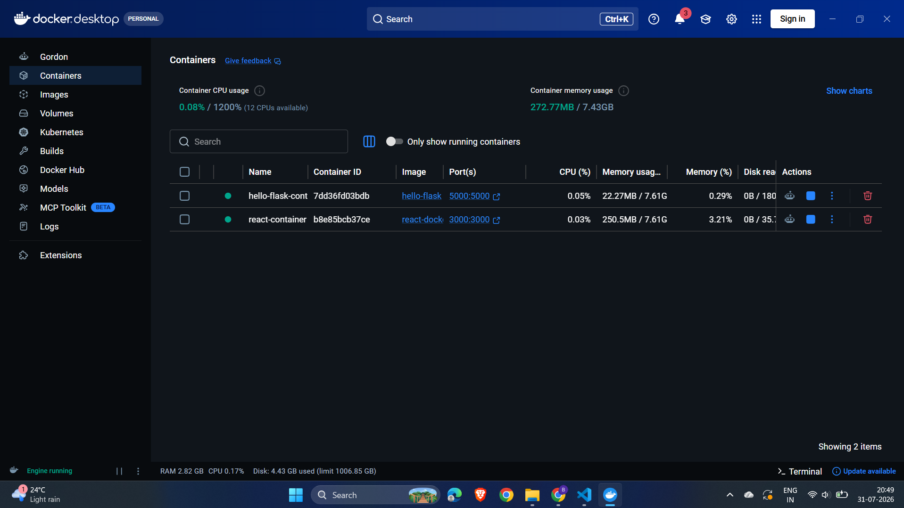
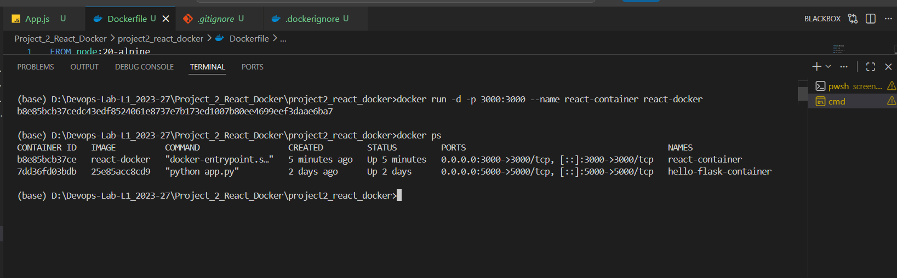
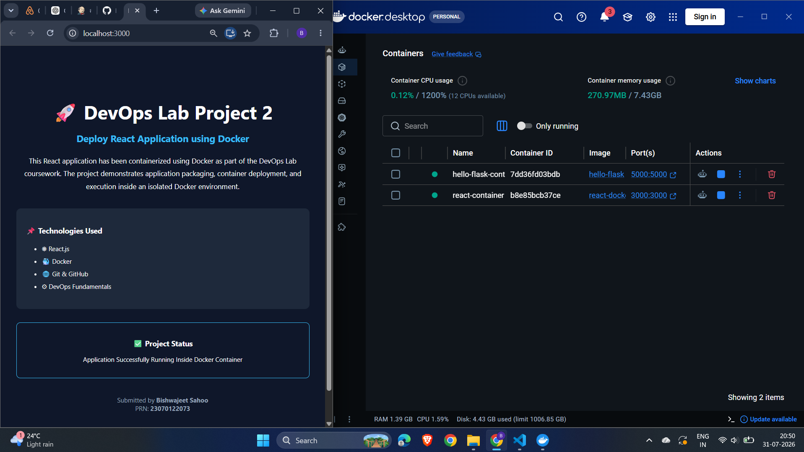
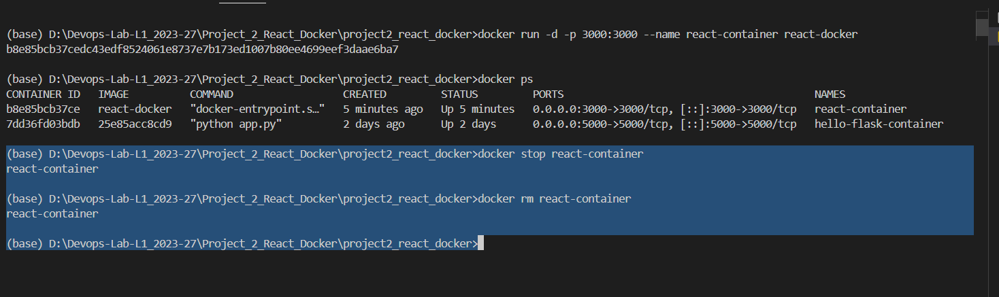

# Project 2 – Deploy React Application in Docker Container

## Objective

The objective of this project is to containerize a React application using Docker and deploy it inside a Docker container. This project demonstrates how frontend applications can be packaged into portable containers, enabling consistent execution across different environments.

---

## Tools & Technologies

* React.js
* Docker
* Docker Desktop
* Node.js
* Git
* GitHub
* Windows PowerShell

---

## Project Overview

A React application was created and customized to display a DevOps-themed landing page. The application was containerized using Docker by creating a Dockerfile and a `.dockerignore` file. A Docker image was built successfully, executed inside a container, and verified through a web browser.

---

## Project Structure

```
Project_2_React_Docker/
│
├── project2_react_docker/
│   ├── src/
│   ├── public/
│   ├── package.json
│   ├── package-lock.json
│   ├── Dockerfile
│   └── .dockerignore
│
├── screenshots/
└── README.md
```

---

## Step 1 – Create and Run React Application

A new React application was initialized using Create React App and customized to display a DevOps project landing page.

### Screenshot



---

## Step 2 – Verify React Application

The application was successfully executed using the React development server and verified in the browser.

### Screenshot



---

## Step 3 – Create Dockerfile

A Dockerfile was created to define the container image for the React application.

The Dockerfile performs the following operations:

* Uses the Node.js base image
* Sets the working directory
* Copies project files
* Installs dependencies
* Exposes port **3000**
* Starts the React application

### Screenshot



---

## Step 4 – Build Docker Image

The Docker image was built using the following command:

```bash
docker build -t react-docker .
```

### Screenshot



---

## Step 5 – Verify Docker Image

The generated Docker image was verified successfully.

### Screenshots





---

## Step 6 – Run Docker Container

The container was started using:

```bash
docker run -d -p 3000:3000 --name react-container react-docker
```

### Screenshot



---

## Step 7 – Verify Container Output

The running application was successfully accessed in the browser using:

```
http://localhost:3000
```

### Screenshot



---

## Step 8 – Stop and Remove Container

After successful verification, the Docker container was stopped and removed.

Commands used:

```bash
docker stop react-container

docker rm react-container
```

### Screenshot



---

## Learning Outcomes

After completing this project, the following DevOps concepts were successfully implemented:

* React application development
* Docker containerization
* Docker image creation
* Docker container deployment
* Port mapping
* Container lifecycle management
* Frontend application deployment using Docker

---

## Conclusion

This project demonstrated the successful deployment of a React application inside a Docker container. Docker simplified application packaging and deployment while providing a consistent runtime environment. This approach forms the foundation of modern frontend deployment practices and Continuous Delivery (CD) pipelines in DevOps.
