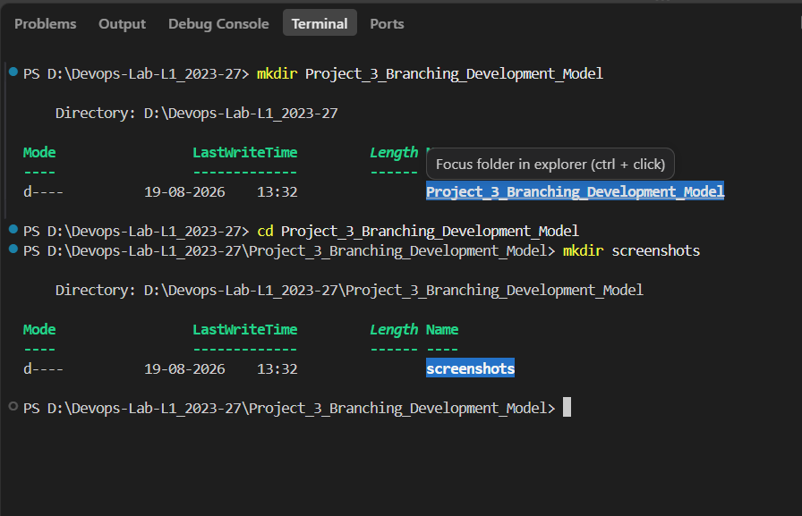
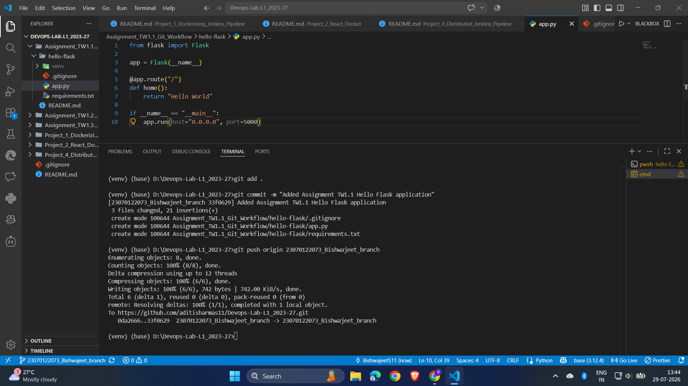
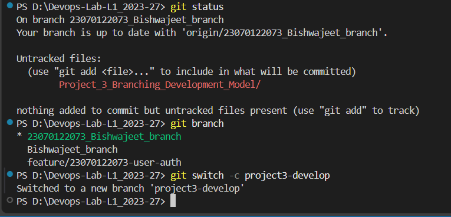
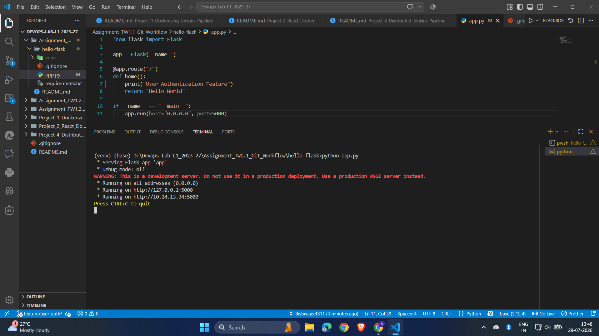
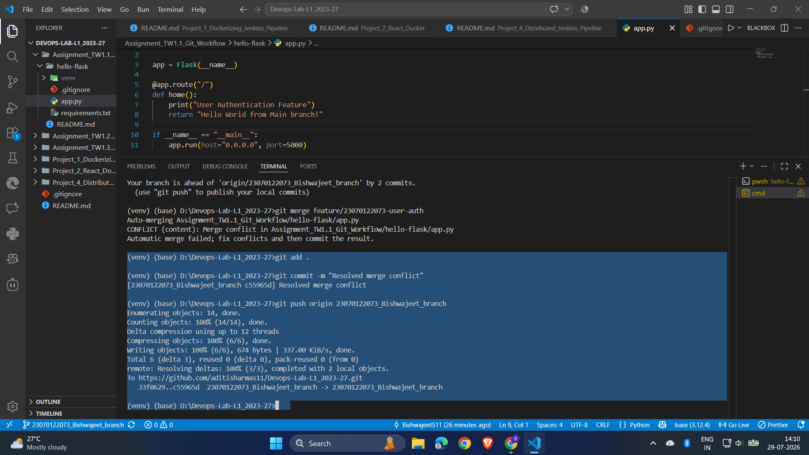
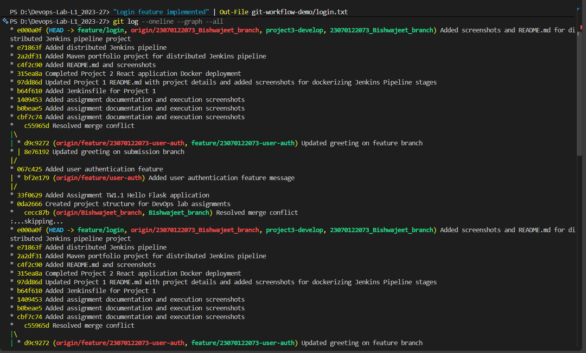
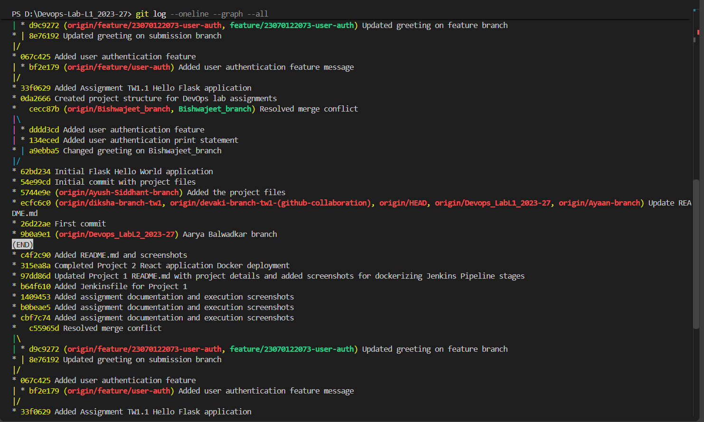
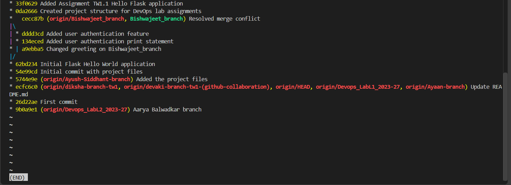

# Project 3 – Branching Development Model

## Objective

The objective of this project is to understand and implement a Git branching development model that helps a development team work on different features independently and integrate changes efficiently.

This project demonstrates the Git workflow for creating branches, switching between branches, developing a feature, pushing changes to GitHub, handling merge conflicts, resolving conflicts, and visualizing the final branch and commit history.

---

# Tools & Technologies

* Git
* GitHub
* Git Bash / Windows PowerShell
* Python
* Flask
* Python Virtual Environment
* Git Branching
* Git Merge
* GitHub Repository

---

# Project Overview

A simple Flask application was used to demonstrate a practical Git branching workflow.

The project started with an initial application and Git repository. A separate feature branch was then created for implementing user authentication functionality.

The development workflow consisted of:

* Creating the project repository
* Making the initial Git commit
* Pushing the project to GitHub
* Creating a feature branch
* Switching to the feature branch
* Developing the user authentication feature
* Pushing the feature branch to GitHub
* Creating and identifying a merge conflict
* Resolving the merge conflict
* Integrating the feature changes
* Reviewing the Git branch and commit history

This workflow demonstrates how Git branching allows developers to work independently while maintaining an organized development history.

---

# Project Structure

```text
Project_3_Branching_Development_Model/
│
├── flask-app/
│   ├── app.py
│   ├── requirements.txt
│   └── venv/
│
├── screenshots/
│   ├── project3_setup.png
│   ├── initial_commit_cmd.png
│   ├── initial_commit_github_view.png
│   ├── creating_new_branch.png
│   ├── creating_auth_feature_branch.png
│   ├── switching_to_auth_feature_branch.png
│   ├── user_auth_feature_code.png
│   ├── pushing_auth_feature_code_to_github.png
│   ├── git_merge_conflict.png
│   ├── git_resolved_merge_conflict.png
│   ├── git_online_graph_log1.png
│   ├── git_online_graph_log2.png
│   └── git_online_graph_log3.png
│
└── README.md
```

---

# Step 1 – Project Setup

The Project 3 directory was created as the working directory for implementing the Git branching development model.

The project setup was verified before beginning the Git workflow.

### Screenshot



---

# Step 2 – Create Flask Application

A simple Flask application was created to provide a practical application for demonstrating Git branching and feature development.

A Python virtual environment was configured for the application, and Flask was installed as the application dependency.

The Flask application was then executed locally to verify that the initial application was working correctly.

The application provided the base project that was subsequently managed using Git.

---

# Step 3 – Initialize Git Repository

Git was initialized for the project so that the application source code could be tracked using version control.

The project files were added to Git and the initial commit was created.

### Initial Commit

The initial version of the project was committed to the local Git repository.

### Screenshot



---

# Step 4 – Push Initial Project to GitHub

After creating the initial commit, the repository was connected to GitHub and the project was pushed to the remote repository.

This established the initial version of the project on GitHub.

### Screenshot


---

# Step 5 – Create Development Branch

A separate branch was created to demonstrate feature-based development.

Creating a separate branch allows developers to work on new functionality without directly modifying the stable development code.

### Command Used

```powershell
git branch
```

A new branch was created for the feature development workflow.

### Screenshot



---

# Step 6 – Create Authentication Feature Branch

A dedicated authentication feature branch was created for developing the user authentication functionality.

The feature branch separates the authentication work from the main development branch.

This approach allows the feature to be developed independently before being integrated into the main project.

### Screenshot


---

# Step 7 – Switch to Authentication Feature Branch

After creating the feature branch, the working directory was switched to the authentication feature branch.

This ensured that the authentication-related development was performed on the feature branch rather than directly on the main branch.

### Screenshot


---

# Step 8 – Develop Authentication Feature

The user authentication functionality was developed on the feature branch.

The feature code was added while keeping the main development branch isolated from the ongoing feature changes.

This demonstrates the main advantage of feature branching: developers can implement and test new functionality independently.

### Screenshot



---

# Step 9 – Push Feature Branch to GitHub

After implementing the authentication feature, the changes were committed and the feature branch was pushed to the GitHub repository.

This made the feature branch available in the remote repository and allowed the development history to be tracked remotely.

### Screenshot


---

# Step 10 – Demonstrate Merge Conflict

A merge conflict was intentionally demonstrated to understand how Git handles conflicting changes made in different branches.

A merge conflict occurs when Git cannot automatically determine which version of a conflicting section should be retained.

The conflict was identified during the branch integration process.

### Screenshot


---

# Step 11 – Resolve Merge Conflict

The conflicting changes were manually reviewed and resolved.

After resolving the conflicting content, the corrected files were staged and the merge process was completed.

This demonstrates an important part of collaborative Git development because conflicts can occur when multiple developers modify the same files or sections of code.

### Screenshot



---

# Step 12 – Verify Git Branch and Commit History

After completing the branching and integration workflow, the Git history was reviewed to verify the development process.

The online Git graph provides a visual representation of the branches and commits created during the project.

### Git History – View 1



### Git History – View 2



### Git History – View 3



These Git graph views demonstrate the branch structure and commit history generated during the development workflow.

---

# Git Branching Workflow

The complete branching workflow implemented in this project can be represented as:

```text
Main / Development Branch
          │
          │
          ├──────────────► Authentication Feature Branch
          │                         │
          │                         ▼
          │                  Develop Feature
          │                         │
          │                         ▼
          │                  Commit Changes
          │                         │
          │                         ▼
          │                  Push to GitHub
          │                         │
          └─────────────────────────┤
                                    ▼
                              Merge Changes
                                    │
                                    ▼
                             Merge Conflict
                                    │
                                    ▼
                            Resolve Conflict
                                    │
                                    ▼
                             Complete Merge
                                    │
                                    ▼
                              Git History
```

---

# Git Commands Used

## Initialize Repository

```powershell
git init
```

## Check Repository Status

```powershell
git status
```

## Add Files

```powershell
git add .
```

## Create Initial Commit

```powershell
git commit -m "Initial commit"
```

## Create a Branch

```powershell
git branch feature/login
```

## Create and Switch to a Branch

```powershell
git switch -c feature/login
```

## View Branches

```powershell
git branch
```

## Switch Branch

```powershell
git switch feature/login
```

## Add Changes

```powershell
git add .
```

## Commit Feature Changes

```powershell
git commit -m "Add authentication feature"
```

## Push Feature Branch

```powershell
git push -u origin feature/login
```

## Merge a Branch

```powershell
git merge feature/login
```

## Check Commit History

```powershell
git log --oneline --graph --all
```

---

# Branching Development Model

The project demonstrates a feature-based Git branching model.

The general workflow is:

```text
Main Branch
    │
    ├── Feature Branch
    │       │
    │       ├── Development
    │       ├── Commit
    │       └── Push
    │
    └── Merge
          │
          ├── Resolve Conflicts
          │
          └── Integrated Code
```

This model allows different developers or teams to work on independent features without continuously modifying the same branch.

---

# Merge Conflict Resolution Workflow

The merge conflict workflow demonstrated in this project was:

```text
Feature Development
        ↓
Commit Changes
        ↓
Push Feature Branch
        ↓
Merge Feature Branch
        ↓
Merge Conflict
        ↓
Identify Conflicting Changes
        ↓
Manually Resolve Conflict
        ↓
Stage Resolved Files
        ↓
Complete Merge
        ↓
Verify Git History
```

This provides practical experience with one of the common challenges encountered in collaborative Git development.

---

# Learning Outcomes

After completing this project, the following concepts were successfully implemented:

* Git repository initialization
* Git version control
* Git commits
* Git branches
* Feature branch development
* Branch switching
* GitHub remote repository
* Pushing branches to GitHub
* Branch-based development workflow
* Git merge
* Merge conflict identification
* Merge conflict resolution
* Git commit history
* Git graph visualization
* Collaborative development workflow
* Faster feature integration using Git branching

---

# Advantages of Branching Development

The branching model demonstrated in this project provides several benefits:

### 1. Independent Development

Developers can work on individual features without directly modifying the main development branch.

### 2. Safer Integration

Feature changes can be reviewed and tested before they are merged into the main branch.

### 3. Parallel Development

Multiple developers can work on different features at the same time.

### 4. Conflict Management

Git provides tools for identifying and resolving conflicts when different branches modify the same files.

### 5. Organized History

Branches and commits provide a clear record of how features were developed and integrated.

---

# Conclusion

This project successfully demonstrated a Git branching development model for faster and more organized work integration.

A Flask application was used as the base project, after which Git version control was implemented and the initial project was pushed to GitHub.

A separate authentication feature branch was created to demonstrate feature-based development. The feature was developed independently, committed, and pushed to GitHub.

A merge conflict was then demonstrated and manually resolved, providing practical experience with collaborative Git workflows.

Finally, the Git graph and commit history were reviewed to verify the branching and integration process.

Overall, this project provided practical experience with Git branching, feature development, GitHub integration, merge operations, conflict resolution, and version-control workflows used in modern software development teams.
