# Project 4 – Architecting Jenkins Pipeline for Scale (Distributed Jenkins Pipeline)

## Objective

The objective of this project is to understand the concept of distributed Continuous Integration using Jenkins by configuring multiple Jenkins agent nodes and executing a Maven project across different build agents. This demonstrates how Jenkins distributes workloads to improve scalability, performance, and build efficiency.

---

# Tools & Technologies

* Jenkins
* Jenkins Pipeline
* Jenkins Agents (Distributed Nodes)
* Apache Maven
* Java JDK 21
* Git
* GitHub
* Windows PowerShell

---

# Project Overview

A simple Maven Portfolio application was created and managed using GitHub. Two Jenkins agents were configured on a Windows machine to simulate a distributed build environment. A Jenkins Pipeline was created to execute different stages of the build process on separate agents.

The pipeline performs the following operations:

* Checks out the project from GitHub
* Builds the Maven project on **Agent-1**
* Executes unit tests on **Agent-2**
* Packages the Maven application
* Archives the generated build artifact

This demonstrates workload distribution among multiple Jenkins nodes.

---

# Project Structure

```text
Project_4_Distributed_Jenkins_Pipeline/
│
├── portfolio/
│   ├── pom.xml
│   ├── src/
│   └── target/
│
├── Jenkinsfile
├── screenshots/
└── README.md
```

---

# Step 1 – Create Maven Portfolio Project

A Maven Quickstart project was generated using the Maven Archetype Plugin.

### Command Used

```bash
mvn archetype:generate ^
-DgroupId=com.bishwajeet.portfolio ^
-DartifactId=portfolio ^
-DarchetypeArtifactId=maven-archetype-quickstart ^
-DinteractiveMode=false
```

### Screenshots

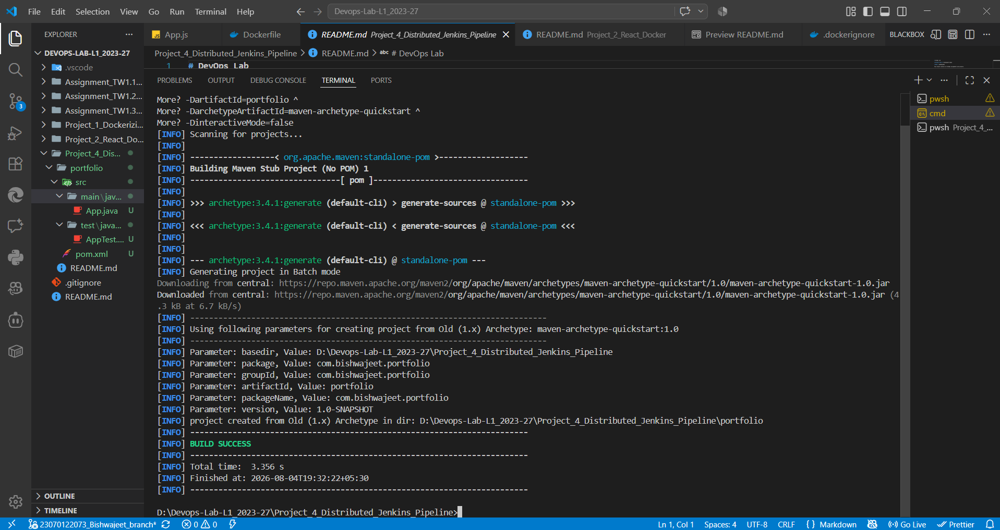

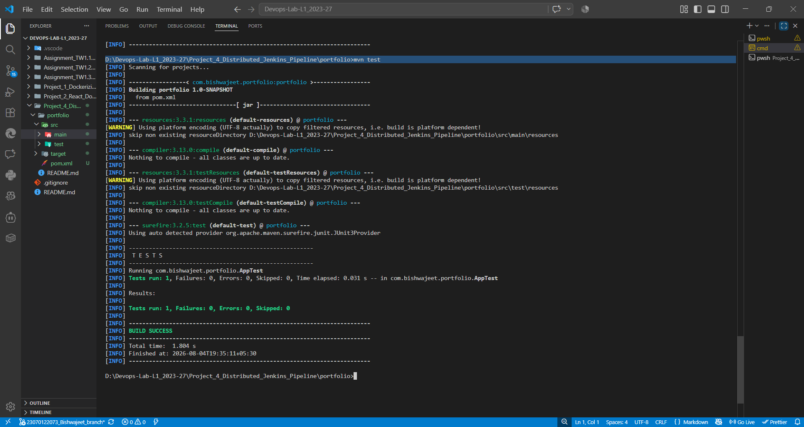

---

# Step 2 – Push Project to GitHub

The Maven project and supporting files were committed and pushed to the GitHub repository.

### Screenshot

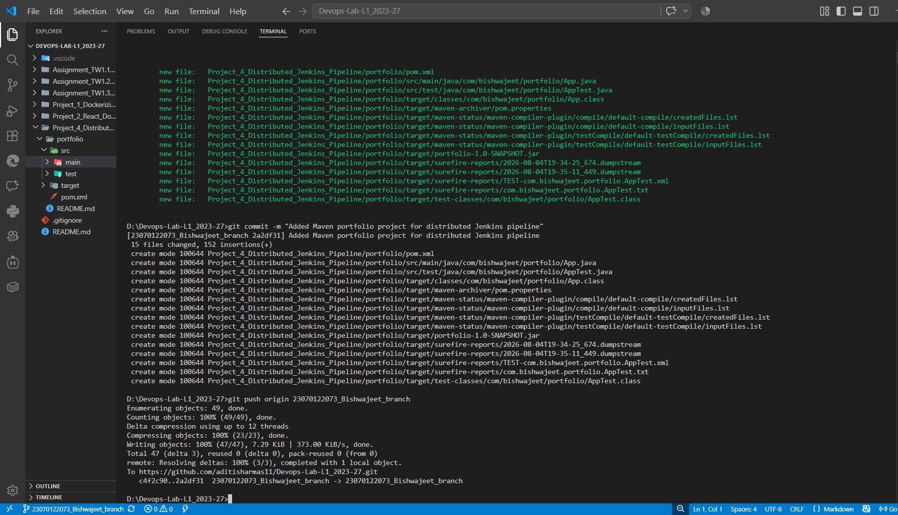

---

# Step 3 – Create Jenkins Agents

Two permanent Jenkins agents were created to simulate a distributed build environment.

### Agent Configuration

| Agent   | Label  | Remote Workspace  |
| ------- | ------ | ----------------- |
| Agent-1 | agent1 | C:\Jenkins\agent1 |
| Agent-2 | agent2 | C:\Jenkins\agent2 |

### Screenshots

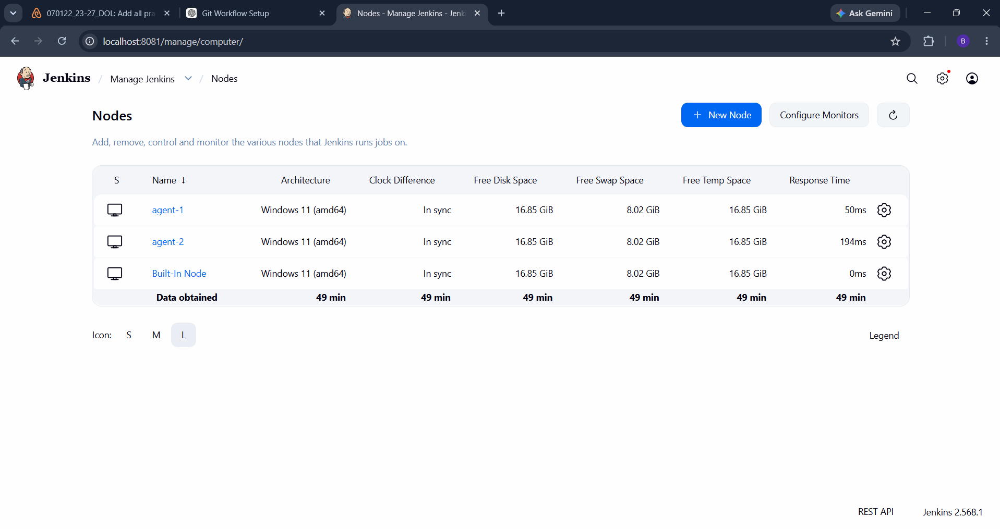

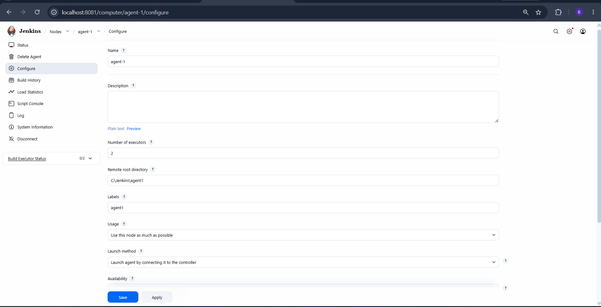

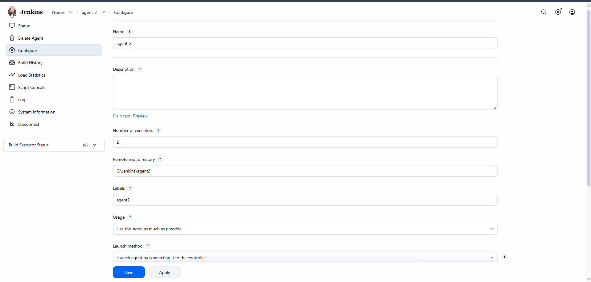

---

# Step 4 – Connect Jenkins Agents

Both Jenkins agents were connected successfully using the Jenkins Remoting Agent.

### Screenshots

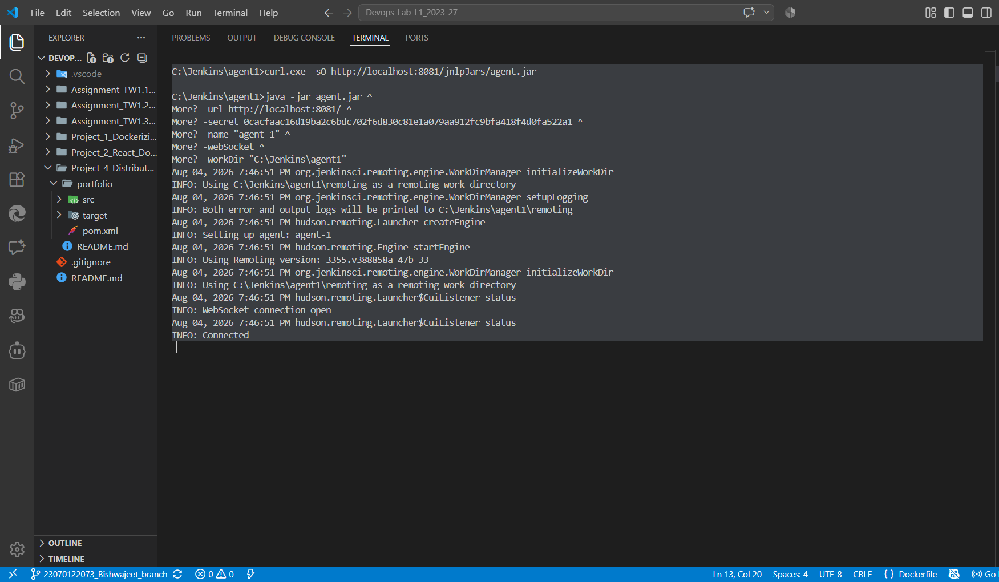

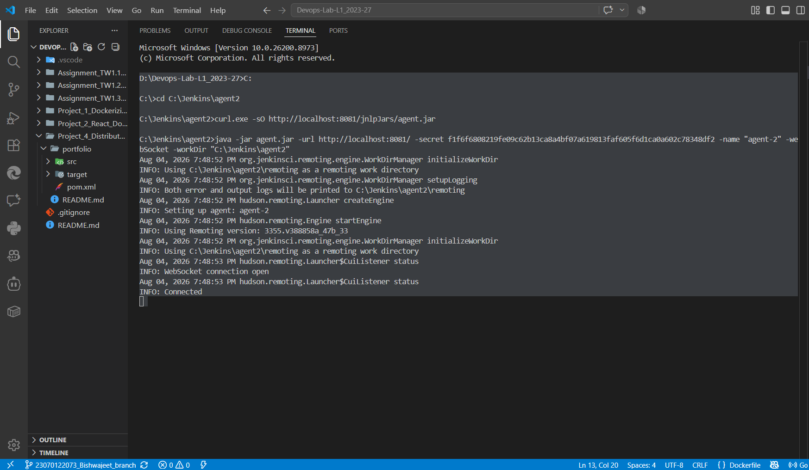

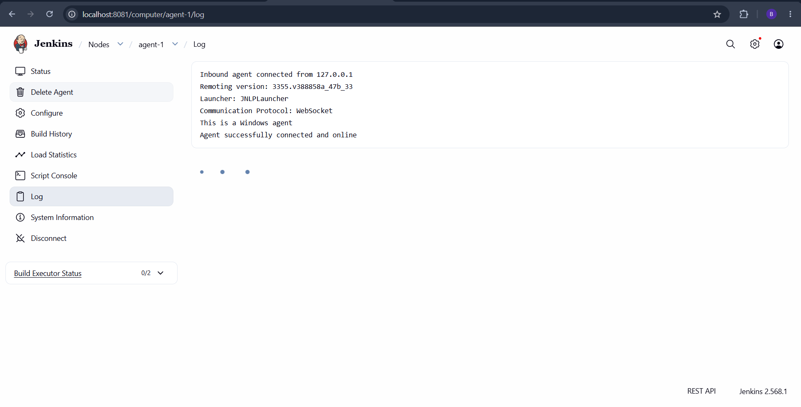

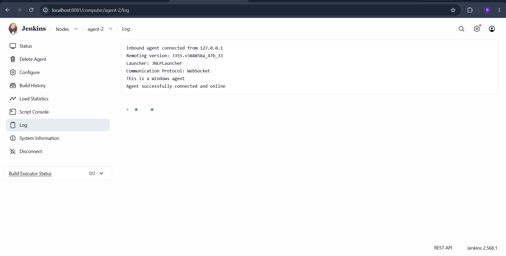

---

# Step 5 – Create Jenkins Pipeline

A Declarative Jenkins Pipeline was created using a Jenkinsfile stored in the GitHub repository.

Pipeline stages:

* Checkout Source Code
* Build
* Test
* Package
* Archive Artifact

### Screenshot

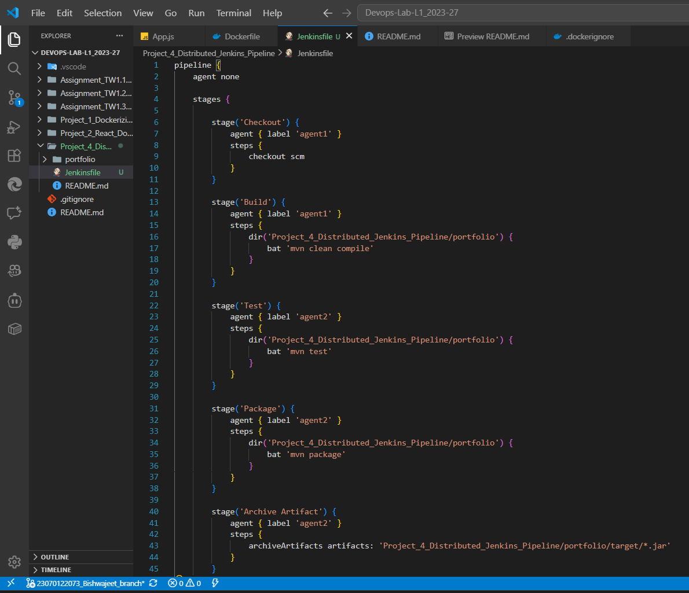

---

# Step 6 – Configure Jenkins Pipeline Job

A Jenkins Pipeline project was configured to pull the Jenkinsfile directly from the GitHub repository.

### Screenshot

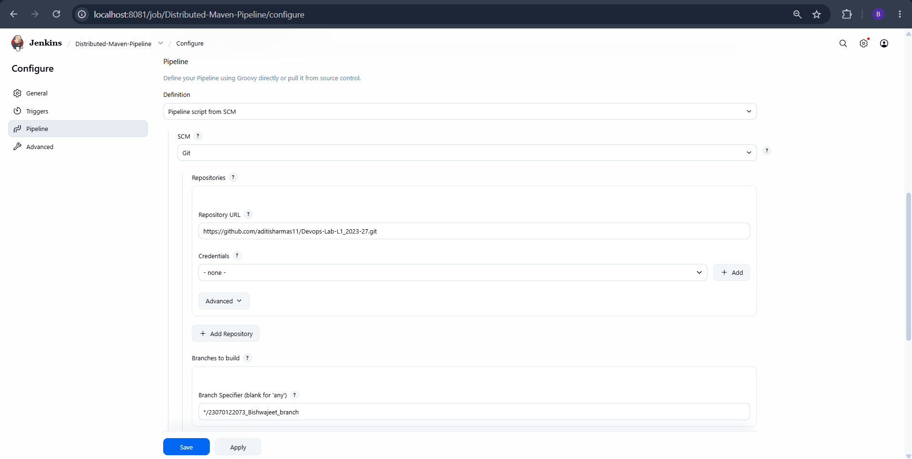

---

# Step 7 – Execute Distributed Pipeline

The pipeline was executed successfully.

Execution flow:

* **Checkout** → Agent-1
* **Build** → Agent-1
* **Test** → Agent-2
* **Package** → Agent-2
* **Archive Artifacts** → Agent-2

This demonstrates distributed execution using multiple Jenkins agents.

### Screenshots

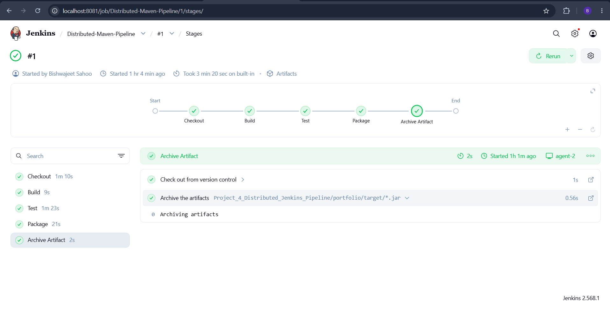

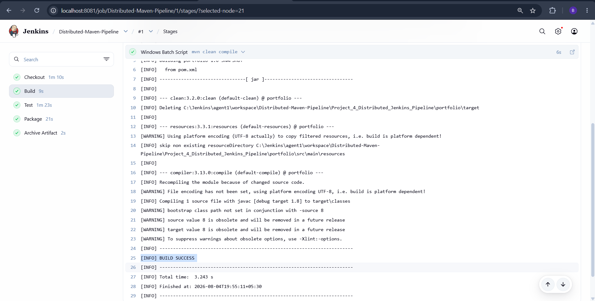

---

# Step 8 – Pipeline Console Output

The Jenkins Console Output verifies that the pipeline executed successfully across multiple agents.

### Screenshots

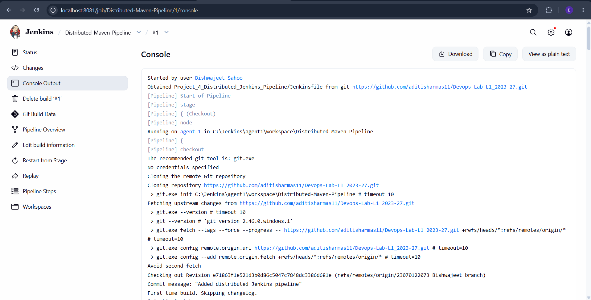

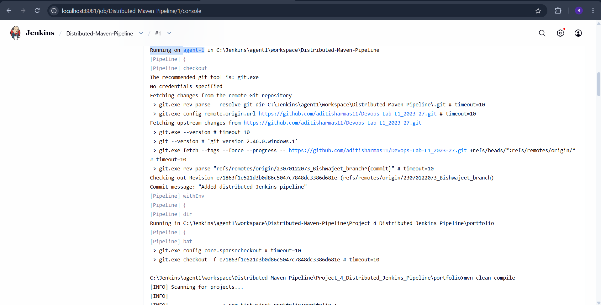

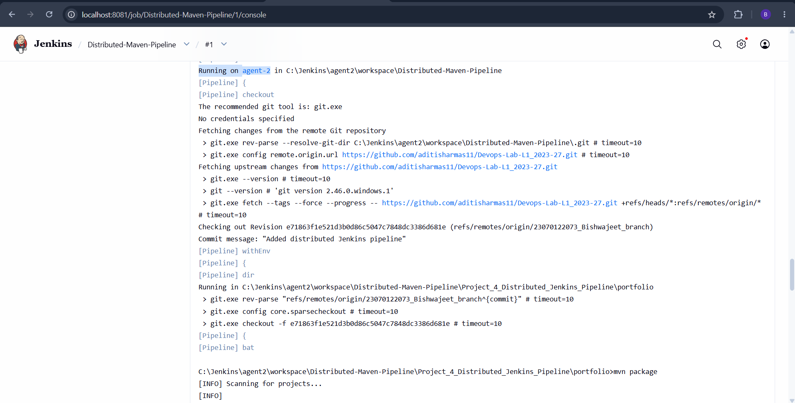

---

# Step 9 – Archive Generated Artifact

The packaged Maven artifact was archived successfully after completion of the pipeline.

### Screenshot

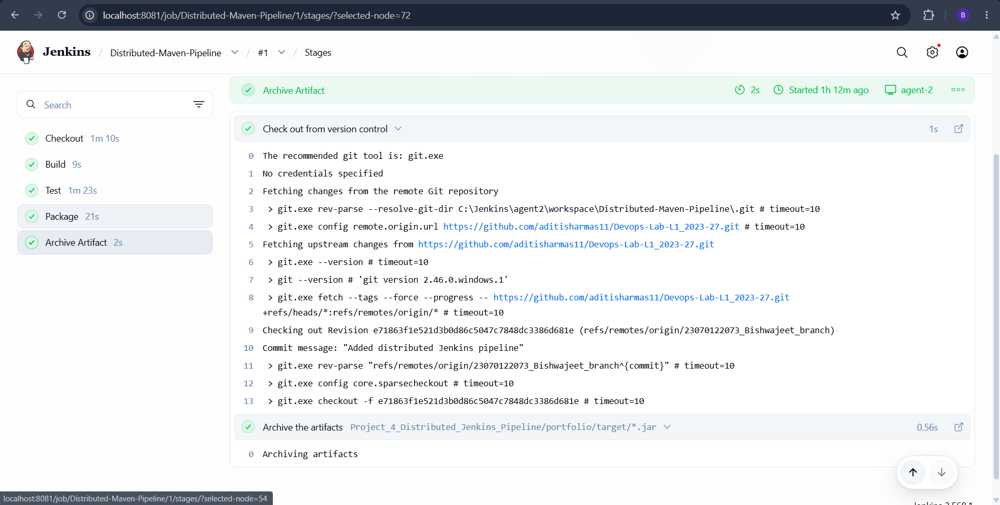

---

# Learning Outcomes

After completing this project, the following DevOps concepts were successfully implemented:

* Apache Maven project creation
* Maven build lifecycle
* Jenkins Declarative Pipeline
* Jenkins Pipeline as Code
* Distributed Jenkins Architecture
* Jenkins Agent configuration
* Build execution across multiple nodes
* GitHub integration with Jenkins
* Artifact generation and archiving
* Continuous Integration (CI) workflow

---

# Conclusion

This project successfully demonstrated the implementation of a distributed Jenkins Pipeline using two Jenkins agents. The Maven application was built, tested, packaged, and archived through separate execution nodes, illustrating the scalability and flexibility of distributed Continuous Integration. The project provided practical experience with Jenkins Pipeline as Code, multi-agent execution, Maven automation, and artifact management, reinforcing essential DevOps concepts used in modern software development and CI/CD environments.
