# Project 5 – Containerizing Spring Boot Application and Docker Image Security Scanning

## Objective

The objective of this project is to develop a Spring Boot REST API, package the application using Maven, containerize the application using Docker, run the Docker container with port mapping, and perform vulnerability scanning on the Docker image.

This project demonstrates the basic DevOps workflow of developing an application, packaging it, creating a container image, running the containerized application, verifying the REST API, and performing container security analysis.

---

# Tools & Technologies

* Java JDK 21
* Spring Boot
* Spring Web
* Spring Boot DevTools
* Apache Maven
* REST API
* Docker
* Dockerfile
* Docker Container
* Trivy
* Git
* GitHub
* Windows PowerShell

---

# Project Overview

A simple Retail Product REST API was developed using Spring Boot.

The application provides two REST endpoints:

* `GET /api/products`
* `GET /api/products/health`

The application was first tested locally using Spring Boot and Maven. After confirming that the API worked correctly, the application was packaged into a JAR file using Maven.

The generated JAR file was then containerized using Docker.

The Docker image was created as:

```text
retail-springboot:1.0
```

The containerized application was executed using port **8000**.

Finally, the Docker image was scanned using Trivy to identify known vulnerabilities in the container image and its dependencies.

---

# Project Structure

```text
Project_5_SpringBoot_Docker_DTR/
│
├── springboot-retail-app/
│   │
│   ├── src/
│   │   ├── main/
│   │   │   ├── java/
│   │   │   │   └── com/
│   │   │   │       └── devops/
│   │   │   │           └── retail_app/
│   │   │   │               ├── RetailAppApplication.java
│   │   │   │               ├── controller/
│   │   │   │               │   └── ProductController.java
│   │   │   │               └── model/
│   │   │   │                   └── Product.java
│   │   │   │
│   │   │   └── resources/
│   │   │       └── application.properties
│   │   │
│   │   └── test/
│   │
│   ├── target/
│   │   └── retail-app-0.0.1-SNAPSHOT.jar
│   │
│   ├── Dockerfile
│   ├── .dockerignore
│   ├── pom.xml
│   ├── mvnw
│   └── mvnw.cmd
│
├── screenshots/
│
└── README.md
```

---

# Step 1 – Create Project Directory

The Project 5 directory was created inside the DevOps laboratory repository.

### Commands Used

```powershell
cd D:\Devops-Lab-L1_2023-27

mkdir Project_5_SpringBoot_Docker_DTR

cd Project_5_SpringBoot_Docker_DTR

mkdir screenshots
```

The Spring Boot application was created inside:

```text
Project_5_SpringBoot_Docker_DTR/springboot-retail-app
```

### Screenshot

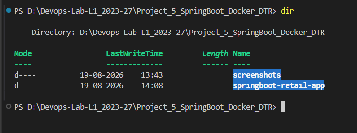

---

# Step 2 – Generate Spring Boot Application

The Spring Boot application was generated using Spring Initializr.

The following configuration was used:

| Configuration | Value                |
| ------------- | -------------------- |
| Project       | Maven                |
| Language      | Java                 |
| Java Version  | 21                   |
| Group         | `com.devops`         |
| Artifact      | `retail-app`         |
| Packaging     | Jar                  |
| Spring Boot   | 4.1.0                |
| Dependency    | Spring Web           |
| Dependency    | Spring Boot DevTools |

The generated project was extracted into:

```text
springboot-retail-app
```

### Screenshot

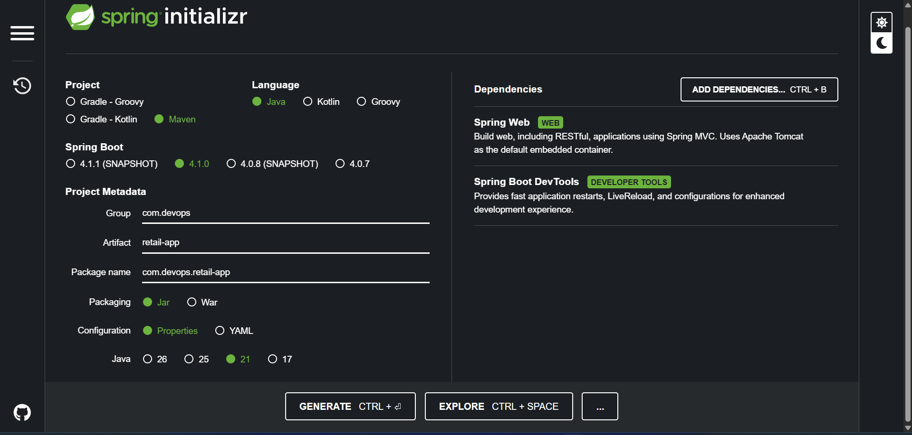

---

# Step 3 – Verify Java and Maven

Java 21 and Maven were verified before building the application.

### Java Version

```powershell
java -version
```

The system was configured with:

```text
Java 21.0.11 LTS
```

### Maven Version

The Maven Wrapper was also verified:

```powershell
.\mvnw.cmd -version
```

Maven was successfully detected and configured with Java 21.

---

# Step 4 – Spring Boot Application Structure

The generated Spring Boot application contains the main application class:

```text
RetailAppApplication.java
```

The application uses the Spring Boot entry point to start the embedded web server.

The project was organized into separate model and controller packages.

### Application Structure

```text
com.devops.retail_app/
│
├── RetailAppApplication.java
│
├── controller/
│   └── ProductController.java
│
└── model/
    └── Product.java
```

### Screenshot

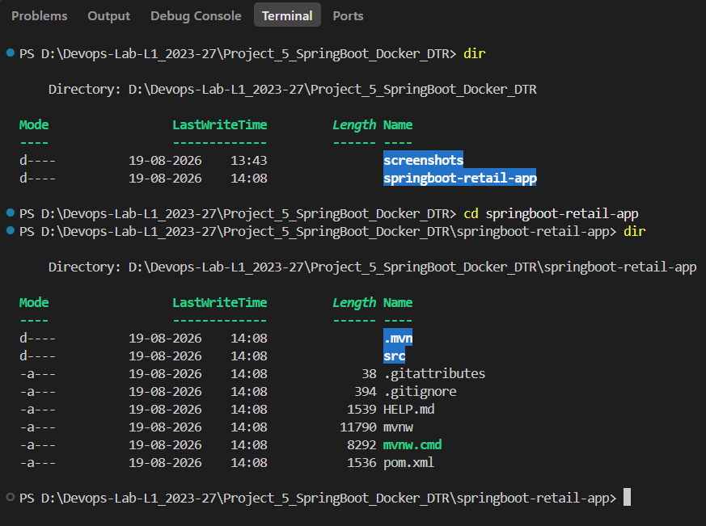

---

# Step 5 – Create Product Model

A **`Product`** model was created to represent retail products.

The model contains the following fields:

```text
id
name
category
price
```

Example:

```java
public class Product {

    private int id;
    private String name;
    private String category;
    private double price;

    // Constructors, getters and setters
}
```

The model is used by the REST controller to return product information in JSON format.

---

# Step 6 – Create REST Controller

A **`ProductController`** was created using Spring MVC annotations.

The controller is mapped to:

```text
/api/products
```

Two endpoints were implemented.

### Products Endpoint

```text
GET /api/products
```

This endpoint returns a list of four retail products.

### Health Endpoint

```text
GET /api/products/health
```

This endpoint returns:

```text
Retail application is running
```

The controller uses:

```java
@RestController
@RequestMapping("/api/products")
```

to expose the REST API.

---

# Step 7 – Configure Application Port

The application was configured to use port **8000**.

The following configuration was added to:

```text
src/main/resources/application.properties
```

```properties
spring.application.name=retail-app
server.port=8000
```

Therefore, the application was accessed through:

```text
http://localhost:8000
```

---

# Step 8 – Run Spring Boot Application Locally

The Spring Boot application was first tested locally before containerization.

### Command Used

```powershell
.\mvnw.cmd spring-boot:run
```

The application started successfully on port **8000**.

This step verifies that the application works correctly before introducing Docker.

### Screenshot

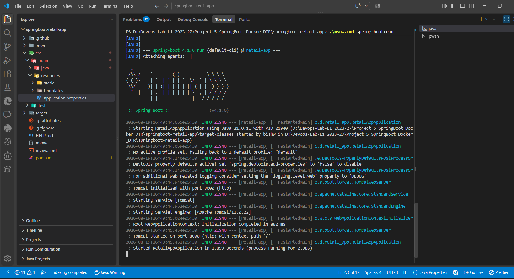

---

# Step 9 – Test REST API Locally

The Products API was tested using a web browser.

### Products API

```text
http://localhost:8000/api/products
```

The endpoint returned the retail product data in JSON format.

### Screenshot

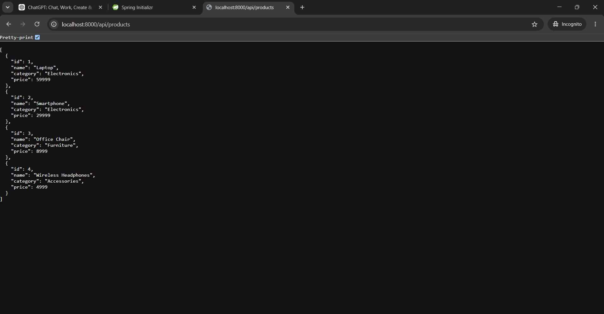

---

# Step 10 – Test Health API Locally

The health endpoint was also tested.

### URL

```text
http://localhost:8000/api/products/health
```

Expected response:

```text
Retail application is running
```

### Screenshot

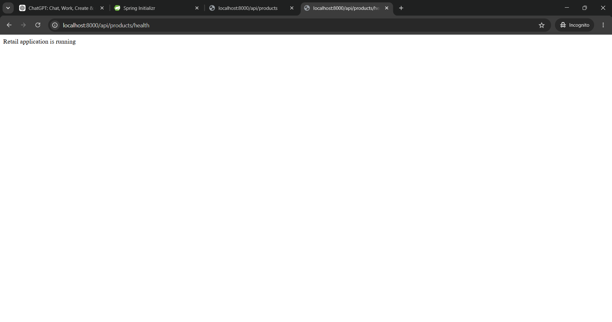

---

# Step 11 – Package Spring Boot Application Using Maven

After verifying the REST API locally, the application was packaged using Maven.

### Command Used

```powershell
.\mvnw.cmd clean package
```

The build completed successfully with:

```text
BUILD SUCCESS
```

Maven generated the application JAR file inside the **`target`** directory.

```text
target/
└── retail-app-0.0.1-SNAPSHOT.jar
```

The JAR file is the deployable Spring Boot application artifact used for Dockerization.

---

# Step 12 – Create Dockerfile

A Dockerfile was created inside:

```text
springboot-retail-app/
```

The Dockerfile contains:

```dockerfile
FROM eclipse-temurin:21-jre

WORKDIR /app

COPY target/*.jar app.jar

EXPOSE 8000

ENTRYPOINT ["java", "-jar", "app.jar"]
```

### Dockerfile Explanation

| Instruction  | Purpose                                        |
| ------------ | ---------------------------------------------- |
| `FROM`       | Uses Java 21 JRE as the base image             |
| `WORKDIR`    | Sets `/app` as the container working directory |
| `COPY`       | Copies the Maven-generated JAR into the image  |
| `EXPOSE`     | Documents container port 8000                  |
| `ENTRYPOINT` | Starts the Spring Boot application             |

### Screenshot

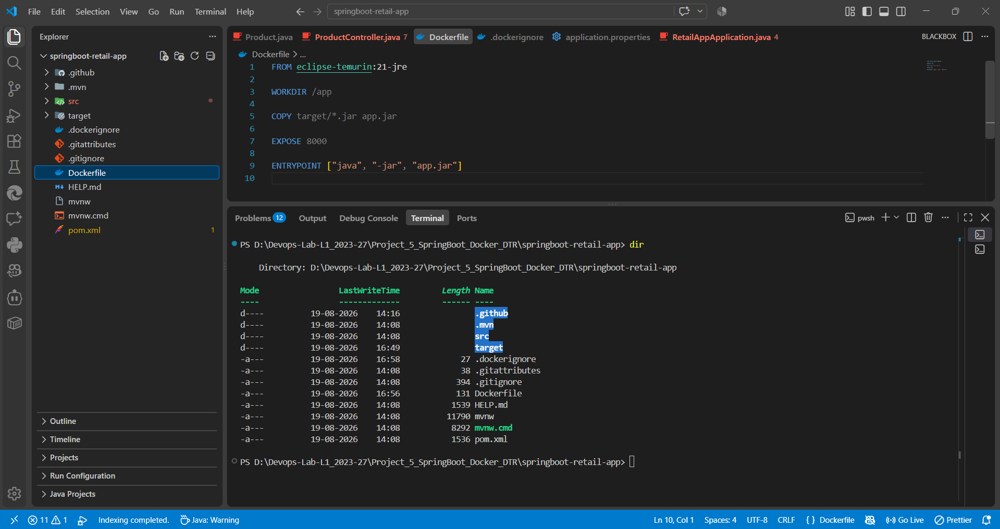

---

# Step 13 – Create .dockerignore

A **`.dockerignore`** file was created to prevent unnecessary files from being included in the Docker build context.

```text
.git
.idea
.vscode
*.log
```

The **`target`** directory was intentionally not excluded because the Dockerfile needs the generated JAR file from the **`target`** directory.

### Screenshot


---

# Step 14 – Build Docker Image

The Docker image was built using the following command:

```powershell
docker build -t retail-springboot:1.0 .
```

The Dockerfile was used to create the image containing the Spring Boot application and Java 21 runtime.

The image was successfully created as:

```text
retail-springboot:1.0
```

### Screenshot

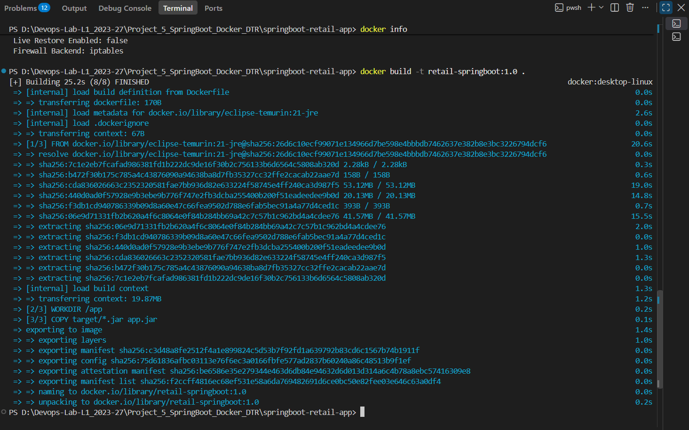

---

# Step 15 – Verify Docker Image

The available Docker images were checked using:

```powershell
docker images
```

The created image was displayed as:

```text
retail-springboot:1.0
```

The image ID was:

```text
f2ccff4816ec
```

The image size was approximately:

```text
492 MB
```

### Screenshot

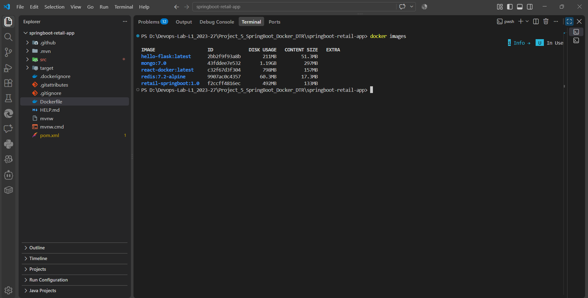

---

# Step 16 – Run Docker Container

The Docker image was started as a container using:

```powershell
docker run -d --name retail-springboot -p 8000:8000 retail-springboot:1.0
```

The port mapping was configured as:

```text
Host Port 8000
      ↓
Container Port 8000
```

This allows the application running inside the container to be accessed from the host machine.

---

# Step 17 – Verify Running Container

The running Docker containers were checked using:

```powershell
docker ps
```

The **`retail-springboot`** container was successfully running.

The container exposed port **8000**.

### Screenshot

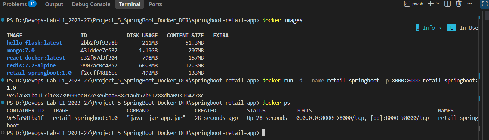

---

# Step 18 – Check Docker Container Logs

The application logs were inspected using:

```powershell
docker logs retail-springboot
```

The logs confirmed that the Spring Boot application started successfully inside the Docker container.

This verifies that the application was not only packaged into the image but was actually running inside the container.

### Screenshot

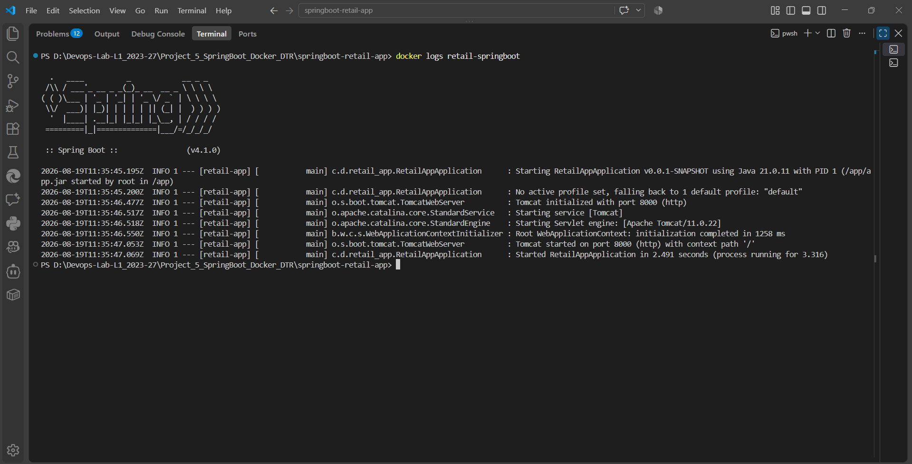

---

# Step 19 – Verify Docker Port Mapping

The Docker port mapping was verified using:

```powershell
docker port retail-springboot
```

The container port was mapped to host port **8000**.

The mapping follows:

```text
localhost:8000
       ↓
Docker Container:8000
       ↓
Spring Boot Application
```

### Screenshot

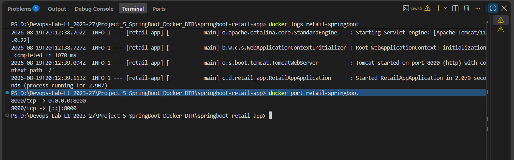

---

# Step 20 – Test Containerized Products API

After starting the Docker container, the REST API was tested again.

### URL

```text
http://localhost:8000/api/products
```

The same product JSON response was successfully returned from the Dockerized application.

This confirms that the Spring Boot application is running correctly inside the Docker container.

### Screenshot

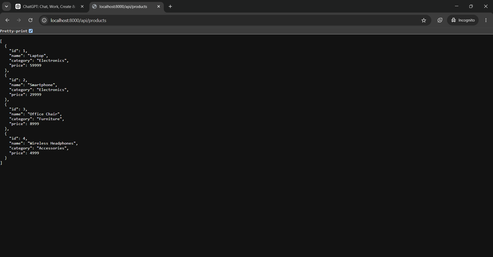

---

# Step 21 – Test Containerized Health API

The health endpoint was tested again after containerization.

### URL

```text
http://localhost:8000/api/products/health
```

Expected response:

```text
Retail application is running
```

The endpoint responded successfully.

### Screenshot

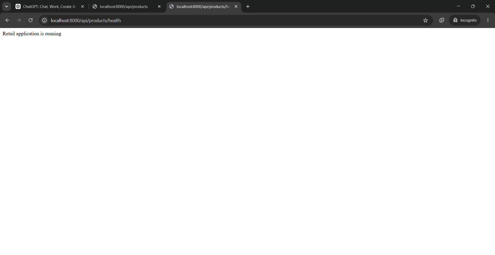

---

# Step 22 – Install Trivy

For container image security scanning, Trivy was installed on the Windows system.

The installed version was verified using:

```powershell
trivy -v
```

Installed version:

```text
Version: 0.74.0
```

Trivy is used to identify known vulnerabilities in container images and their dependencies.

### Screenshot

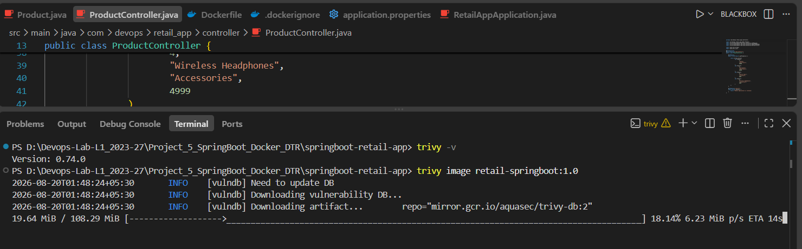

---

# Step 23 – Scan Docker Image Using Trivy

The Docker image was scanned using:

```powershell
trivy image retail-springboot:1.0
```

Trivy analyzed the image and reported known vulnerabilities based on its vulnerability database.

The scan provides information such as:

* Vulnerability ID
* Package/Library
* Installed Version
* Fixed Version
* Severity

### Screenshot

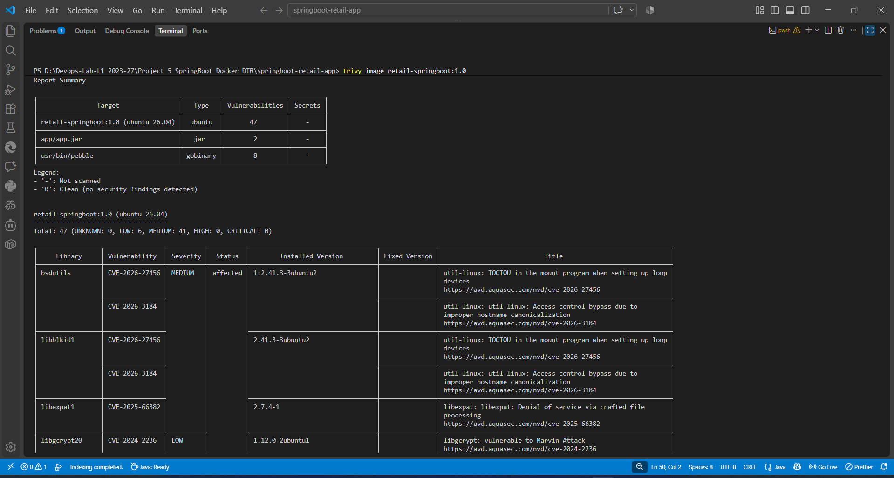

---

# Step 24 – Scan HIGH and CRITICAL Vulnerabilities

A focused scan was performed to identify HIGH and CRITICAL severity vulnerabilities.

### Command Used

```powershell
trivy image --severity HIGH,CRITICAL retail-springboot:1.0
```

This provides a more focused view of vulnerabilities that require higher priority attention.

### Screenshot

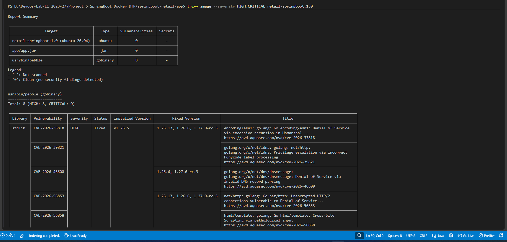

---

# DTR / Image Scanning Note

The project is named:

```text
Project_5_SpringBoot_Docker_DTR
```

The Docker image was successfully created and scanned locally using **Trivy 0.74.0**.

Trivy is a container vulnerability scanner and should not be represented as a Docker Trusted Registry (DTR) server.

If an institutional Docker Trusted Registry environment is provided, the image can additionally be pushed to that registry and scanned according to the institution's DTR workflow.

For the local Windows implementation of this project, Trivy was used to demonstrate the Docker image vulnerability scanning requirement.

---

# DevOps Workflow

The complete workflow implemented in this project is:

```text
Spring Boot Application
          ↓
REST API Development
          ↓
Local Application Testing
          ↓
Maven Build
          ↓
JAR Artifact
          ↓
Dockerfile
          ↓
Docker Image
          ↓
Docker Container
          ↓
Port Mapping
          ↓
Containerized REST API
          ↓
Trivy Vulnerability Scan
```

---

# Docker Commands Used

### Build Image

```powershell
docker build -t retail-springboot:1.0 .
```

### List Images

```powershell
docker images
```

### Run Container

```powershell
docker run -d --name retail-springboot -p 8000:8000 retail-springboot:1.0
```

### List Running Containers

```powershell
docker ps
```

### View Container Logs

```powershell
docker logs retail-springboot
```

### Check Port Mapping

```powershell
docker port retail-springboot
```

### Inspect Container

```powershell
docker inspect retail-springboot
```

### Stop Container

```powershell
docker stop retail-springboot
```

### Remove Container

```powershell
docker rm retail-springboot
```

---

# Trivy Commands Used

### Check Trivy Version

```powershell
trivy -v
```

### Full Image Scan

```powershell
trivy image retail-springboot:1.0
```

### HIGH and CRITICAL Scan

```powershell
trivy image --severity HIGH,CRITICAL retail-springboot:1.0
```

---

# Learning Outcomes

After completing this project, the following DevOps concepts were successfully implemented:

* Spring Boot application development
* REST API development
* Java 21 application development
* Maven project management
* Maven build and packaging
* Spring Boot JAR generation
* Dockerfile creation
* Docker image creation
* Docker container execution
* Docker port mapping
* Container log inspection
* Containerized REST API testing
* Docker image vulnerability scanning
* Trivy security scanning
* Basic container security concepts
* Application containerization workflow

---

# Conclusion

This project successfully demonstrated the complete process of developing and containerizing a Spring Boot REST API.

The Retail Product API was developed using Spring Boot and Java 21 and was first tested locally to verify its functionality. The application was then packaged into a JAR file using Maven.

A Dockerfile was created using the Eclipse Temurin Java 21 runtime image, and the Spring Boot JAR was converted into a Docker image named **`retail-springboot:1.0`**.

The Docker image was successfully executed as a container with port **8000** mapped from the host to the container. Both the Products API and Health API were successfully tested after containerization.

Finally, Trivy 0.74.0 was used to scan the Docker image for known vulnerabilities, demonstrating an additional security step in the containerization workflow.

Overall, the project provided practical experience with Spring Boot, Maven, Docker, REST APIs, container management, port mapping, and container image security scanning, reinforcing important DevOps concepts used in modern application deployment.
