# Project 6: Social Media Infrastructure Challenges – Using Kubernetes Autoscaling

## 1. Project Overview

This project demonstrates how Kubernetes can be used to address **infrastructure scalability challenges** for a social media application.

The project implements a Flask-based social media application and deploys it on a Kubernetes cluster created using **Minikube**. Kubernetes **Horizontal Pod Autoscaler (HPA)** is configured to automatically increase or decrease the number of application pods based on CPU utilization.

The main objective is to demonstrate application scalability by:

- Creating a containerized Flask application.
- Creating and running a Kubernetes cluster using Minikube.
- Deploying the application on Kubernetes.
- Exposing the application through a Kubernetes Service.
- Installing and enabling the Kubernetes Metrics Server.
- Configuring a Horizontal Pod Autoscaler.
- Increasing CPU utilization to generate application load.
- Demonstrating automatic scaling of Kubernetes pods.

---

## 2. Project Objectives

The objectives of this project are:

1. To understand the infrastructure scalability challenges of a social media application.
2. To containerize a Flask application using Docker.
3. To create a local Kubernetes cluster using Minikube.
4. To deploy the application using a Kubernetes Deployment.
5. To expose the application using a Kubernetes Service.
6. To enable Kubernetes resource metrics using Metrics Server.
7. To configure Horizontal Pod Autoscaling (HPA).
8. To generate CPU load on the application.
9. To demonstrate automatic scaling of application pods based on CPU utilization.

---

## 3. Project Directory Structure

The project is organized as follows:

```text
Project_6_Social_Media_Kubernetes_Autoscaling/
│
├── k8s/
│   ├── deployment.yaml
│   ├── hpa.yaml
│   └── service.yaml
│
├── screenshots/
│   ├── autoscale_no_of_k8s_pods.png
│   ├── docker_image_created.png
│   ├── hpa_configuration.png
│   ├── increased_cpu_utilization.png
│   ├── kubernetes_cluster_running.png
│   ├── kubernetes_deployment.png
│   ├── metrics_server_running.png
│   ├── minikube_k8s_setup.png
│   ├── project6_flask_app_setup.png
│   ├── project6_setup.png
│   └── social_media_posts_health_api.png
│
└── social-media-app/
    ├── app.py
    ├── Dockerfile
    └── requirements.txt
```

---

# 4. Initial Project Setup

The project was created in the following directory:

```text
D:\Devops-Lab-L1_2023-27\Project_6_Social_Media_Kubernetes_Autoscaling
```

The initial project structure and setup were verified before implementing the Flask application and Kubernetes configuration.

### Screenshot

**Screenshot:** `project6_setup.png`

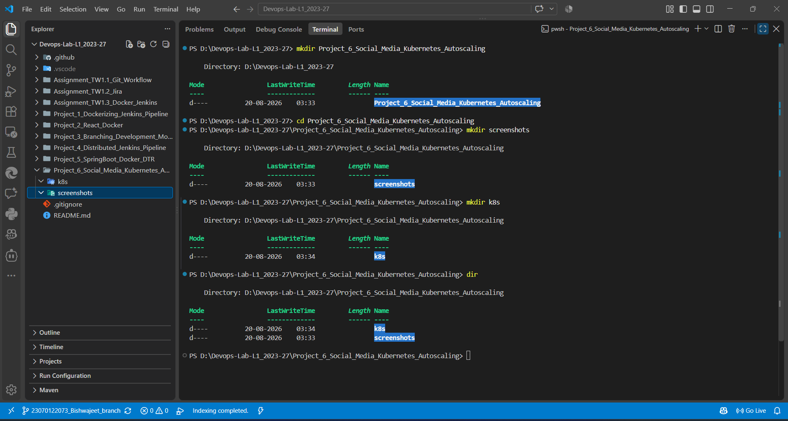

This screenshot documents the initial Project 6 setup and working environment.

---

# 5. Flask Social Media Application

A lightweight Flask application was created under the `social-media-app` directory.

The application provides social-media-related endpoints and a health endpoint that can be used to verify whether the application is running correctly after deployment.

The application source file is:

```text
social-media-app/app.py
```

The Flask application was tested during the implementation process before containerizing and deploying it to Kubernetes.

### Screenshot

**Screenshot:** `project6_flask_app_setup.png`

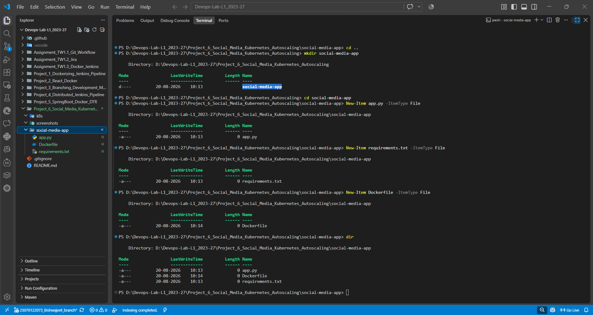

This screenshot demonstrates the Flask application setup and execution.

---

# 6. Application Dependencies

The Python dependencies required by the application are specified in:

```text
social-media-app/requirements.txt
```

The application uses Flask as the web framework.

The dependency file allows the required Python packages to be installed when creating the Docker image.

---

# 7. Docker Containerization

The Flask application was containerized using Docker.

The Docker configuration is defined in:

```text
social-media-app/Dockerfile
```

The Docker image contains:

- Python runtime environment
- Flask application
- Required Python dependencies
- Application startup configuration

A Docker image was created successfully for the social media application.

### Screenshot

**Screenshot:** `docker_image_created.png`

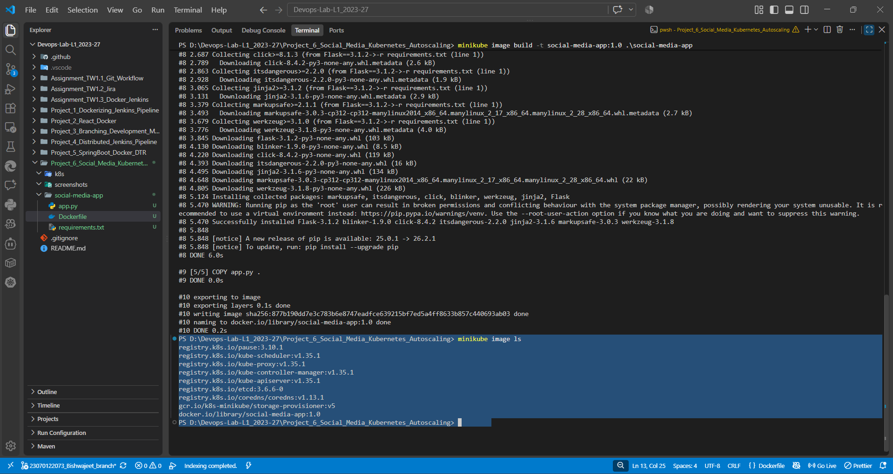

This screenshot provides evidence that the Docker image for the application was successfully created.

---

# 8. Kubernetes Cluster Setup Using Minikube

A local Kubernetes cluster was created using **Minikube**.

Minikube provides a local Kubernetes environment suitable for development and demonstration purposes.

The Kubernetes cluster was started and verified before deploying the application.

### Screenshot

**Screenshot:** `minikube_k8s_setup.png`

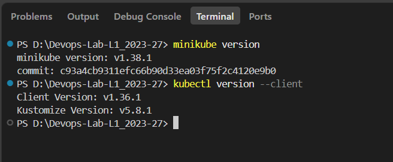

This screenshot documents the Minikube/Kubernetes setup.

### Kubernetes Cluster Running

After starting Minikube, the Kubernetes cluster status was verified.

### Screenshot

**Screenshot:** `kubernetes_cluster_running.png`

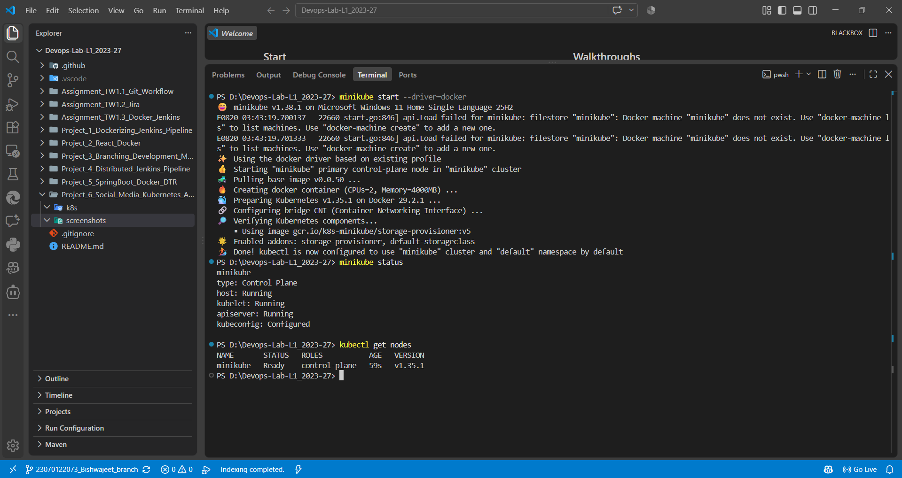

This confirms that the Kubernetes cluster was running successfully.

---

# 9. Kubernetes Deployment

The application was deployed to Kubernetes using a Deployment configuration.

The deployment configuration is stored in:

```text
k8s/deployment.yaml
```

The Kubernetes Deployment manages the application pods and ensures that the required number of replicas are maintained.

The deployment also specifies the container image and CPU resource requirements needed by the Horizontal Pod Autoscaler.

A Kubernetes Deployment was successfully created.

### Screenshot

**Screenshot:** `kubernetes_deployment.png`

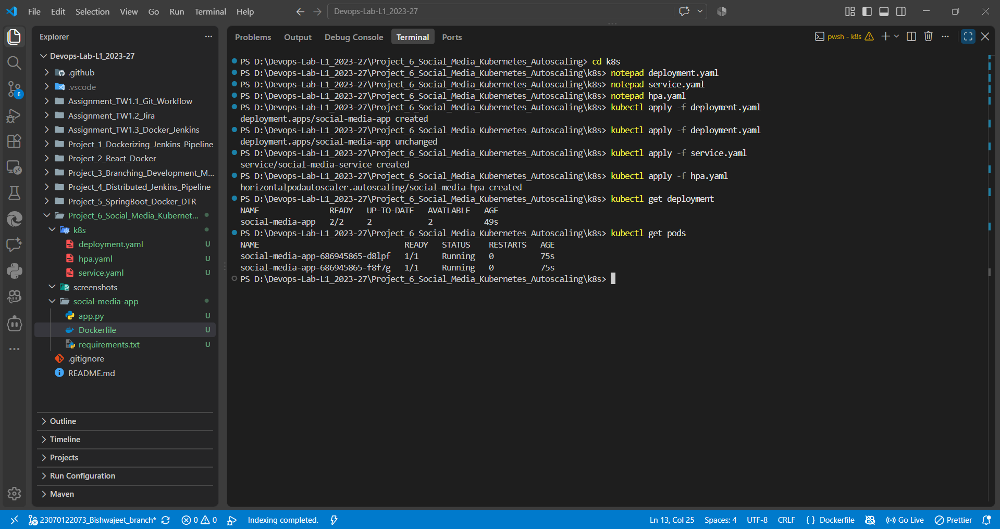

This screenshot demonstrates the successful Kubernetes deployment of the social media application.

---

# 10. Kubernetes Service

The application is exposed through a Kubernetes Service.

The service configuration is stored in:

```text
k8s/service.yaml
```

The Service provides a stable network endpoint through which the application can be accessed.

The Service also allows traffic to be directed to the appropriate application pods managed by the Deployment.

---

# 11. Social Media Application Health Check

After deploying the application, the application endpoints were tested to verify that the service was accessible and functioning correctly.

The health API was used to confirm that the deployed application was operational.

### Screenshot

**Screenshot:** `social_media_posts_health_api.png`

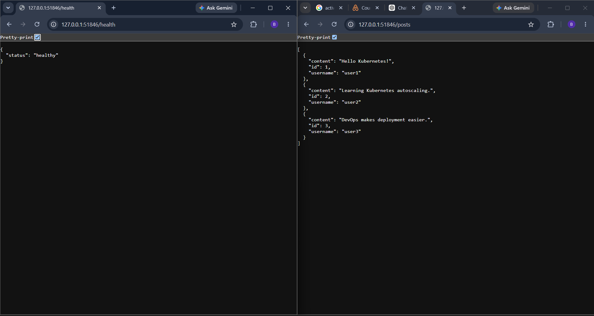

This screenshot demonstrates successful access to the social media application and its health/API endpoint.

---

# 12. Kubernetes Metrics Server

Horizontal Pod Autoscaling requires resource utilization metrics such as CPU utilization.

Therefore, the Kubernetes Metrics Server was enabled and verified in the Minikube cluster.

The Metrics Server provides resource usage information that can be consumed by Kubernetes HPA.

### Screenshot

**Screenshot:** `metrics_server_running.png`

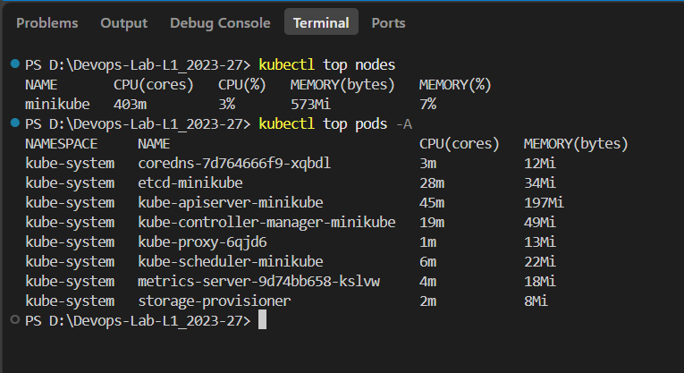

This screenshot demonstrates that the Kubernetes Metrics Server was running successfully.

---

# 13. Horizontal Pod Autoscaler Configuration

The Horizontal Pod Autoscaler configuration is stored in:

```text
k8s/hpa.yaml
```

The HPA monitors CPU utilization of the application pods.

When CPU utilization increases above the configured target, Kubernetes automatically increases the number of pod replicas.

When the workload decreases, Kubernetes can subsequently reduce the number of replicas.

The HPA configuration therefore provides the application's automatic horizontal scaling capability.

### Screenshot

**Screenshot:** `hpa_configuration.png`

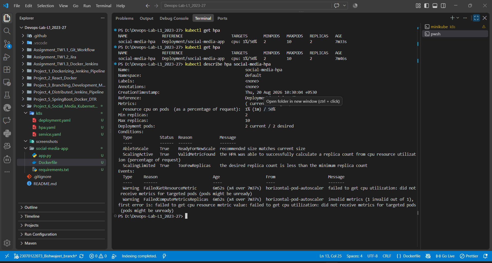

This screenshot demonstrates that the Horizontal Pod Autoscaler was configured successfully.

---

# 14. CPU Resource Utilization and Load Generation

To demonstrate Kubernetes autoscaling, additional workload was generated against the application.

The increased workload caused CPU utilization of the application pods to increase.

This allows the HPA to detect that the current CPU utilization is above the configured target and initiate horizontal scaling.

### Screenshot

**Screenshot:** `increased_cpu_utilization.png`

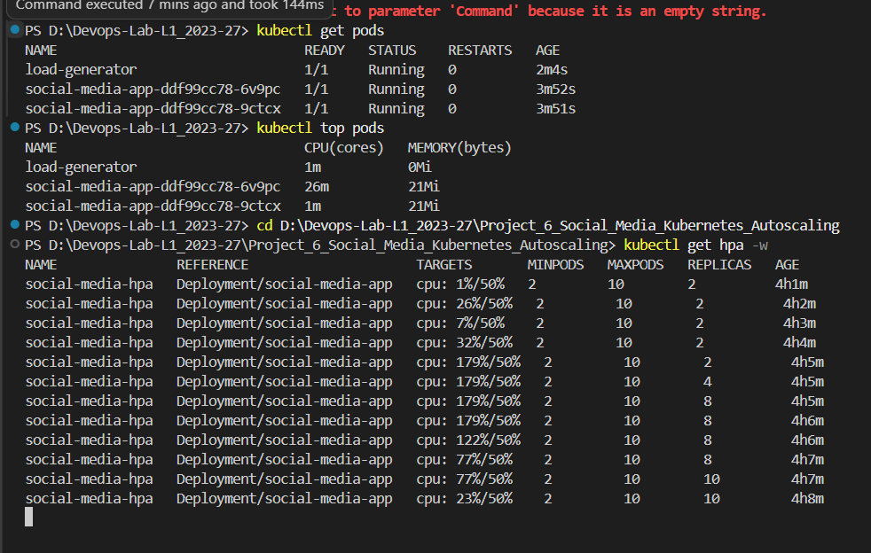

This screenshot demonstrates the increase in CPU utilization generated during the autoscaling test.

---

# 15. Automatic Kubernetes Pod Autoscaling

Once CPU utilization increased, the Horizontal Pod Autoscaler responded by increasing the number of application pod replicas.

This demonstrates the main objective of the project:

```text
Increased Application Load
          ↓
Increased CPU Utilization
          ↓
HPA Detects High CPU Usage
          ↓
Kubernetes Increases Replicas
          ↓
Additional Application Pods Created
```

### Screenshot

**Screenshot:** `autoscale_no_of_k8s_pods.png`

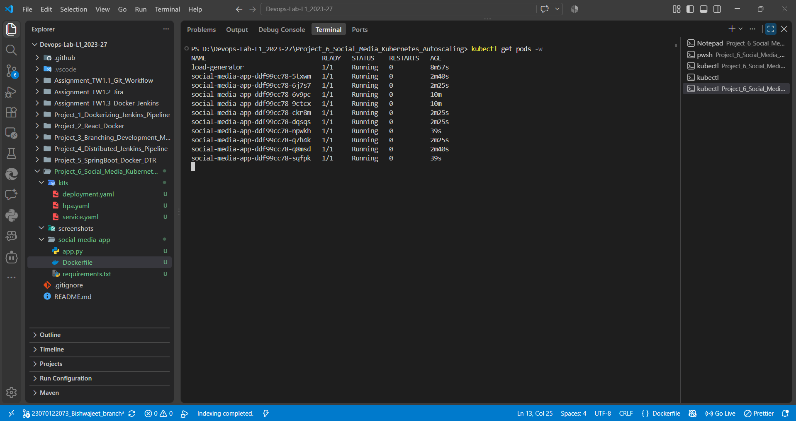

This is the key result of the project. It demonstrates that Kubernetes automatically increased the number of application pods in response to increased resource utilization.

---

# 16. Autoscaling Implementation Flow

The complete implementation can be summarized as follows:

```text
                 Flask Social Media Application
                           │
                           ▼
                     Docker Container
                           │
                           ▼
                     Minikube Cluster
                           │
                           ▼
                  Kubernetes Deployment
                           │
                           ▼
                     Application Pods
                           │
                           ▼
                   Kubernetes Service
                           │
                           ▼
                     User/Application
                           │
                           ▼
                   Increased CPU Load
                           │
                           ▼
                     Metrics Server
                           │
                           ▼
               Horizontal Pod Autoscaler
                           │
                           ▼
                   More Pod Replicas
```

This architecture demonstrates how Kubernetes can dynamically scale application infrastructure based on workload.

---

# 17. Kubernetes Configuration Files

The Kubernetes configuration files used in this project are located in the `k8s` directory.

## `deployment.yaml`

```text
k8s/deployment.yaml
```

Responsible for:

- Creating the application Deployment.
- Managing application pods.
- Defining the container image.
- Defining container resource requirements.
- Maintaining the desired number of replicas.

## `service.yaml`

```text
k8s/service.yaml
```

Responsible for:

- Exposing the application.
- Providing network access to the application pods.
- Routing traffic to the appropriate pods.

## `hpa.yaml`

```text
k8s/hpa.yaml
```

Responsible for:

- Configuring Horizontal Pod Autoscaling.
- Defining minimum replicas.
- Defining maximum replicas.
- Defining CPU utilization target.
- Automatically adjusting the number of application replicas.

---

# 18. Complete Implementation Sequence

The project was implemented in the following sequence:

### Step 1 – Create Project Structure

Created the Project 6 directory with separate directories for:

- Flask application
- Kubernetes configuration
- Screenshots

### Step 2 – Develop Flask Application

Created:

```text
social-media-app/app.py
```

and implemented the social media application and health/API functionality.

### Step 3 – Create Docker Configuration

Created:

```text
social-media-app/Dockerfile
social-media-app/requirements.txt
```

and built the application Docker image.

### Step 4 – Start Minikube

Created and started the local Kubernetes cluster using Minikube.

### Step 5 – Configure Kubernetes Deployment

Created:

```text
k8s/deployment.yaml
```

and deployed the application pods.

### Step 6 – Configure Kubernetes Service

Created:

```text
k8s/service.yaml
```

to expose the application.

### Step 7 – Enable Metrics Server

Enabled the Metrics Server so that Kubernetes could obtain CPU utilization metrics.

### Step 8 – Configure HPA

Created:

```text
k8s/hpa.yaml
```

to automatically scale the application based on CPU utilization.

### Step 9 – Generate CPU Load

Increased application workload to increase CPU utilization.

### Step 10 – Verify Autoscaling

Observed Kubernetes automatically increase the number of application pods.

---

# 19. Evidence Summary

The following screenshots provide evidence for the complete implementation:

| Implementation Evidence | Screenshot |
|---|---|
| Initial Project Setup | `project6_setup.png` |
| Flask Application | `project6_flask_app_setup.png` |
| Docker Image | `docker_image_created.png` |
| Minikube Setup | `minikube_k8s_setup.png` |
| Kubernetes Cluster | `kubernetes_cluster_running.png` |
| Kubernetes Deployment | `kubernetes_deployment.png` |
| Metrics Server | `metrics_server_running.png` |
| Application Health/API | `social_media_posts_health_api.png` |
| HPA Configuration | `hpa_configuration.png` |
| Increased CPU Utilization | `increased_cpu_utilization.png` |
| Automatic Pod Scaling | `autoscale_no_of_k8s_pods.png` |

---

# 20. Result

The Project 6 implementation successfully demonstrates **Kubernetes-based application scalability**.

The Flask social media application was containerized using Docker and deployed to a Minikube Kubernetes cluster. Kubernetes Deployment and Service resources were used to manage and expose the application.

The Kubernetes Metrics Server was enabled to provide resource utilization metrics, and a Horizontal Pod Autoscaler was configured to monitor CPU utilization.

When additional workload was generated, CPU utilization increased and the HPA automatically increased the number of application pods.

Therefore, the project successfully demonstrates how Kubernetes can address infrastructure scalability challenges by dynamically allocating additional application instances based on workload.

---

# 21. Conclusion

This project demonstrates the practical implementation of **horizontal application scaling using Kubernetes**.

The implementation shows that instead of manually creating additional application instances when traffic increases, Kubernetes can automatically manage the number of application pods using the Horizontal Pod Autoscaler.

The overall scalability mechanism demonstrated in this project is:

```text
Application Load
      ↓
CPU Utilization Increases
      ↓
Metrics Server Collects Metrics
      ↓
HPA Evaluates CPU Target
      ↓
Replica Count Increases
      ↓
Kubernetes Creates Additional Pods
      ↓
Application Capacity Increases
```

This provides a foundation for deploying scalable social media applications in containerized and Kubernetes-based environments.
