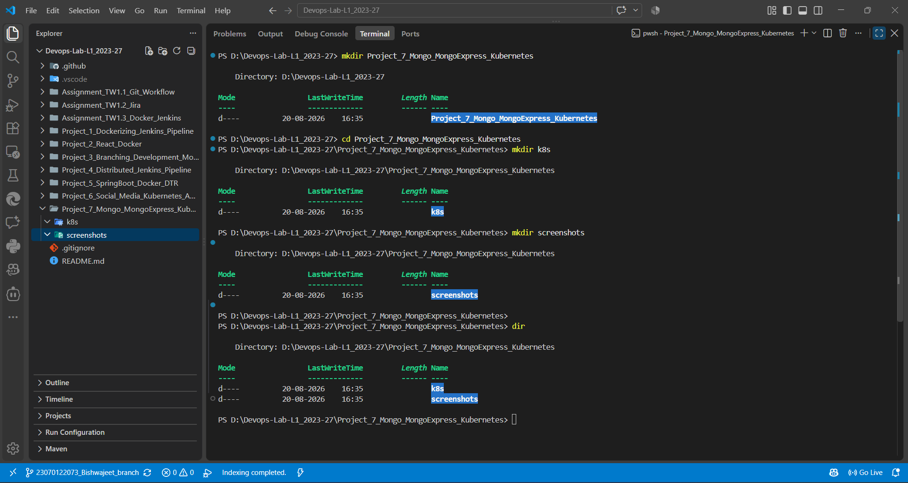
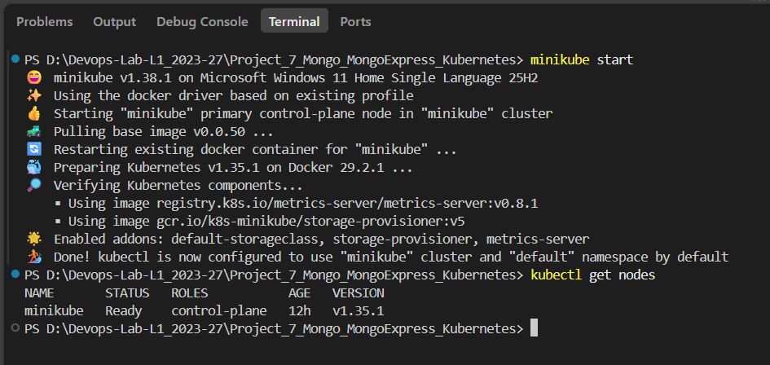
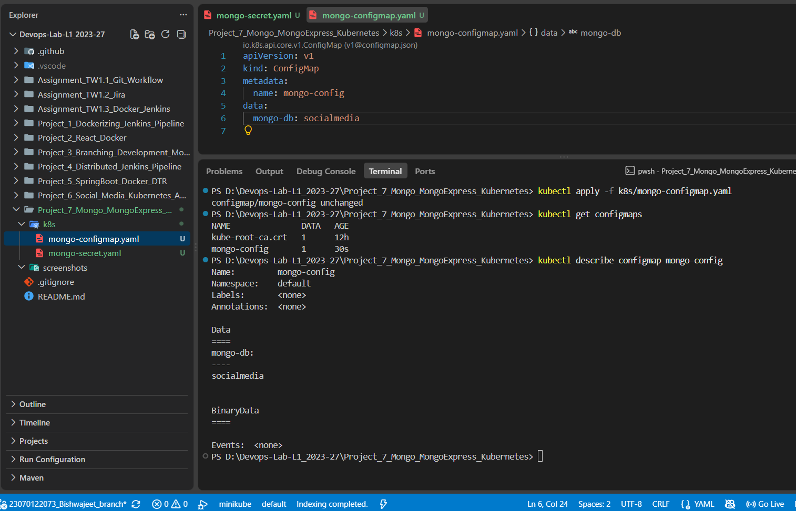
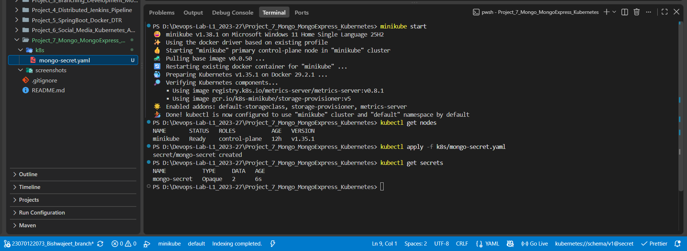
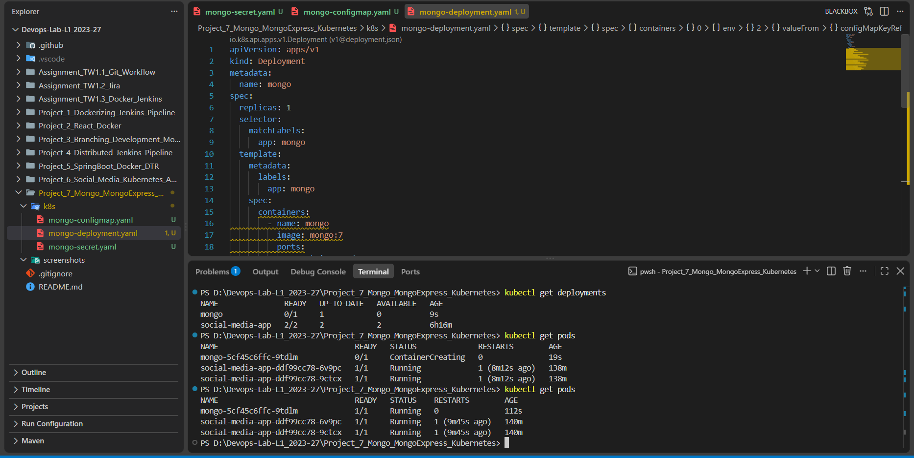
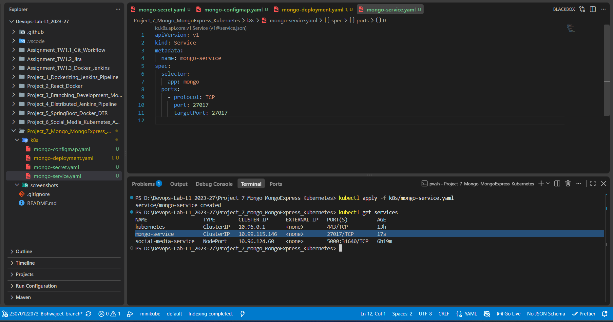
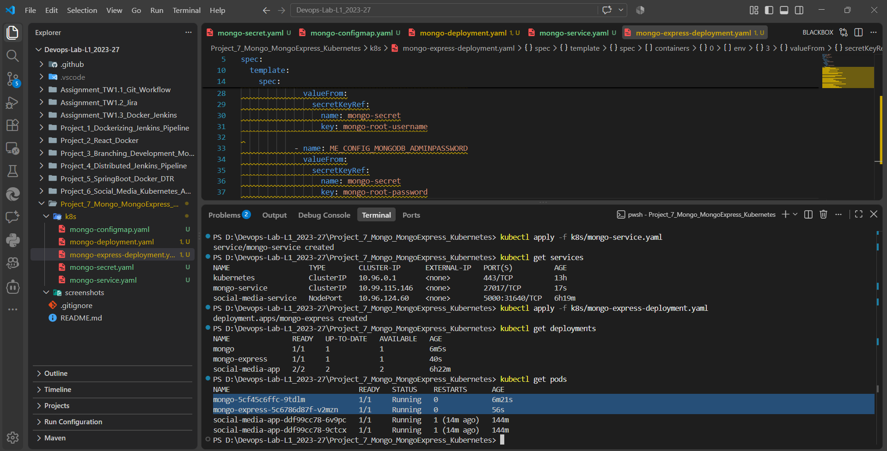
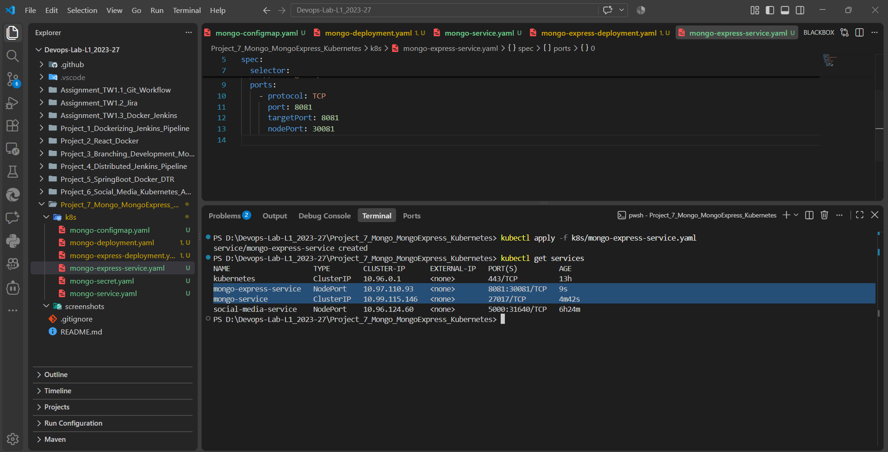
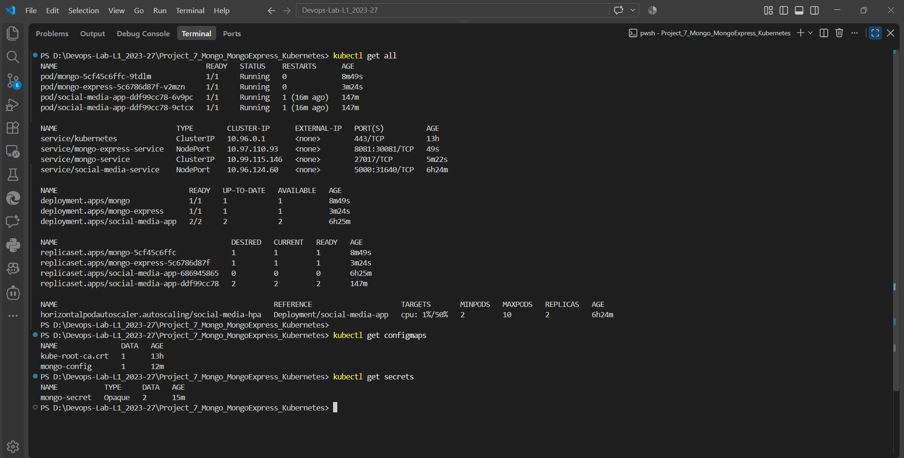
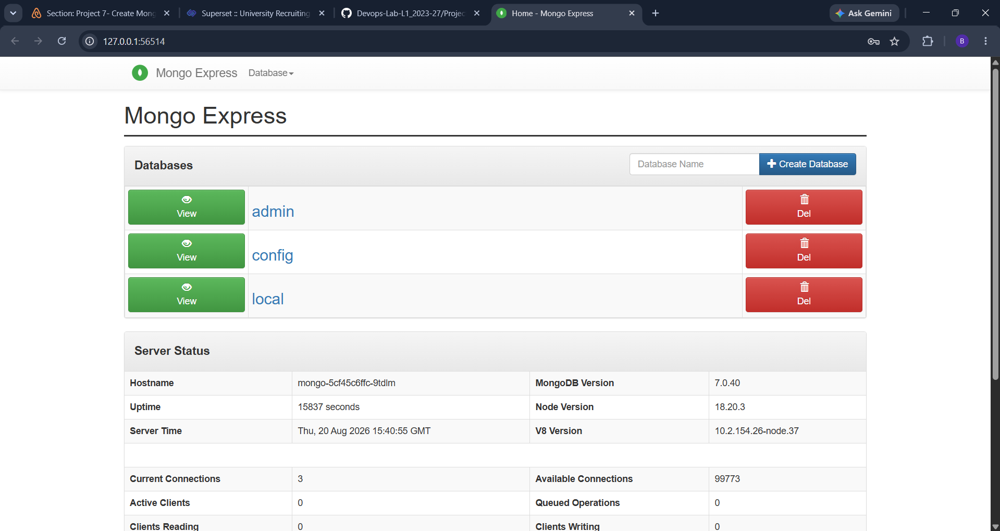

# Project 7: MongoDB and Mongo Express Deployment Using Kubernetes

## 1. Project Overview

This project demonstrates how **MongoDB** and **Mongo Express** can be deployed and managed using **Kubernetes**.

The project uses **Minikube** to create a local Kubernetes cluster and deploys MongoDB as the database backend and Mongo Express as a web-based interface for interacting with MongoDB.

The main objective is to demonstrate the use of Kubernetes resources such as:

* Kubernetes Deployments
* Kubernetes Services
* ConfigMaps
* Secrets
* Minikube
* MongoDB
* Mongo Express

The project also demonstrates how Kubernetes configuration objects can be used to provide application configuration and securely manage database credentials.

---

## 2. Project Objectives

The objectives of this project are:

1. To understand how MongoDB can be deployed using Kubernetes.
2. To deploy MongoDB using a Kubernetes Deployment.
3. To expose MongoDB using a Kubernetes Service.
4. To use a Kubernetes ConfigMap for non-sensitive configuration.
5. To use a Kubernetes Secret for sensitive MongoDB credentials.
6. To deploy Mongo Express using Kubernetes.
7. To configure Mongo Express to communicate with MongoDB.
8. To expose Mongo Express using a Kubernetes Service.
9. To create and run a local Kubernetes cluster using Minikube.
10. To verify that MongoDB and Mongo Express are running successfully.

---

## 3. Project Directory Structure

The project is organized as follows:

```text
Project_7_Mongo_MongoExpress_Kubernetes/
│
├── k8s/
│   ├── mongo-configmap.yaml
│   ├── mongo-deployment.yaml
│   ├── mongo-express-deployment.yaml
│   ├── mongo-express-service.yaml
│   ├── mongo-secret.yaml
│   └── mongo-service.yaml
│
└── screenshots/
    ├── kubernetes_resources.png
    ├── minikube_running.png
    ├── mongo_configmap.png
    ├── mongo_deployment.png
    ├── mongo_express_deployment.png
    ├── mongo_express_running.png
    ├── mongo_express_service.png
    ├── mongo_secret.png
    ├── mongo_service.png
    └── project7_setup.png
```

---

# 4. Initial Project Setup

The project was created in the following directory:

```text
D:\Devops-Lab-L1_2023-27\Project_7_Mongo_MongoExpress_Kubernetes
```

The project contains two main directories:

* `k8s` – contains Kubernetes configuration files.
* `screenshots` – contains screenshots documenting the implementation and verification steps.

### Screenshot

**Screenshot:** `project7_setup.png`



This screenshot documents the initial Project 7 setup and working environment.

---

# 5. Kubernetes Configuration Files

All Kubernetes configuration files for the project are stored inside the `k8s` directory.

The configuration consists of:

```text
k8s/
├── mongo-configmap.yaml
├── mongo-deployment.yaml
├── mongo-express-deployment.yaml
├── mongo-express-service.yaml
├── mongo-secret.yaml
└── mongo-service.yaml
```

These files define the Kubernetes resources required to deploy MongoDB and Mongo Express.

---

# 6. Minikube Kubernetes Cluster

A local Kubernetes cluster was created using **Minikube**.

Minikube provides a local Kubernetes environment where MongoDB and Mongo Express can be deployed and tested.

The Minikube cluster was started before applying the Kubernetes configuration files.

### Screenshot

**Screenshot:** `minikube_running.png`



This screenshot demonstrates that Minikube was running successfully.

---

# 7. MongoDB ConfigMap

A Kubernetes **ConfigMap** was created to store MongoDB-related non-sensitive configuration.

The configuration file is:

```text
k8s/mongo-configmap.yaml
```

The ConfigMap allows configuration values to be separated from the MongoDB Deployment configuration.

### Screenshot

**Screenshot:** `mongo_configmap.png`



This screenshot demonstrates the MongoDB ConfigMap configuration.

---

# 8. MongoDB Secret

A Kubernetes **Secret** was created to store sensitive MongoDB authentication information.

The configuration file is:

```text
k8s/mongo-secret.yaml
```

Kubernetes Secrets are used for sensitive values such as database usernames and passwords rather than placing these values directly inside application configuration.

### Screenshot

**Screenshot:** `mongo_secret.png`



This screenshot demonstrates the MongoDB Secret configuration.

---

# 9. MongoDB Deployment

MongoDB was deployed to Kubernetes using a Kubernetes Deployment.

The configuration file is:

```text
k8s/mongo-deployment.yaml
```

The MongoDB Deployment is responsible for creating and managing the MongoDB pod.

The Deployment also uses the Kubernetes configuration resources created for the project.

### Screenshot

**Screenshot:** `mongo_deployment.png`



This screenshot demonstrates the MongoDB Kubernetes Deployment.

---

# 10. MongoDB Service

A Kubernetes Service was created to provide network access to the MongoDB deployment.

The configuration file is:

```text
k8s/mongo-service.yaml
```

The MongoDB Service provides a stable Kubernetes network endpoint that can be used by Mongo Express to communicate with the MongoDB application.

### Screenshot

**Screenshot:** `mongo_service.png`



This screenshot demonstrates the MongoDB Kubernetes Service.

---

# 11. Mongo Express Deployment

Mongo Express was deployed as a separate Kubernetes application.

The configuration file is:

```text
k8s/mongo-express-deployment.yaml
```

Mongo Express provides a web-based interface for interacting with MongoDB.

The Mongo Express Deployment creates and manages the Mongo Express pod and configures it to communicate with the MongoDB service.

### Screenshot

**Screenshot:** `mongo_express_deployment.png`



This screenshot demonstrates the Mongo Express Kubernetes Deployment.

---

# 12. Mongo Express Service

A Kubernetes Service was created to expose Mongo Express.

The configuration file is:

```text
k8s/mongo-express-service.yaml
```

The Service provides network access to the Mongo Express application so that its web interface can be accessed after deployment.

### Screenshot

**Screenshot:** `mongo_express_service.png`



This screenshot demonstrates the Mongo Express Kubernetes Service.

---

# 13. Kubernetes Resources Verification

After applying the Kubernetes configuration files, the deployed resources were checked to verify that the required MongoDB and Mongo Express resources were created successfully.

The Kubernetes resources include the Deployments, Services, ConfigMap, Secret, and application pods.

### Screenshot

**Screenshot:** `kubernetes_resources.png`



This screenshot provides evidence that the Kubernetes resources were created successfully.

---

# 14. Mongo Express Running

After deploying MongoDB and Mongo Express, the Mongo Express application was accessed to verify that it was running successfully.

Mongo Express provides a web-based interface through which the MongoDB database can be accessed.

### Screenshot

**Screenshot:** `mongo_express_running.png`



This screenshot demonstrates that Mongo Express was successfully running and accessible.

---

# 15. Kubernetes Configuration Summary

The following Kubernetes configuration files were used in the project.

## `mongo-configmap.yaml`

```text
k8s/mongo-configmap.yaml
```

Responsible for:

* Storing MongoDB non-sensitive configuration.
* Separating configuration from the Deployment definition.

## `mongo-secret.yaml`

```text
k8s/mongo-secret.yaml
```

Responsible for:

* Storing sensitive MongoDB authentication information.
* Providing credentials to the required Kubernetes workloads.

## `mongo-deployment.yaml`

```text
k8s/mongo-deployment.yaml
```

Responsible for:

* Creating the MongoDB Deployment.
* Managing the MongoDB pod.
* Configuring the MongoDB container.

## `mongo-service.yaml`

```text
k8s/mongo-service.yaml
```

Responsible for:

* Providing network access to MongoDB.
* Providing a stable service endpoint for Mongo Express.

## `mongo-express-deployment.yaml`

```text
k8s/mongo-express-deployment.yaml
```

Responsible for:

* Creating the Mongo Express Deployment.
* Managing the Mongo Express pod.
* Configuring communication with MongoDB.

## `mongo-express-service.yaml`

```text
k8s/mongo-express-service.yaml
```

Responsible for:

* Exposing Mongo Express.
* Providing access to the Mongo Express web interface.

---

# 16. MongoDB and Mongo Express Architecture

The overall Kubernetes architecture can be summarized as follows:

```text
                         Minikube Kubernetes Cluster
                                  │
                 ┌────────────────┴────────────────┐
                 │                                 │
                 ▼                                 ▼
        MongoDB Deployment                 Mongo Express Deployment
                 │                                 │
                 ▼                                 ▼
          MongoDB Pod                     Mongo Express Pod
                 │                                 │
                 ▼                                 │
          MongoDB Service ◄────────────────────────┘
                 │
                 ▼
          MongoDB Database
```

The Kubernetes resources work together to provide the complete MongoDB and Mongo Express application environment.

---

# 17. Configuration and Security Flow

The project uses both a ConfigMap and a Secret to provide configuration to the Kubernetes workloads.

```text
                 Kubernetes Configuration
                          │
             ┌────────────┴────────────┐
             │                         │
             ▼                         ▼
       ConfigMap                    Secret
             │                         │
             │                  Sensitive Credentials
             │                         │
             └────────────┬────────────┘
                          ▼
                   MongoDB / Mongo Express
                          │
                          ▼
                   Running Application
```

This approach separates configuration values from the application Deployment definitions and provides a dedicated Kubernetes resource for sensitive credentials.

---

# 18. Complete Implementation Sequence

The project was implemented in the following sequence:

### Step 1 – Create Project Structure

Created the Project 7 directory with separate directories for:

* Kubernetes configuration files.
* Screenshots.

### Step 2 – Start Minikube

Started the local Kubernetes cluster using Minikube.

### Step 3 – Create MongoDB ConfigMap

Created:

```text
k8s/mongo-configmap.yaml
```

to define MongoDB-related configuration.

### Step 4 – Create MongoDB Secret

Created:

```text
k8s/mongo-secret.yaml
```

to store MongoDB authentication information.

### Step 5 – Deploy MongoDB

Created and applied:

```text
k8s/mongo-deployment.yaml
```

to deploy MongoDB.

### Step 6 – Create MongoDB Service

Created and applied:

```text
k8s/mongo-service.yaml
```

to provide network access to MongoDB.

### Step 7 – Deploy Mongo Express

Created and applied:

```text
k8s/mongo-express-deployment.yaml
```

to deploy the Mongo Express application.

### Step 8 – Create Mongo Express Service

Created and applied:

```text
k8s/mongo-express-service.yaml
```

to expose Mongo Express.

### Step 9 – Verify Kubernetes Resources

Checked the Kubernetes resources to confirm that the deployments, services, pods, ConfigMap, and Secret were created.

### Step 10 – Verify Mongo Express

Accessed Mongo Express and verified that the web interface was running successfully.

---

# 19. Evidence Summary

The following screenshots provide evidence for the complete Project 7 implementation:

| Implementation Evidence  | Screenshot                     |
| ------------------------ | ------------------------------ |
| Initial Project Setup    | `project7_setup.png`           |
| Minikube Running         | `minikube_running.png`         |
| MongoDB ConfigMap        | `mongo_configmap.png`          |
| MongoDB Secret           | `mongo_secret.png`             |
| MongoDB Deployment       | `mongo_deployment.png`         |
| MongoDB Service          | `mongo_service.png`            |
| Mongo Express Deployment | `mongo_express_deployment.png` |
| Mongo Express Service    | `mongo_express_service.png`    |
| Kubernetes Resources     | `kubernetes_resources.png`     |
| Mongo Express Running    | `mongo_express_running.png`    |

All screenshots are stored in the `screenshots` directory and are directly linked in this README.

---

# 20. Result

The Project 7 implementation successfully demonstrates the deployment of **MongoDB and Mongo Express using Kubernetes**.

A Minikube Kubernetes cluster was used as the deployment environment. MongoDB was deployed using a Kubernetes Deployment and exposed through a Kubernetes Service. A ConfigMap was used for configuration and a Secret was used for sensitive authentication information.

Mongo Express was deployed separately and configured to communicate with MongoDB through the Kubernetes Service. A dedicated Service was also created to provide access to the Mongo Express web interface.

The Kubernetes resources were verified after deployment, and the Mongo Express interface was successfully accessed.

Therefore, the project demonstrates how Kubernetes can be used to deploy a database application together with a web-based database management interface.

---

# 21. Conclusion

This project demonstrates the practical deployment of **MongoDB and Mongo Express in a Kubernetes environment**.

The implementation covers several important Kubernetes concepts:

```text
Minikube
   ↓
Kubernetes Cluster
   ↓
ConfigMap + Secret
   ↓
MongoDB Deployment
   ↓
MongoDB Service
   ↓
Mongo Express Deployment
   ↓
Mongo Express Service
   ↓
Mongo Express Web Interface
```

The project provides a practical example of how multiple Kubernetes resources can work together to deploy and expose a database application.

The use of **Deployments, Services, ConfigMaps, and Secrets** demonstrates fundamental Kubernetes concepts required for managing containerized applications and their configuration.
