# Project 8: Complete Microservices Application Using Kubernetes

## 1. Project Overview

This project demonstrates how a complete application consisting of multiple independent microservices can be containerized and deployed using **Kubernetes**.

The application consists of four microservices:

* User Service
* Product Service
* Order Service
* Payment Service

Each microservice is packaged as a Docker container and deployed independently using Kubernetes Deployments.

Kubernetes Services are used to provide stable network endpoints for communication between the microservices. Kubernetes ConfigMaps are used to provide non-sensitive application configuration, while Kubernetes Secrets are used to manage sensitive configuration values.

The project uses **Minikube** as the local Kubernetes cluster.

The main Kubernetes concepts demonstrated in this project are:

* Kubernetes Deployments
* Kubernetes Services
* Kubernetes ConfigMaps
* Kubernetes Secrets
* Kubernetes Pods
* Minikube
* Docker container images
* Microservice architecture
* Kubernetes service discovery
* Inter-service communication
* Multiple replicas
* Containerized application deployment

---

## 2. Project Objectives

The objectives of this project are:

1. To understand the concept of microservice-based application architecture.

2. To create at least four independent microservices.

3. To containerize each microservice using Docker.

4. To create Docker images for the four microservices.

5. To create a local Kubernetes cluster using Minikube.

6. To deploy the User Service using a Kubernetes Deployment.

7. To deploy the Product Service using a Kubernetes Deployment.

8. To deploy the Order Service using a Kubernetes Deployment.

9. To deploy the Payment Service using a Kubernetes Deployment.

10. To create Kubernetes Services for all four microservices.

11. To use Kubernetes ConfigMaps for non-sensitive application configuration.

12. To use Kubernetes Secrets for sensitive configuration.

13. To configure communication between the microservices using Kubernetes Services.

14. To run multiple replicas of each microservice.

15. To verify that all microservices are running successfully.

16. To verify inter-service communication between the microservices.

17. To demonstrate a complete containerized microservices application running on Kubernetes.

---

# 3. Application Architecture

The application follows a microservice architecture in which different business responsibilities are implemented as independent services.

The four microservices are:

```text
User Service
     │
     │ Provides user information
     │
     ▼

Product Service
     │
     │ Provides product information
     │
     ▼

Order Service
     │
     │ Coordinates order processing
     │
     ├──────────────► User Service
     │
     ├──────────────► Product Service
     │
     └──────────────► Payment Service
````

The Order Service acts as the coordinating service for an order operation.

It communicates with:

-  User Service to obtain user information. 
-  Product Service to obtain product information. 
-  Payment Service to process or verify payment information. 

The services communicate using Kubernetes Service names rather than relying on individual Pod IP addresses.

---

# 4. Project Directory Structure

The project is organized as follows:

```
```

```
Project_8_Microservices_Kubernetes/

│
├── k8s/
│
│   ├── configmap.yaml
│   ├── secret.yaml
│   ├── user-service.yaml
│   ├── product-service.yaml
│   ├── order-service.yaml
│   └── payment-service.yaml
│
├── microservices/
│
│   ├── user-service/
│   │   ├── Dockerfile
│   │   └── application files
│   │
│   ├── product-service/
│   │   ├── Dockerfile
│   │   └── application files
│   │
│   ├── order-service/
│   │   ├── Dockerfile
│   │   └── application files
│   │
│   └── payment-service/
│       ├── Dockerfile
│       └── application files
│
└── screenshots/
    
    ├── project8_setup.png
    ├── project8_structure.png
    ├── project8_docker_images.png
    ├── project8_kubernetes_cluster.png
    ├── project8_minikube_images.png
    ├── project8_configmap_secret.png
    ├── project8_microservices_congigmap_secrets.png
    ├── project8_kubernetes_deployments.png
    ├── project8_kubernetes_pods_running.png
    ├── project8_services.png
    ├── project8_user_service_test.png
    ├── project8_product_service_test.png
    ├── project8_payment_service_test.png
    ├── project8_orders_service_test.png
    ├── project8_interservice_communication.png
    └── project8_final_kubernetes_status.png
```

The `microservices` directory contains the source code and Docker configuration for the four application services.

The `k8s` directory contains the Kubernetes configuration files.

The `screenshots` directory contains implementation and verification evidence.

---

# 5. Initial Project Setup

The project was created in the following directory:

```
```

```
D:\Devops-Lab-L1_2023-27\Project_8_Microservices_Kubernetes
```

The project contains three major directories:

```
```

```
Project_8_Microservices_Kubernetes/

├── k8s/
├── microservices/
└── screenshots/
```

The `k8s` directory contains Kubernetes configuration files.

The `microservices` directory contains the four microservice applications.

The `screenshots` directory contains screenshots documenting the implementation and verification process.

### Screenshot

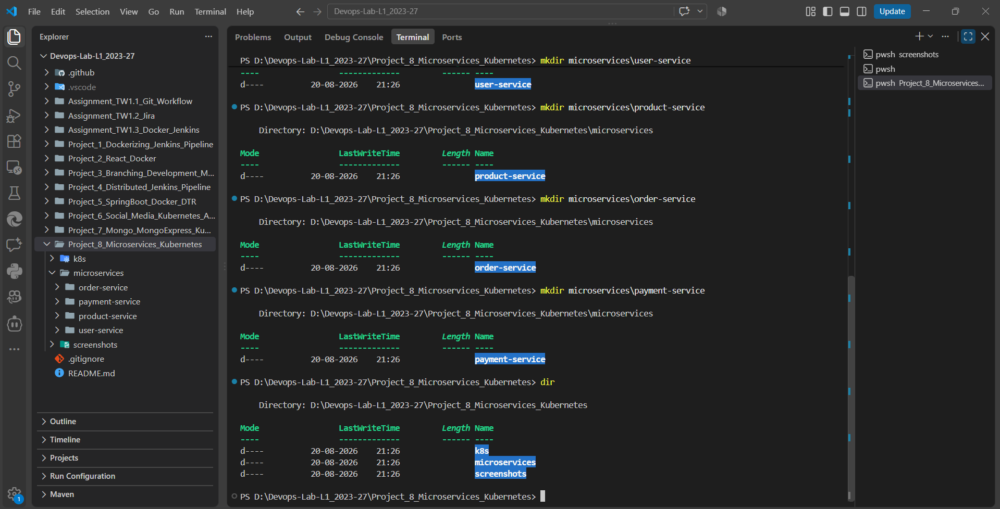


This screenshot documents the initial Project 8 working environment and project setup.

---

# 6. Microservices Project Structure

The application consists of four independent microservices.

```
```

```
microservices/

├── user-service/
│
├── product-service/
│
├── order-service/
│
└── payment-service/
```

Each service represents an independent part of the application.

The services can be developed, built, containerized, deployed, scaled, and managed independently.

### User Service

The User Service is responsible for user-related operations and provides user information to other services.

### Product Service

The Product Service manages product-related information.

### Order Service

The Order Service coordinates order-related operations and communicates with the User, Product, and Payment Services.

### Payment Service

The Payment Service handles payment-related operations.

### Screenshot

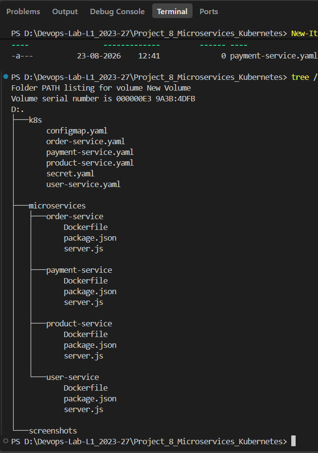


This screenshot demonstrates the project structure containing the four microservices and Kubernetes configuration directories.

---

# 7. Docker Containerization

Each microservice was containerized using Docker.

The following Docker images were created:

```
```

```
user-service:1.0

product-service:1.0

order-service:1.0

payment-service:1.0
```

Containerizing each microservice allows the applications to be packaged with their required runtime environment and deployed consistently.

The Docker images are later used by Kubernetes to create application Pods.

### Screenshot

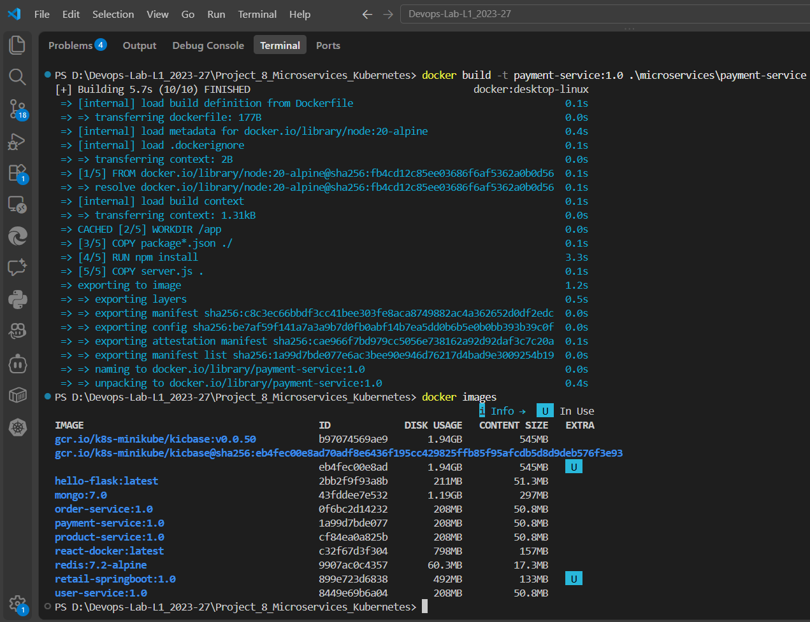


This screenshot demonstrates that Docker images for the microservices were successfully created.

---

# 8. Minikube Kubernetes Cluster

A local Kubernetes cluster was created using **Minikube**.

Minikube provides a local Kubernetes environment suitable for developing, testing, and demonstrating Kubernetes applications.

The four microservices were deployed inside the Minikube Kubernetes cluster.

### Screenshot

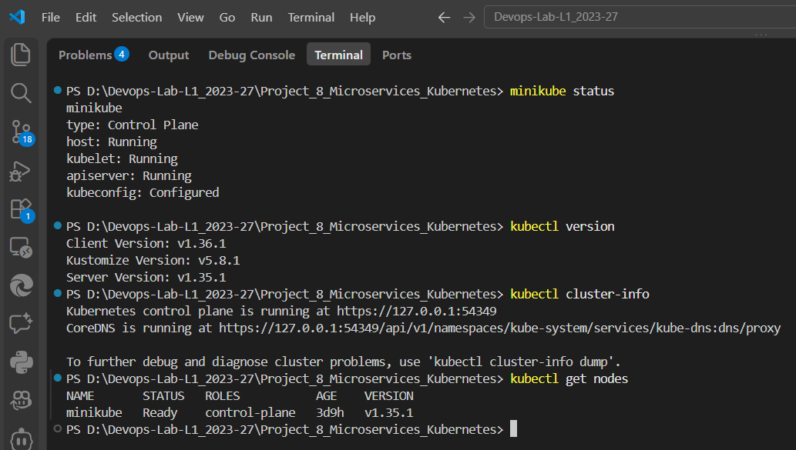


This screenshot demonstrates the Kubernetes cluster environment used for Project 8.

---

# 9. Loading Docker Images into Minikube

Because the Kubernetes environment used for the project is Minikube, the application Docker images were made available inside the Minikube environment.

The following images were loaded:

```
```

```
user-service:1.0

product-service:1.0

order-service:1.0

payment-service:1.0
```

This allows Kubernetes to create the application containers using the locally built images.

The images available inside Minikube were verified using:

```
```

```
minikube image ls
```

### Screenshot

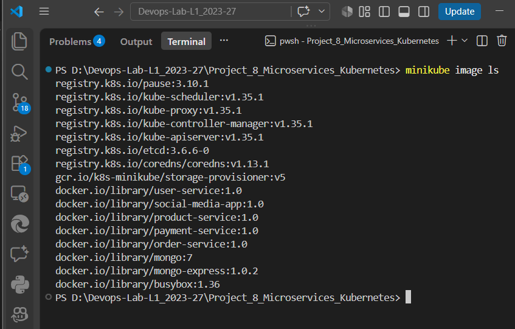


This screenshot demonstrates that the four microservice Docker images are available inside the Minikube environment.

---

# 10. Kubernetes Configuration Files

All Kubernetes configuration files are stored inside the `k8s` directory.

The Kubernetes configuration consists of:

```
```

```
k8s/

├── configmap.yaml

├── secret.yaml

├── user-service.yaml

├── product-service.yaml

├── order-service.yaml

└── payment-service.yaml
```

These files define the Kubernetes resources required to deploy and expose the complete microservices application.

---

# 11. Kubernetes ConfigMap

A Kubernetes **ConfigMap** is used to store non-sensitive application configuration.

The ConfigMap contains configuration required by the microservices, including service endpoints used for communication between services.

Examples of service URLs include:

```
```

```
USER_SERVICE_URL=http://user-service:3000

PRODUCT_SERVICE_URL=http://product-service:3000

PAYMENT_SERVICE_URL=http://payment-service:3000
```

Using Kubernetes Service names allows the microservices to communicate through Kubernetes service discovery.

The configuration is separated from the application container images, making it easier to change configuration without rebuilding the Docker images.

The configuration file is:

```
```

```
k8s/configmap.yaml
```

### Screenshot

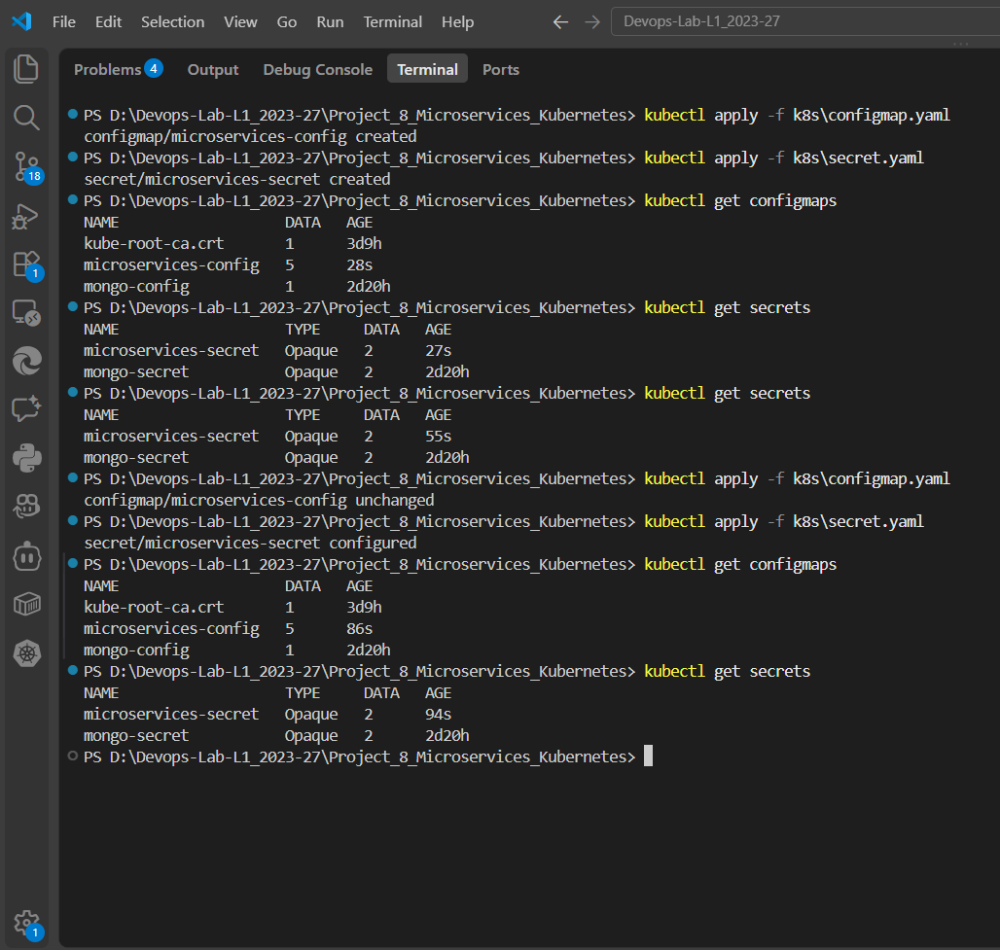


This screenshot demonstrates the Kubernetes ConfigMap and Secret resources used by the project.

---

# 12. Kubernetes Secret

A Kubernetes **Secret** is used to store sensitive configuration information.

Sensitive values should not be directly embedded inside application source code or Kubernetes Deployment definitions.

The project uses a Kubernetes Secret for sensitive configuration required by the application.

The configuration file is:

```
```

```
k8s/secret.yaml
```

The Secret provides a dedicated Kubernetes resource for managing sensitive application configuration.

### Screenshot


This screenshot demonstrates the existence of the Kubernetes Secret used by the project.

Sensitive Secret values are not exposed in the documentation.

---

# 13. Microservices ConfigMap and Secret Configuration

The microservice Deployments are configured to consume values from Kubernetes ConfigMaps and Secrets.

This provides separation between:

```
```

```
Application Code

        +

Container Image

        +

Kubernetes Configuration

        +

Sensitive Configuration
```

The microservices therefore do not need to contain environment-specific configuration directly inside their Docker images.

### Screenshot

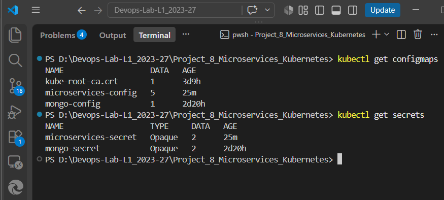


This screenshot demonstrates how the microservice deployments are associated with the Kubernetes configuration resources.

---

# 14. User Service Deployment

The User Service was deployed using a Kubernetes Deployment.

The configuration file is:

```
```

```
k8s/user-service.yaml
```

The Deployment creates and manages User Service Pods.

Two replicas were configured for the User Service.

This provides basic redundancy and demonstrates Kubernetes replica management.

### Screenshot

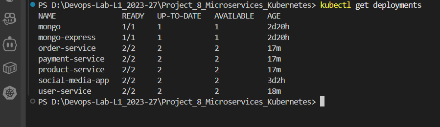


This screenshot demonstrates the User Service Deployment and its running replicas.

---

# 15. Product Service Deployment

The Product Service was deployed using a Kubernetes Deployment.

The configuration file is:

```
```

```
k8s/product-service.yaml
```

The Deployment manages the Product Service Pods.

Two replicas were configured for the Product Service.

### Screenshot


This screenshot demonstrates the Product Service Deployment and its running replicas.

---

# 16. Order Service Deployment

The Order Service was deployed using a Kubernetes Deployment.

The configuration file is:

```
```

```
k8s/order-service.yaml
```

The Order Service acts as a coordinating microservice.

It communicates with the other application services using Kubernetes Service names.

Two replicas were configured for the Order Service.

### Screenshot


This screenshot demonstrates the Order Service Deployment and its running replicas.

---

# 17. Payment Service Deployment

The Payment Service was deployed using a Kubernetes Deployment.

The configuration file is:

```
```

```
k8s/payment-service.yaml
```

The Deployment manages the Payment Service Pods.

Two replicas were configured for the Payment Service.

### Screenshot


This screenshot demonstrates the Payment Service Deployment and its running replicas.

---

# 18. Kubernetes Services

A Kubernetes Service was created for each microservice.

The services are:

```
```

```
user-service

product-service

order-service

payment-service
```

The Kubernetes Services provide stable network endpoints for the application Pods.

Instead of communicating directly with individual Pod IP addresses, microservices communicate using Kubernetes Service names.

For example:

```
```

```
http://user-service:3000

http://product-service:3000

http://payment-service:3000
```

This provides stable service discovery even when individual Pods are recreated.

### Screenshot

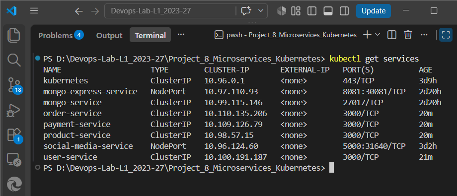


This screenshot demonstrates the Kubernetes Services created for the four microservices.

---

# 19. Kubernetes Pods Running

Each microservice was configured with two replicas.

The resulting application environment contains:

```
```

```
User Service
    └── 2 Pods

Product Service
    └── 2 Pods

Order Service
    └── 2 Pods

Payment Service
    └── 2 Pods
```

Therefore, the four microservices run a total of eight application Pods.

All application Pods were verified to be in the `Running` state.

### Screenshot

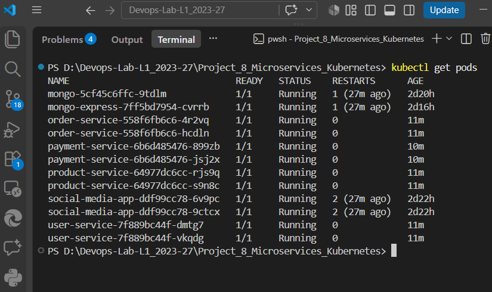


This screenshot demonstrates that all four microservices are running successfully with two replicas each.

---

# 20. User Service Verification

The User Service was tested after deployment to verify that the application was responding successfully.

The Kubernetes Service was accessed using port forwarding during local testing.

The User Service response was successfully received from the running Kubernetes application.

### Screenshot

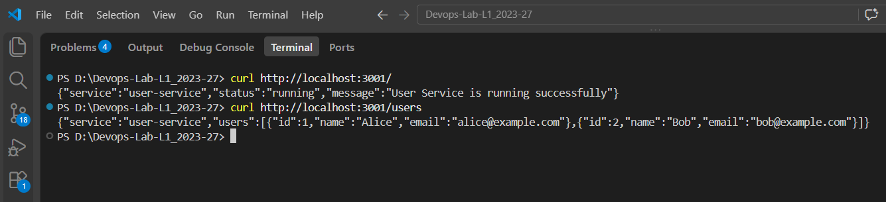


This screenshot demonstrates that the User Service is successfully running and responding to requests.

---

# 21. Product Service Verification

The Product Service was tested after deployment.

The service responded successfully to requests sent through the Kubernetes environment.

### Screenshot

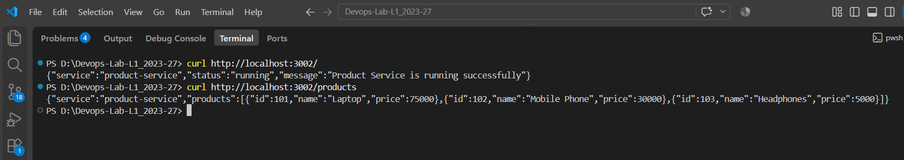


This screenshot demonstrates that the Product Service is successfully running and responding to requests.

---

# 22. Payment Service Verification

The Payment Service was tested after deployment.

The service successfully responded to requests through the Kubernetes Service.

### Screenshot

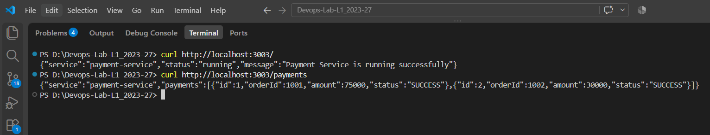


This screenshot demonstrates that the Payment Service is successfully running and responding to requests.

---

# 23. Order Service Verification

The Order Service was tested after deployment.

The service successfully responded to requests through its Kubernetes Service.

### Screenshot

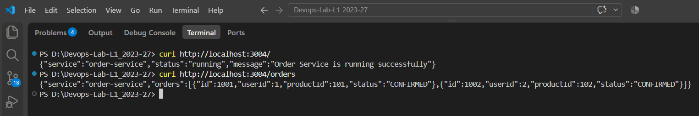


This screenshot demonstrates that the Order Service is successfully running and responding to requests.

---

# 24. Inter-Service Communication

One of the most important features of the project is communication between the independent microservices.

The Order Service communicates with:

```
```

```
Order Service
      │
      ├──────────────► User Service
      │
      ├──────────────► Product Service
      │
      └──────────────► Payment Service
```

The communication takes place using Kubernetes Service DNS names.

The Order Service does not need to know the individual Pod IP addresses of the other services.

Instead, Kubernetes provides stable Service names such as:

```
```

```
user-service

product-service

payment-service
```

The successful inter-service request demonstrates that the four microservices are able to operate together as a distributed application.

### Screenshot

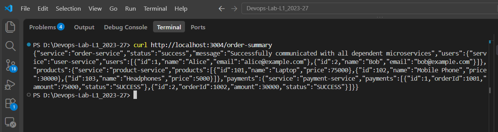


This screenshot provides evidence that the Order Service successfully communicates with the other microservices.

---

# 25. Kubernetes Deployment Verification

After all Kubernetes resources were applied, the Deployments were checked using:

```
```

```
kubectl get deployments
```

The four Project 8 Deployments reached the following state:

```
```

```
order-service       2/2
payment-service     2/2
product-service     2/2
user-service        2/2
```

The `2/2` status indicates that two desired replicas were created and both replicas are available.

### Screenshot


This screenshot provides evidence that all four microservice Deployments are successfully running with two replicas each.

---

# 26. Kubernetes Pod Verification

The Pods were checked using:

```
```

```
kubectl get pods
```

The Project 8 application Pods reached the following state:

```
```

```
User Service       2 Pods   Running

Product Service    2 Pods   Running

Order Service      2 Pods   Running

Payment Service    2 Pods   Running
```

Each Pod showed:

```
```

```
1/1 Running
```

which indicates that the application container inside each Pod was successfully started.

### Screenshot


This screenshot provides evidence that all microservice Pods are running successfully.

---

# 27. Final Kubernetes Status

The final Kubernetes environment was checked after completing the deployment and verification process.

The final state included:

```
```

```
Deployments

├── user-service
├── product-service
├── order-service
└── payment-service
```

Each Deployment had two available replicas.

The corresponding Kubernetes Services were also successfully created.

The application Pods were in the `Running` state.

### Screenshot

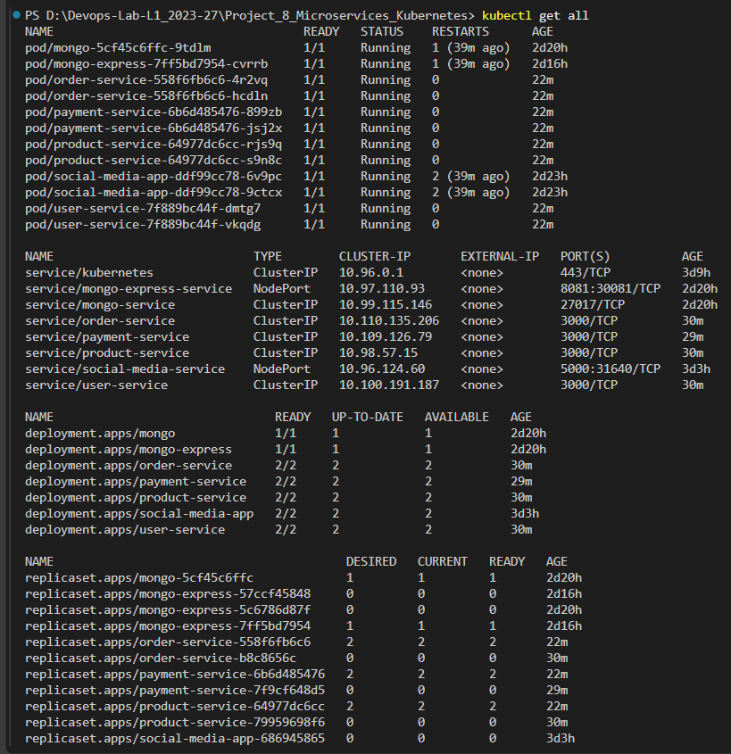


This screenshot provides final evidence that the Kubernetes microservices application was successfully deployed.

---

# 28. Kubernetes Configuration Summary

The following Kubernetes configuration files were used in the project.

## `configmap.yaml`

```
```

```
k8s/configmap.yaml
```

Responsible for:

-  Storing non-sensitive application configuration. 
-  Providing service URLs to the microservices. 
-  Separating configuration from application code. 

---

## `secret.yaml`

```
```

```
k8s/secret.yaml
```

Responsible for:

-  Storing sensitive configuration. 
-  Providing protected configuration values to the required workloads. 
-  Separating sensitive information from application code. 

---

## `user-service.yaml`

```
```

```
k8s/user-service.yaml
```

Responsible for:

-  Creating the User Service Deployment. 
-  Running two User Service replicas. 
-  Creating the User Service Kubernetes Service. 
-  Providing a stable network endpoint for the User Service. 

---

## `product-service.yaml`

```
```

```
k8s/product-service.yaml
```

Responsible for:

-  Creating the Product Service Deployment. 
-  Running two Product Service replicas. 
-  Creating the Product Service Kubernetes Service. 
-  Providing a stable network endpoint for the Product Service. 

---

## `order-service.yaml`

```
```

```
k8s/order-service.yaml
```

Responsible for:

-  Creating the Order Service Deployment. 
-  Running two Order Service replicas. 
-  Creating the Order Service Kubernetes Service. 
-  Configuring communication with the User, Product, and Payment Services. 

---

## `payment-service.yaml`

```
```

```
k8s/payment-service.yaml
```

Responsible for:

-  Creating the Payment Service Deployment. 
-  Running two Payment Service replicas. 
-  Creating the Payment Service Kubernetes Service. 
-  Providing a stable network endpoint for the Payment Service. 

---

# 29. Complete Microservices Architecture

The overall Kubernetes architecture can be summarized as follows:

```
```

```
                    Minikube Kubernetes Cluster
                              │
                              │
                    ┌─────────┴─────────┐
                    │                   │
                    ▼                   ▼
              ConfigMap              Secret
                    │                   │
                    └─────────┬─────────┘
                              │
                              ▼
                   Kubernetes Deployments
                              │
          ┌───────────────────┼───────────────────┐
          │                   │                   │
          ▼                   ▼                   ▼
   User Service        Product Service       Payment Service
      Deployment           Deployment            Deployment
          │                   │                   │
       2 Pods              2 Pods               2 Pods
          │                   │                   │
          └───────────────────┼───────────────────┘
                              │
                              ▼
                       Order Service
                         Deployment
                              │
                           2 Pods
                              │
              ┌───────────────┼───────────────┐
              │               │               │
              ▼               ▼               ▼
        User Service   Product Service   Payment Service
           Service         Service          Service
```

The architecture demonstrates how Kubernetes can host multiple independent services while providing service discovery and networking between them.

---

# 30. Microservice Communication Flow

The communication flow can be represented as:

```
```

```
                        Client Request
                              │
                              ▼
                       Order Service
                              │
              ┌───────────────┼───────────────┐
              │               │               │
              ▼               ▼               ▼
        User Service    Product Service   Payment Service
              │               │               │
              ▼               ▼               ▼
        User Response   Product Response   Payment Response
              │               │               │
              └───────────────┼───────────────┘
                              │
                              ▼
                       Order Service
                              │
                              ▼
                        Final Response
```

This demonstrates the distributed nature of the application.

Each service performs a specific responsibility and communicates with other services through Kubernetes networking.

---

# 31. Configuration and Security Flow

The project uses Kubernetes ConfigMaps and Secrets to provide configuration to the application.

```
```

```
                    Kubernetes Configuration
                              │
                 ┌────────────┴────────────┐
                 │                         │
                 ▼                         ▼
             ConfigMap                 Secret
                 │                         │
                 │                  Sensitive Values
                 │                         │
                 └────────────┬────────────┘
                              │
                              ▼
                     Microservice Pods
                              │
                              ▼
                     Running Application
```

The ConfigMap provides non-sensitive configuration such as service URLs.

The Secret provides sensitive configuration values.

This approach separates configuration from application code and provides a dedicated mechanism for sensitive information.

---

# 32. Multiple Replica Architecture

Each microservice was configured with two replicas.

```
```

```
User Service
│
├── Pod 1
└── Pod 2


Product Service
│
├── Pod 1
└── Pod 2


Order Service
│
├── Pod 1
└── Pod 2


Payment Service
│
├── Pod 1
└── Pod 2
```

Therefore:

```
```

```
4 Microservices × 2 Replicas
             =
8 Application Pods
```

Running multiple replicas demonstrates Kubernetes Deployment and replica management capabilities.

It also provides basic redundancy because the application service can continue running when one replica becomes unavailable.

---

# 33. Complete Implementation Sequence

The project was implemented in the following sequence.

## Step 1 – Create Project Structure

Created the Project 8 directory with:

```
```

```
k8s/

microservices/

screenshots/
```

---

## Step 2 – Create Four Microservices

Created the following services:

```
```

```
user-service

product-service

order-service

payment-service
```

Each service was developed as an independent application.

---

## Step 3 – Create Dockerfiles

A Dockerfile was created for each microservice.

The Dockerfiles define how the applications are packaged into Docker containers.

---

## Step 4 – Build Docker Images

Docker images were built for all four services:

```
```

```
user-service:1.0

product-service:1.0

order-service:1.0

payment-service:1.0
```

---

## Step 5 – Start Minikube

A local Kubernetes cluster was started using Minikube.

---

## Step 6 – Make Images Available to Minikube

The four Docker images were loaded into the Minikube environment so that Kubernetes could use the locally built images.

---

## Step 7 – Create ConfigMap

Created:

```
```

```
k8s/configmap.yaml
```

to store non-sensitive microservice configuration.

---

## Step 8 – Create Secret

Created:

```
```

```
k8s/secret.yaml
```

to store sensitive configuration values.

---

## Step 9 – Deploy User Service

Created and applied:

```
```

```
k8s/user-service.yaml
```

This created the User Service Deployment and Service.

---

## Step 10 – Deploy Product Service

Created and applied:

```
```

```
k8s/product-service.yaml
```

This created the Product Service Deployment and Service.

---

## Step 11 – Deploy Order Service

Created and applied:

```
```

```
k8s/order-service.yaml
```

This created the Order Service Deployment and Service.

---

## Step 12 – Deploy Payment Service

Created and applied:

```
```

```
k8s/payment-service.yaml
```

This created the Payment Service Deployment and Service.

---

## Step 13 – Verify Deployments

Used:

```
```

```
kubectl get deployments
```

to verify that all four microservice Deployments had two available replicas.

---

## Step 14 – Verify Pods

Used:

```
```

```
kubectl get pods
```

to verify that all eight application Pods were running successfully.

---

## Step 15 – Verify Services

Used:

```
```

```
kubectl get services
```

to verify that Kubernetes Services were created for all four microservices.

---

## Step 16 – Test Individual Microservices

The following services were individually tested:

```
```

```
User Service

Product Service

Payment Service

Order Service
```

The services successfully responded to requests.

---

## Step 17 – Test Inter-Service Communication

The Order Service was tested to verify communication with:

```
```

```
User Service

Product Service

Payment Service
```

The successful response demonstrated that Kubernetes Service discovery and networking were functioning correctly.

---

## Step 18 – Verify Final Kubernetes State

The final Kubernetes resources were checked to confirm that the complete microservices application was deployed successfully.

---

# 34. Evidence Summary

The following screenshots provide evidence for the complete Project 8 implementation.

| Implementation EvidenceScreenshot |                                                |
| --------------------------------- | ---------------------------------------------- |
| Initial Project Setup             | `project8_setup.png`                           |
| Project Structure                 | `project8_structure.png`                       |
| Docker Images                     | `project8_docker_images.png`                   |
| Kubernetes Cluster                | `project8_kubernetes_cluster.png`              |
| Minikube Images                   | `project8_minikube_images.png`                 |
| ConfigMap and Secret              | `project8_configmap_secret.png`                |
| Microservice Configuration        | `project8_microservices_configmap_secrets.png` |
| Kubernetes Deployments            | `project8_kubernetes_deployments.png`          |
| Kubernetes Pods Running           | `project8_kubernetes_pods_running.png`         |
| Kubernetes Services               | `project8_services.png`                        |
| User Service Test                 | `project8_user_service_test.png`               |
| Product Service Test              | `project8_product_service_test.png`            |
| Payment Service Test              | `project8_payment_service_test.png`            |
| Order Service Test                | `project8_orders_service_test.png`             |
| Inter-Service Communication       | `project8_interservice_communication.png`      |
| Final Kubernetes Status           | `project8_final_kubernetes_status.png`         |

All screenshots are stored in the `screenshots` directory and are directly linked in this README.

---

# 35. Result

The Project 8 implementation successfully demonstrates the deployment of a complete **four-microservice application using Kubernetes**.

The application consists of:

```
```

```
User Service

Product Service

Order Service

Payment Service
```

Each microservice was containerized using Docker and deployed using a Kubernetes Deployment.

Each microservice was configured with two replicas, resulting in eight application Pods.

Kubernetes Services were created to provide stable network endpoints and enable communication between the microservices.

A ConfigMap was used to provide non-sensitive application configuration, while a Secret was used for sensitive configuration.

The Order Service successfully communicated with the User Service, Product Service, and Payment Service using Kubernetes Service discovery.

The final Kubernetes environment was verified successfully, with all four microservices running with two replicas each.

Therefore, the project demonstrates the practical use of Kubernetes for deploying, managing, networking, configuring, and verifying a complete microservices-based application.

---

# 36. Conclusion

This project demonstrates the practical deployment of a **complete containerized microservices application in Kubernetes**.

The implementation covers several important DevOps and Kubernetes concepts:

```
```

```
Docker
   ↓
Containerized Microservices
   ↓
Minikube
   ↓
Kubernetes Cluster
   ↓
ConfigMap + Secret
   ↓
Kubernetes Deployments
   ↓
Multiple Pod Replicas
   ↓
Kubernetes Services
   ↓
Service Discovery
   ↓
Inter-Service Communication
   ↓
Complete Microservices Application
```

The project demonstrates how independent microservices can be packaged as Docker containers and deployed as separate Kubernetes workloads.

The use of **Deployments** demonstrates application lifecycle and replica management.

The use of **Services** demonstrates stable networking and service discovery.

The use of **ConfigMaps** demonstrates externalized non-sensitive configuration.

The use of **Secrets** demonstrates dedicated management of sensitive configuration.

The use of multiple replicas demonstrates Kubernetes scaling and redundancy.

Finally, the successful inter-service communication demonstrates that the individual microservices can operate together as one distributed application.

Thus, Project 8 provides a practical demonstration of how Kubernetes can be used to deploy and manage a complete microservices-based application.

```
```

````
