# Project 9: Apache2 Server Deployment and Host Access Using Kubernetes

> All project evidence screenshots are embedded below using relative paths from the `screenshots/` directory. They will render in GitHub, VS Code Markdown Preview, and other standard Markdown viewers when the repository structure is preserved.

## 1. Project Overview

This project demonstrates how to create and deploy an **Apache2 HTTP server using Kubernetes** and access the deployed Apache2 server from the **host machine**.

The project uses **Minikube** to create a local Kubernetes cluster. Apache2 is deployed inside a Kubernetes Deployment using the official Apache HTTP Server container image.

A Kubernetes Service of type **NodePort** is used to expose the Apache2 application outside the Kubernetes cluster so that it can be accessed from the Windows host machine.

The project demonstrates the following Kubernetes concepts:

* Kubernetes Cluster
* Minikube
* Kubernetes Deployment
* Kubernetes Pods
* Kubernetes Service
* NodePort
* Container Port
* Service Endpoints
* `kubectl exec`
* `kubectl logs`
* Kubernetes scaling
* Host-machine access
* Apache2 HTTP Server

---

# 2. Project Objectives

The objectives of this project are:

1. To create a local Kubernetes cluster using Minikube.

2. To understand how Kubernetes Deployments are created.

3. To deploy an Apache2 HTTP server inside a Kubernetes Pod.

4. To configure an Apache2 Deployment with multiple replicas.

5. To create a Kubernetes Service for the Apache2 application.

6. To understand the difference between `port`, `targetPort`, and `nodePort`.

7. To expose the Apache2 application using a NodePort Service.

8. To access the Apache2 server from the Windows host machine.

9. To verify Apache2 from inside the container.

10. To inspect Apache2 container logs.

11. To verify Kubernetes Service endpoints.

12. To demonstrate scaling of the Apache2 Deployment.

13. To verify the final Kubernetes resources.

---

# 3. Project Directory Structure

The project is organized as follows:

```text
Project_9_Apache2_Kubernetes/

│
├── k8s/
│   ├── apache-deployment.yaml
│   └── apache-service.yaml
│
├── screenshots/
│   ├── project9_setup.png
│   ├── project9_minikube_running.png
│   ├── project9_kubernetes_cluster.png
│   ├── project9_apache_deployment.png
│   ├── project9_apache_service.png
│   ├── project9_apache_pods.png
│   ├── project9_apache_inside_container.png
│   ├── project9_apache_host_access.png
│   ├── project9_host_curl_test.png
│   ├── project9_apache_logs.png
│   ├── project9_apache_scaling.png
│   ├── project9_service_endpoints.png
│   └── project9_final_kubernetes_status.png
│
└── README.md
````

The `k8s` directory contains the Kubernetes YAML configuration files.

The `screenshots` directory contains evidence of the implementation, testing, and final verification.

---

# 4. Initial Project Setup

The Project 9 directory was created inside the DevOps laboratory repository.

The project location is:


```
D:\Devops-Lab-L1_2023-27\Project_9_Apache2_Kubernetes
```

The project contains two main directories:

- `k8s` – contains Kubernetes configuration files. 
- `screenshots` – contains screenshots documenting the implementation. 

### Screenshot

**Screenshot:** `project9_setup.png`

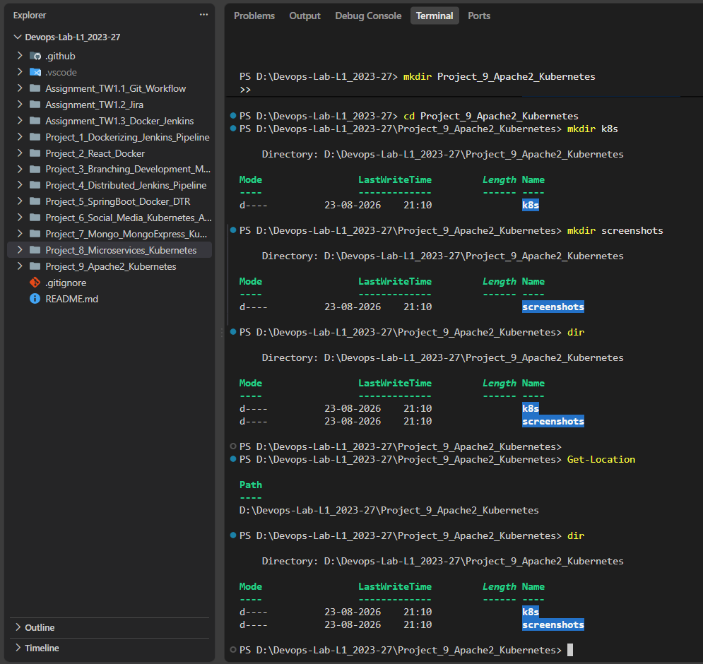


---

# 5. Minikube Kubernetes Cluster

A local Kubernetes cluster was created using **Minikube**.

Minikube provides a local Kubernetes environment in which the Apache2 application can be deployed and tested.

The Minikube cluster was started before deploying the Apache2 Kubernetes resources.

The cluster status was verified using:


```
minikube status
```

The Kubernetes node was also verified using:


```
kubectl get nodes
```

### Screenshot

**Screenshot:** `project9_minikube_running.png`

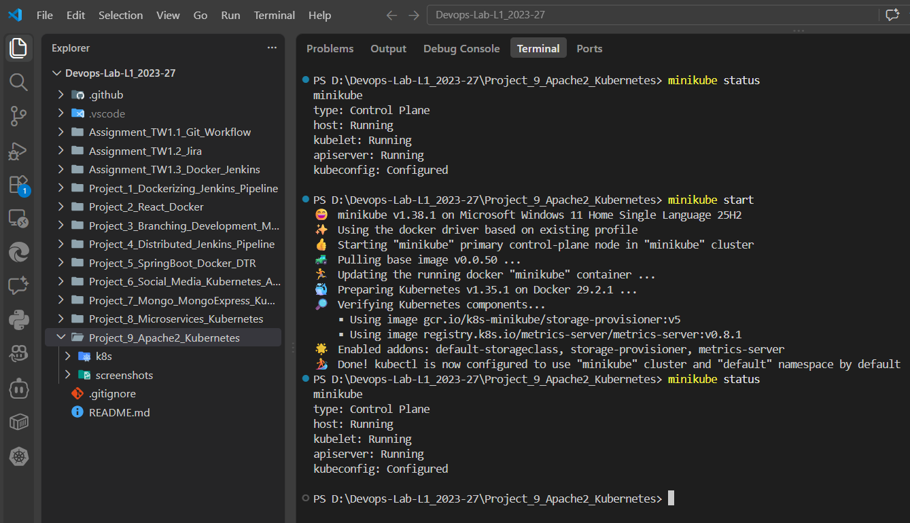


---

# 6. Kubernetes Cluster Verification

The Kubernetes cluster connection was verified using:


```
kubectl cluster-info
```

The Kubernetes nodes were checked using:


```
kubectl get nodes
```

This confirmed that `kubectl` was successfully communicating with the Minikube Kubernetes cluster.

### Screenshot

**Screenshot:** `project9_kubernetes_cluster.png`

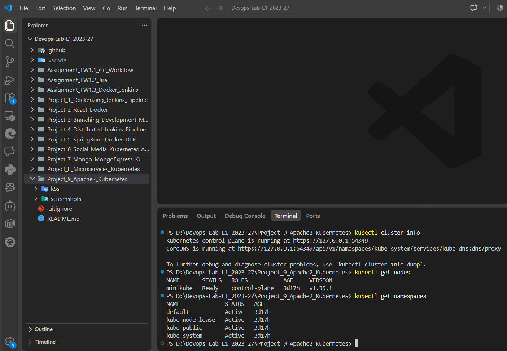


---

# 7. Kubernetes Configuration Files

The Kubernetes configuration files are stored inside the `k8s` directory.

The project contains:


```
k8s/

├── apache-deployment.yaml
└── apache-service.yaml
```

The Deployment file is responsible for creating and managing the Apache2 Pods.

The Service file is responsible for exposing the Apache2 application using a Kubernetes NodePort.

---

# 8. Apache2 Deployment

Apache2 was deployed using a Kubernetes Deployment.

The configuration file is:


```
k8s/apache-deployment.yaml
```

The Deployment uses the Apache HTTP Server container image:


```
image: httpd:2.4
```

The Apache container listens on port:


```
80
```

The Deployment was configured with:


```
replicas: 2
```

Therefore, Kubernetes maintains two Apache2 Pods.

The Deployment was created using:


```
kubectl apply -f .\k8s\apache-deployment.yaml
```

The Deployment was verified using:


```
kubectl get deployment apache2
```

### Screenshot

**Screenshot:** `project9_apache_deployment.png`

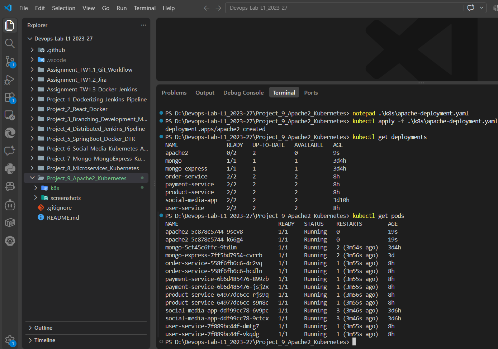


---

# 9. Apache2 Pods

The Apache2 Deployment creates two Pods.

The Pods were checked using:


```
kubectl get pods -l app=apache2
```

The Pods were also inspected using:


```
kubectl get pods -l app=apache2 -o wide
```

The expected state is:


```
READY   STATUS
1/1     Running
1/1     Running
```

This confirms that both Apache2 containers were running successfully.

### Screenshot

**Screenshot:** `project9_apache_pods.png`

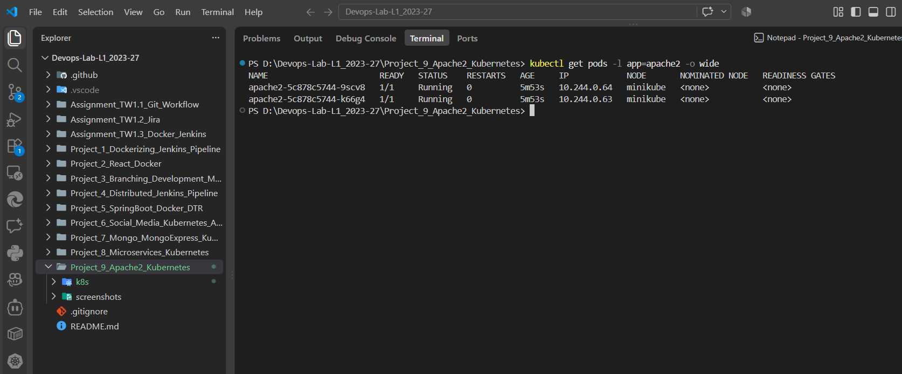


---

# 10. Apache2 Kubernetes Service

A Kubernetes Service was created to provide stable network access to the Apache2 Pods.

The configuration file is:


```
k8s/apache-service.yaml
```

The Service uses:


```
type: NodePort
```

The Service configuration maps:


```
Service Port: 80
Target Port: 80
Node Port: 30080
```

The Service was created using:


```
kubectl apply -f .\k8s\apache-service.yaml
```

The Service was verified using:


```
kubectl get service apache2-service
```

The Service details were inspected using:


```
kubectl describe service apache2-service
```

### Screenshot

**Screenshot:** `project9_apache_service.png`

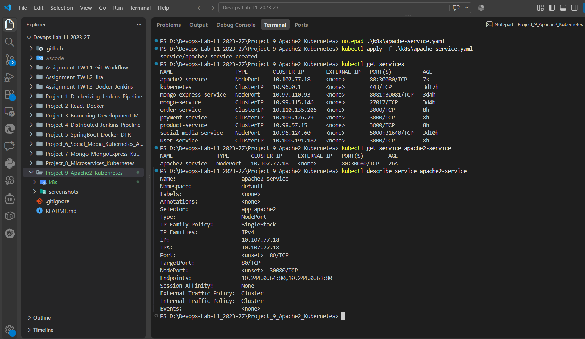


---

# 11. Apache2 Service Networking

The Apache2 Service provides a stable Kubernetes network endpoint for the Apache2 Pods.

The networking flow is:


```
Windows Host Machine
        |
        v
Minikube Node
        |
        v
NodePort 30080
        |
        v
Apache2 Service
        |
        +----------------+
        |                |
        v                v
 Apache2 Pod 1      Apache2 Pod 2
    Port 80            Port 80
```

The Service selects Pods using the label:


```
app: apache2
```

The Service then forwards incoming requests to port `80` of the selected Apache2 Pods.

---

# 12. Apache2 Inside the Container

Apache2 was also verified from inside one of the Kubernetes containers.

A shell was opened inside an Apache2 Pod using:


```
kubectl exec -it <POD_NAME> -- sh
```

The Apache version was checked using:


```
httpd -v
```

The Apache server was tested internally using:


```
curl http://localhost
```

The response from Apache confirmed that the HTTP server was running successfully inside the container.

### Screenshot

**Screenshot:** `project9_apache_inside_container.png`

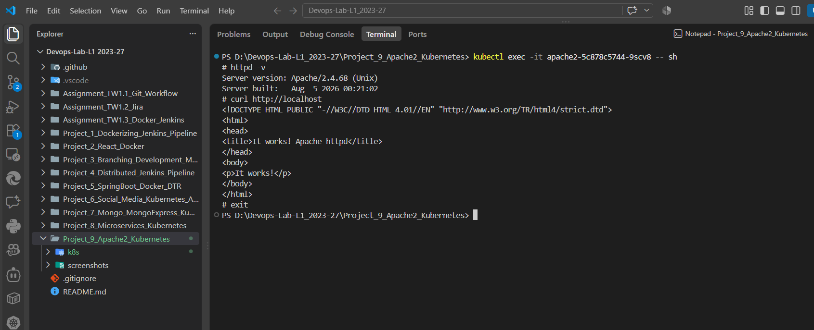


---

# 13. Accessing Apache2 from the Host Machine

The main objective of this project is to access the Apache2 server from the host machine.

The Kubernetes Service was exposed using a NodePort.

The Minikube Service URL was obtained using:


```
minikube service apache2-service --url
```

Minikube provided a URL that could be accessed from the Windows host machine.

The URL was opened in a web browser.

The Apache2 default web page was displayed successfully.

This demonstrates the following communication path:


```
Windows Host Machine
        |
        v
Minikube
        |
        v
NodePort
        |
        v
Apache2 Service
        |
        v
Apache2 Pod
        |
        v
Apache HTTP Server
```

### Screenshot

**Screenshot:** `project9_apache_host_access.png`

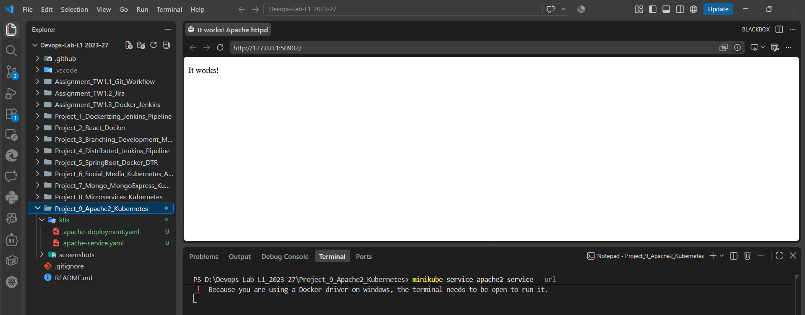


---

# 14. Host Machine HTTP Test

The Apache2 application was also tested from the Windows host using a command-line HTTP request.

The Service URL obtained from Minikube was used with:


```
curl.exe <URL_RETURNED_BY_MINIKUBE>
```

The Apache2 HTML response was returned successfully.

This provides command-line evidence that the host machine could communicate with the Apache2 application through the Kubernetes Service.

### Screenshot

**Screenshot:** `project9_host_curl_test.png`

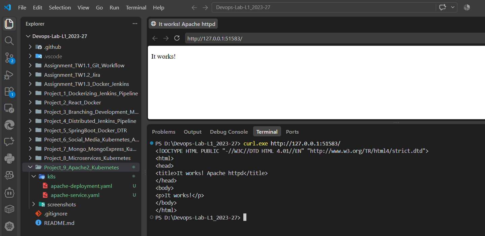


---

# 15. Apache2 Logs

Apache2 container logs were checked using:


```
kubectl logs <POD_NAME>
```

After accessing the Apache2 web page from the host machine, the request appeared in the Apache logs.

This confirms that the HTTP request successfully reached the Apache2 container.

The log verification demonstrates the complete communication path from the host machine to the Kubernetes Service and finally to the Apache2 application.

### Screenshot

**Screenshot:** `project9_apache_logs.png`

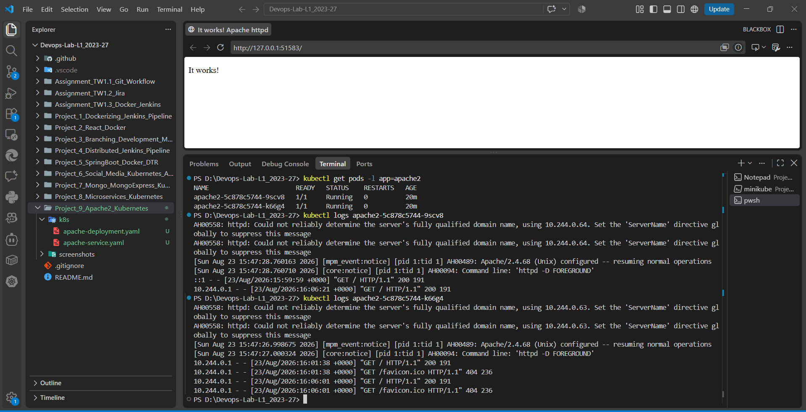


---

# 16. Kubernetes Service Endpoints

The endpoints associated with the Apache2 Service were checked using:


```
kubectl get endpoints apache2-service
```

The Service endpoints correspond to the IP addresses of the Apache2 Pods.

The endpoints demonstrate that the Kubernetes Service is correctly connected to the Apache2 Pods.

The relationship can be represented as:


```
apache2-service
      |
      +------------------+
      |                  |
      v                  v
Apache2 Pod 1       Apache2 Pod 2
```

### Screenshot

**Screenshot:** `project9_service_endpoints.png`

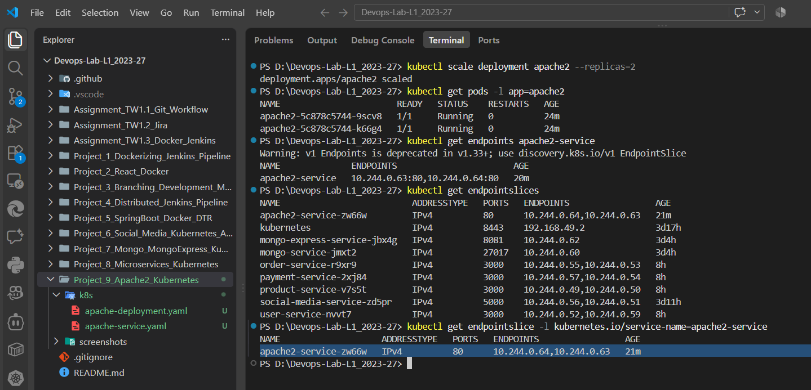


---

# 17. Kubernetes Deployment Scaling

Kubernetes scaling was demonstrated by changing the number of Apache2 replicas.

The Deployment was initially configured with:


```
replicas: 2
```

The Deployment was temporarily scaled to three replicas using:


```
kubectl scale deployment apache2 --replicas=3
```

The Deployment was then checked using:


```
kubectl get deployment apache2
```

The Pods were checked using:


```
kubectl get pods -l app=apache2
```

The result demonstrated that Kubernetes automatically created an additional Apache2 Pod.

After testing, the Deployment was restored to two replicas:


```
kubectl scale deployment apache2 --replicas=2
```

### Screenshot

**Screenshot:** `project9_apache_scaling.png`

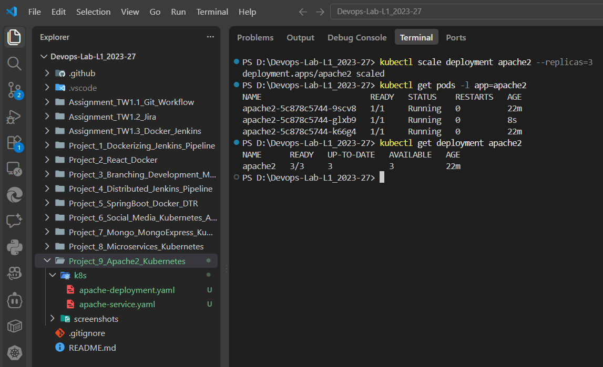


---

# 18. Kubernetes Resources Used

The project uses the following Kubernetes resources:

| Resource | Name | Purpose |
| --- | --- | --- |
| Deployment          | `apache2`         | Creates and manages Apache2 Pods          |
| Pod                 | `apache2-*`       | Runs Apache2 containers                   |
| Service             | `apache2-service` | Provides stable network access            |
| NodePort            | `30080`           | Exposes Apache2 outside the cluster       |
| Minikube            | `minikube`        | Provides the local Kubernetes environment |

---

# 19. Apache2 Deployment Configuration

The `apache-deployment.yaml` file contains the following main configuration:


```
apiVersion: apps/v1
kind: Deployment
metadata:
  name: apache2
spec:
  replicas: 2
  selector:
    matchLabels:
      app: apache2
  template:
    metadata:
      labels:
        app: apache2
    spec:
      containers:
        - name: apache2
          image: httpd:2.4
          ports:
            - containerPort: 80
```

The main responsibilities of the Deployment are:

-  Creating Apache2 Pods. 
-  Maintaining two replicas. 
-  Running the Apache HTTP Server container. 
-  Exposing container port 80. 
-  Restarting failed containers automatically. 
-  Maintaining the desired number of replicas. 

---

# 20. Apache2 Service Configuration

The `apache-service.yaml` file contains the Kubernetes Service configuration.

The Service uses:


```
apiVersion: v1
kind: Service
metadata:
  name: apache2-service
spec:
  selector:
    app: apache2
  ports:
    - protocol: TCP
      port: 80
      targetPort: 80
      nodePort: 30080
  type: NodePort
```

The main responsibilities of the Service are:

-  Providing a stable network endpoint. 
-  Selecting Apache2 Pods using the `app: apache2` label. 
-  Forwarding traffic to port 80. 
-  Exposing the application through NodePort 30080. 

---

# 21. Understanding Kubernetes Ports

Three port concepts are used in the Apache2 Service.

## Container Port


```
80
```

Apache2 listens on port 80 inside the container.

## Target Port


```
80
```

The Service forwards incoming requests to port 80 of the Apache2 Pods.

## Node Port


```
30080
```

The NodePort exposes the Service through the Kubernetes node.

The relationship is:


```
Host Machine
     |
     | NodePort 30080
     v
Kubernetes Node
     |
     v
Apache2 Service :80
     |
     | targetPort 80
     v
Apache2 Container :80
```

---

# 22. Complete Apache2 Architecture

The complete Project 9 architecture is:


```
                       Windows Host Machine
                               |
                               |
                       HTTP Request
                               |
                               v
                    Minikube Kubernetes
                               |
                               |
                         NodePort 30080
                               |
                               v
                    apache2-service
                       Service :80
                               |
                 +-------------+-------------+
                 |                           |
                 v                           v
          Apache2 Pod 1                Apache2 Pod 2
             Port 80                     Port 80
                 |                           |
                 +-------------+-------------+
                               |
                               v
                         Apache HTTP
                            Server
                               |
                               v
                       HTTP Response
                               |
                               v
                       Windows Browser
```

The architecture demonstrates how Kubernetes exposes a containerized application to a host machine.

---

# 23. Complete Implementation Sequence

The project was implemented using the following sequence.

## Step 1 – Create Project Directory

Created:


```
Project_9_Apache2_Kubernetes
```

with:


```
k8s
screenshots
```

## Step 2 – Start Minikube

Started the Minikube Kubernetes cluster.

## Step 3 – Verify Kubernetes

Used:


```
kubectl cluster-info
kubectl get nodes
```

## Step 4 – Create Apache2 Deployment

Created:


```
k8s/apache-deployment.yaml
```

## Step 5 – Deploy Apache2

Applied:


```
kubectl apply -f k8s/apache-deployment.yaml
```

## Step 6 – Verify Apache2 Pods

Used:


```
kubectl get pods -l app=apache2
```

## Step 7 – Create Apache2 Service

Created:


```
k8s/apache-service.yaml
```

## Step 8 – Apply Service

Used:


```
kubectl apply -f k8s/apache-service.yaml
```

## Step 9 – Verify Service

Used:


```
kubectl get service apache2-service
```

## Step 10 – Verify Apache2 Internally

Used:


```
kubectl exec -it <POD_NAME> -- sh
```

and:


```
httpd -v
curl http://localhost
```

## Step 11 – Expose Apache2 to Host

Used:


```
minikube service apache2-service --url
```

## Step 12 – Access Apache2 from Browser

Opened the URL provided by Minikube from the Windows host machine.

## Step 13 – Test Using PowerShell

Used:


```
curl.exe <MINIKUBE_URL>
```

## Step 14 – Check Logs

Used:


```
kubectl logs <POD_NAME>
```

## Step 15 – Demonstrate Scaling

Used:


```
kubectl scale deployment apache2 --replicas=3
```

## Step 16 – Verify Service Endpoints

Used:


```
kubectl get endpoints apache2-service
```

## Step 17 – Restore Replicas

Restored the Deployment to two replicas:


```
kubectl scale deployment apache2 --replicas=2
```

## Step 18 – Final Verification

Verified the complete Apache2 Kubernetes deployment.

---

# 24. Final Kubernetes Status

The final Project 9 resources were verified using Kubernetes commands.

The main resources include:


```
Deployment:
apache2

Pods:
apache2-*

Service:
apache2-service
```

The final verification included:


```
kubectl get deployment apache2
kubectl get pods -l app=apache2
kubectl get service apache2-service
kubectl get all -l app=apache2
```

### Screenshot

**Screenshot:** `project9_final_kubernetes_status.png`

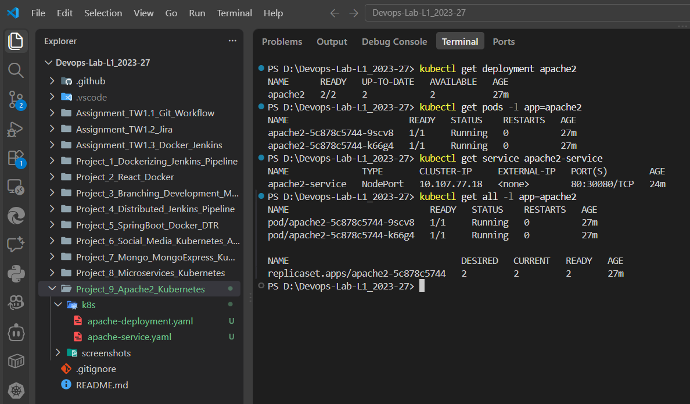


---

# 25. Evidence Summary

The following screenshots provide evidence for the complete Project 9 implementation.

| Implementation Evidence | Screenshot |
| --- | --- |
| Initial Project Setup             | `project9_setup.png`                   |
| Minikube Running                  | `project9_minikube_running.png`        |
| Kubernetes Cluster                | `project9_kubernetes_cluster.png`      |
| Apache2 Deployment                | `project9_apache_deployment.png`       |
| Apache2 Service                   | `project9_apache_service.png`          |
| Apache2 Pods                      | `project9_apache_pods.png`             |
| Apache2 Inside Container          | `project9_apache_inside_container.png` |
| Apache2 Host Access               | `project9_apache_host_access.png`      |
| Host Machine CURL Test            | `project9_host_curl_test.png`          |
| Apache2 Logs                      | `project9_apache_logs.png`             |
| Apache2 Scaling                   | `project9_apache_scaling.png`          |
| Service Endpoints                 | `project9_service_endpoints.png`       |
| Final Kubernetes Status           | `project9_final_kubernetes_status.png` |

All screenshots are stored inside the `screenshots` directory and are directly linked in this README.

---

# 26. Important Kubernetes Commands Used

The following commands were used throughout the project.

## Minikube


```
minikube status
minikube service apache2-service --url
```

## Kubernetes Cluster


```
kubectl cluster-info
kubectl get nodes
```

## Deployment


```
kubectl apply -f k8s/apache-deployment.yaml
kubectl get deployment apache2
kubectl describe deployment apache2
```

## Pods


```
kubectl get pods
kubectl get pods -l app=apache2
kubectl get pods -l app=apache2 -o wide
kubectl describe pod <POD_NAME>
```

## Service


```
kubectl apply -f k8s/apache-service.yaml
kubectl get service apache2-service
kubectl describe service apache2-service
```

## Container Access


```
kubectl exec -it <POD_NAME> -- sh
```

Inside the container:


```
httpd -v
curl http://localhost
```

## Logs


```
kubectl logs <POD_NAME>
```

## Scaling


```
kubectl scale deployment apache2 --replicas=3
kubectl get pods -l app=apache2
kubectl scale deployment apache2 --replicas=2
```

## Endpoints


```
kubectl get endpoints apache2-service
```

## Final Verification


```
kubectl get deployment apache2
kubectl get pods -l app=apache2
kubectl get service apache2-service
kubectl get all -l app=apache2
```

---

# 27. Result

The Project 9 implementation successfully demonstrates the deployment of an **Apache2 HTTP server using Kubernetes**.

A Minikube cluster was used as the local Kubernetes environment. Apache2 was deployed using a Kubernetes Deployment with two replicas.

A Kubernetes Service of type NodePort was created to expose Apache2 outside the Kubernetes cluster.

The Apache2 application was successfully accessed from the Windows host machine using the URL provided by:


```
minikube service apache2-service --url
```

The Apache2 server was also verified from inside the Kubernetes container using `httpd -v` and `curl`.

The application logs were inspected to verify incoming HTTP requests. Kubernetes Service endpoints were checked to confirm that the Service was connected to the Apache2 Pods.

Deployment scaling was also demonstrated by temporarily increasing the number of Apache2 replicas from two to three.

Therefore, the project successfully demonstrates how Kubernetes can be used to deploy, manage, expose, test, and scale a containerized Apache2 web server.

---

# 28. Conclusion

This project demonstrates the practical use of Kubernetes to deploy and expose an Apache2 web server.

The complete flow can be summarized as:


```
Minikube
   |
   v
Kubernetes Cluster
   |
   v
Apache2 Deployment
   |
   v
Apache2 Pods
   |
   v
Apache2 Service
   |
   v
NodePort
   |
   v
Windows Host Machine
   |
   v
Web Browser / CURL
   |
   v
Apache2 HTTP Response
```

The project covers fundamental Kubernetes concepts including:


```
Minikube
   ↓
Deployment
   ↓
Pods
   ↓
Container
   ↓
Service
   ↓
NodePort
   ↓
External Access
   ↓
Scaling
   ↓
Logs and Verification
```

The successful host-machine access confirms that the Apache2 server was correctly deployed inside Kubernetes and exposed through a Kubernetes NodePort Service.

The project therefore provides a practical demonstration of deploying and accessing a containerized web server using Kubernetes.


````

---

## 29. Final File Structure

```text
Project_9_Apache2_Kubernetes/
│
├── k8s/
│   ├── apache-deployment.yaml
│   └── apache-service.yaml
│
├── screenshots/
│   ├── project9_setup.png
│   ├── project9_minikube_running.png
│   ├── project9_kubernetes_cluster.png
│   ├── project9_apache_deployment.png
│   ├── project9_apache_service.png
│   ├── project9_apache_pods.png
│   ├── project9_apache_inside_container.png
│   ├── project9_apache_host_access.png
│   ├── project9_host_curl_test.png
│   ├── project9_apache_logs.png
│   ├── project9_apache_scaling.png
│   ├── project9_service_endpoints.png
│   └── project9_final_kubernetes_status.png
│
└── README.md
```

> **Note:** Project 9 does not require a ConfigMap or Secret. The implementation is focused on the Apache2 Deployment, NodePort Service, host access, verification, logs, endpoints, and scaling.
